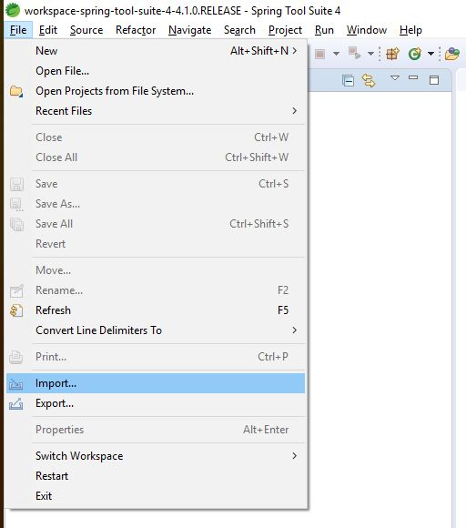
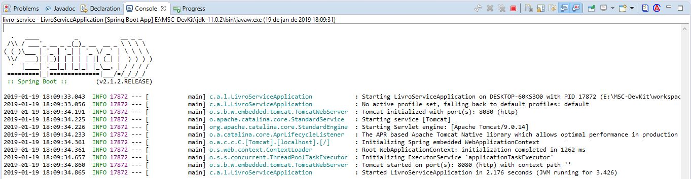
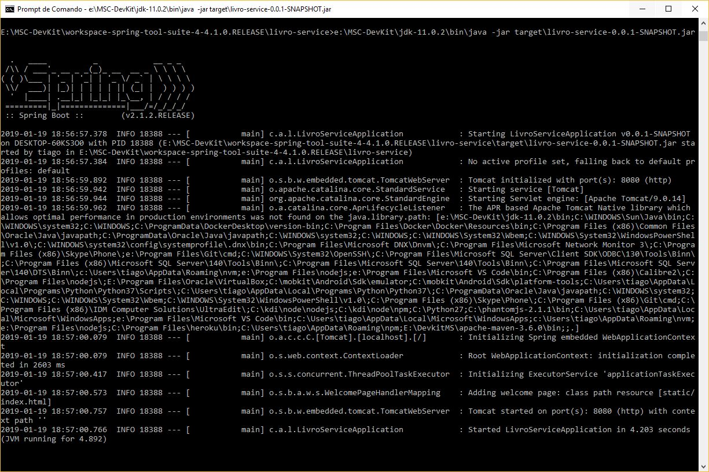

# Construindo uma aplicação com Spring Boot

Começaremos criando o esqueleto e nosso primeiro microsserviço, o microsserviço de livros:


Fazer o download do arquivo gerado

Extrair em:

```
C:\MSC-DevKit\workspace-spring-tool-suite-4-4.1.0.RELEASE
```

Importar o projeto:




Executar o projeto:


Acompanhar o log:



Ver se a aplicação foi inicializada em http://localhost:8080 :


## Adicionando um conteúdo estático

Clicar com o botão direiro em src/main/resources/static -> New -> Other... -> HTML File -> index.html

Adicionar o seguinte conteúdo:

```html
<!DOCTYPE html>
<html>
<head>
<meta charset="UTF-8">
<title>Microsserviço Livros</title>
</head>
<body>
	<h1>Microsserviço de Livros</h1>
</body>
</html>
```

Agora poderemos acessar novamente http://localhost:8080 e ver a página que criamos:


## Executando via linha de comandos

Run as -> Maven Install

Via ```cmd``` iniciar o jar com o comando ```java -jar```:



## Entendendo o projeto base

- ```pom.xml```

```xml
<?xml version="1.0" encoding="UTF-8"?>
<project xmlns="http://maven.apache.org/POM/4.0.0" xmlns:xsi="http://www.w3.org/2001/XMLSchema-instance"
	xsi:schemaLocation="http://maven.apache.org/POM/4.0.0 http://maven.apache.org/xsd/maven-4.0.0.xsd">
	<modelVersion>4.0.0</modelVersion>

    <!-- Diz ao Maven para incluir as dependências do Spring Boot Starter Kit -->
	<parent>
		<groupId>org.springframework.boot</groupId>
		<artifactId>spring-boot-starter-parent</artifactId>
		<version>2.1.2.RELEASE</version>
		<relativePath/> <!-- lookup parent from repository -->
	</parent>

	<groupId>com.acme</groupId>
	<artifactId>livro-service</artifactId>
	<version>0.0.1-SNAPSHOT</version>
	<name>livro-service</name>
	<description>Demo project for Spring Boot</description>

	<properties>
		<java.version>1.8</java.version>
	</properties>

	<dependencies>

        <!-- Diz ao Maven para incluir as dependências da Web do Spring Boot -->
		<dependency>
			<groupId>org.springframework.boot</groupId>
			<artifactId>spring-boot-starter-web</artifactId>
		</dependency>

        <!-- Diz ao Maven para incluir as dependências de testes do Spring Boot -->
		<dependency>
			<groupId>org.springframework.boot</groupId>
			<artifactId>spring-boot-starter-test</artifactId>
			<scope>test</scope>
		</dependency>
	</dependencies>

    <!-- Diz ao Maven para incluir plugins de maven específicos do Spring para construir e implementar aplicações Spring Boot -->
	<build>
		<plugins>
			<plugin>
				<groupId>org.springframework.boot</groupId>
				<artifactId>spring-boot-maven-plugin</artifactId>
			</plugin>
		</plugins>
	</build>

</project>
```

- ```src/main/java/com/acme/livroservice/LivroServiceApplication.java```

```java
package com.acme.livroservice;

import org.springframework.boot.SpringApplication;
import org.springframework.boot.autoconfigure.SpringBootApplication;

/* @SpringBootApplication diz ao framework Spring Boot que esta é a classe de bootstrap para o projeto */
@SpringBootApplication
public class LivroServiceApplication {

	public static void main(String[] args) {

        /* Chamada para iniciar todo o serviço de inicialização do Spring */
		SpringApplication.run(LivroServiceApplication.class, args);
	}

}
```

## Inicializando o git na pasta do projeto

```bash
> git init
Initialized empty Git repository in E:/MSC-DevKit/workspace-spring-tool-suite-4-4.1.0.RELEASE/livro-service/.git/
```

Para comitar determinado estado do projeto, faça:

```bash
> git add .
> git commit -am "Mensagem de commit"
```
