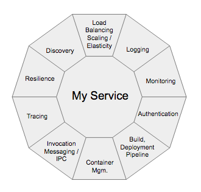

# Introdução

(Adaptado de https://www.redhat.com/pt-br/topics/microservices/what-are-microservices)

Microsserviços são uma abordagem de arquitetura para a criação de aplicações. O que diferencia a arquitetura de microsserviços das abordagens monolíticas tradicionais é como ela decompõe a aplicação por funções básicas. Cada função é denominada um serviço e pode ser criada e implantada de maneira independente. Isso significa que cada serviço individual pode funcionar ou falhar sem comprometer os demais.

Pense na última vez em que você acessou um site de vendas no varejo. Provavelmente, você usou a barra de pesquisa do site para procurar produtos. Essa pesquisa representa um serviço. Talvez você também tenha visto recomendações de produtos relacionados, extraídas de um banco de dados das preferências dos compradores. Isso também é um serviço. Você adicionou algum item ao carrinho de compras? Isso mesmo, esse é mais um serviço.

Portanto, um microsserviço é uma função essencial de uma aplicação e é executado independentemente dos outros serviços. No entanto, a arquitetura de microsserviços é mais complexa do que o mero acoplamento flexível das funções essenciais de uma aplicação. Trata-se da restruturação das equipes de desenvolvimento e da comunicação entre serviços de modo a preparar a aplicação para falhas inevitáveis, escalabilidade futura e integração de recursos novos.

Como isso é possível? Com a adaptação dos fundamentos da arquitetura orientada a serviço (SOA) para a implantação de microsserviços.

## Isso soa familiar?
Se você conhece o método de decompor aplicações em funções essenciais para evitar os problemas provocados pelas arquiteturas monolíticas é porque o estilo de arquitetura de microsserviços é semelhante ao da arquitetura orientada para serviços (SOA), um já consagrado no desenvolvimento de programas de software.

Nos primórdios do desenvolvimento de aplicações, até mesmo as alterações mais insignificantes em uma aplicação pronta exigiam uma atualização da versão de atacado, com um ciclo próprio de garantia da qualidade (QA). Isso, provavelmente, atrasava o trabalho de muitas subequipes. Muitas vezes, essa abordagem é chamada de “monolítica” porque o código-fonte da aplicação toda era incorporado em uma única unidade de implantação, como .war ou .ear. Se a atualização de alguma das partes causasse erros, era necessário desativar a aplicação inteira, reverter a escala e corrigir o problema. Embora essa abordagem ainda seja viável para aplicações menores, as empresas em ampla expansão não podem se dar ao luxo de sofrer com tempo de inatividade.

A arquitetura orientada a serviço serve pra resolver essa questão, pois estrutura as aplicações em serviços distintos e reutilizáveis que se comunicam por meio de um Enterprise Service Bus (ESB). Nessa arquitetura, os serviços individuais, cada um deles organizado em torno de um processo de negócios específico, aderem a um protocolo de comunicação, como SOAP, ActiveMQ ou Apache Thrift, para que sejam compartilhados por meio do ESB. Quando reunidos, esse pacote de serviços, integrados por meio de um ESB, formam uma aplicação.

Por um lado, isso permite criar, testar e ajustar os serviços de maneira simultânea, eliminando os ciclos de desenvolvimento monolíticos. No entanto, por outro lado, o ESB representa um ponto único de falha no sistema inteiro. Portanto, todo o esforço empregado para eliminar uma estrutura monolítica, de certo modo, serviu apenas para criar outra: o ESB, que potencialmente pode congestionar toda a organização.

## Então, qual é a diferença entre a SOA e a arquitetura de microsserviços?

Os microsserviços podem se comunicar entre si, normalmente sem monitoração de estado. Portanto, as aplicações criadas dessa maneira podem ser mais tolerantes a falhas e depender menos de um único ESB. Além disso, as equipes de desenvolvimento podem escolher as ferramentas que desejarem, pois os microsserviços podem se comunicar por meio de interfaces de programação de aplicações (APIs) independentes de linguagem.

Levando em consideração a história da SOA, os microsserviços não são uma ideia completamente nova. Porém, eles se tornaram mais viáveis graças aos avanços nas tecnologias de containerização. Com os containers Linux, agora é possível executar várias partes de uma aplicação de maneira independente no mesmo hardware e com um controle muito maior sobre os componentes individuais e ciclos de vida.

O maior desafio para a adoção de qualquer arquitetura nova é dar o primeiro passo. Você quer criar aplicações novas ou transformar as antigas? Em ambos os casos, é bom refletir sobre os benefícios e os desafios de criar microsserviços.

## Quais são os benefícios da arquitetura de microsserviços?

Com os microsserviços, suas equipes e tarefas rotineiras podem ser tornar mais eficientes por meio do desenvolvimento distribuído. Além disso, é possível desenvolver vários microsserviços ao mesmo tempo. Isso significa que você pode ter mais desenvolvedores trabalhando simultaneamente na mesma aplicação, o que resulta na redução do tempo gasto com desenvolvimento.

- Lançamento no mercado com mais rapidez
Como os ciclos de desenvolvimento são reduzidos, a arquitetura de microsserviços é compatível com implantações e atualizações mais ágeis.

- Altamente escalável
À medida que a demanda por determinados serviços aumenta, você pode fazer implantações em vários servidores e infraestruturas para atender às suas necessidades.

- Resiliente
Os serviços independentes, se construídos corretamente, não afetam uns aos outros. Isso significa que, se um elemento falhar, o restante da aplicação permanece em funcionamento, diferentemente do modelo monolítico.

- Fácil de implantar
Como as aplicações baseadas em microsserviços são mais modulares e menores do que as aplicações monolíticas tradicionais, as preocupações resultantes dessas implantações são invalidadas. Isso requer uma coordenação maior, mas as recompensas podem ser extraordinárias.

- Acessível
Como a aplicação maior é decomposta em partes menores, os desenvolvedores tem mais facilidade para entender, atualizar e aprimorar essas partes. Isso resulta em ciclos de desenvolvimento mais rápidos, principalmente quando também são empregadas as tecnologias de desenvolvimento ágil.

- Mais aberta
Devido ao uso de APIs poliglotas, os desenvolvedores têm liberdade para escolher a melhor linguagem e tecnologia para a função necessária.

## E os desafios?
Se a sua organização pretende migrar para a arquitetura de microsserviços, tenha em mente que será necessário implementar mudanças não somente nas aplicações, mas também no modo como as pessoas trabalham. As mudanças organizacionais e culturais podem ser, em parte, consideradas como desafios, porque cada equipe terá um ritmo próprio de implantação e será responsável por um serviço exclusivo, com um conjunto próprio de clientes. Talvez essas não sejam preocupações típicas para os desenvolvedores, mas elas serão essenciais para o sucesso da arquitetura de microsserviços.

Além das mudanças na cultura e nos processos, a complexidade e a eficiência são outros dois grandes desafios da arquitetura baseada em microsserviços. John Frizelle, arquiteto de plataformas do Red Hat Mobile, definiu as oito categorias de desafios a seguir em sua palestra no Red Hat Summit de 2017:

1. ***Compilação***: é necessário dedicar um tempo à identificação das dependências entre os serviços. É preciso estar ciente de que concluir uma compilação pode gerar muitas outras devido a essas dependências. Também é necessário levar em consideração como os microsserviços afetam os dados.
1. ***Testes***: os testes de integração, assim como os testes end-to-end, podem ser mais difíceis e importantes como jamais foram. Saiba que uma falha em uma parte da arquitetura pode provocar outra mais adiante, dependendo de como os serviços foram projetados para embasar uns aos outros.
1. ***Controle de versão***: ao atualizar para versões novas, lembre-se de que a compatibilidade com as versões anteriores pode ser rompida. É possível resolver esse problema usando a lógica condicional, mas isso pode se tornar outra complicação rapidamente. Como alternativa, você pode colocar no ar várias versões ativas para clientes diferentes, mas essa solução é mais complexa em termos de manutenção e gerenciamento.
1. ***Implantação***: sim, isso também é um desafio, pelo menos na configuração inicial. Para facilitar a implantação, primeiro é necessário investir bastante na automação, pois a complexidade dos microsserviços é demais para a implantação manual. Pense sobre como e em que ordem os serviços serão implementados.
1. ***Geração de logs***: com os sistemas distribuídos, é necessário ter logs centralizados para unificar tudo. Caso contrário, é impossível gerenciar o escalonamento.
1. ***Monitoramento***: é crítico ter uma visualização centralizada do sistema para identificar as fontes de problemas.
1. ***Depuração***: a depuração remota não é uma opção e não funciona com centenas de serviços. Infelizmente, no momento não há uma única resposta para como realizar depurações.
1. ***Conectividade***: considere a detecção de serviços, seja de maneira centralizada ou integrada.

