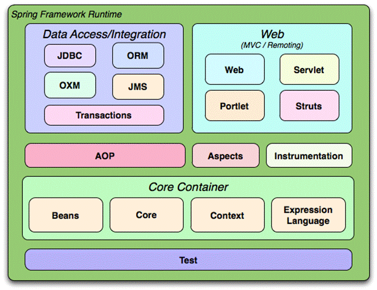
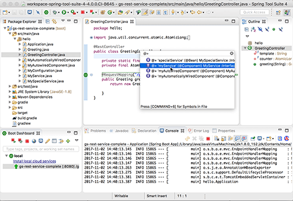

# Spring

## Spring Framework

O Spring Framework é uma solução leve e um potencial imediato para a criação de aplicativos corporativos. No entanto, o Spring é modular, permitindo que você use apenas as partes que você precisa, sem ter que trazer o resto. Você pode usar o contêiner IoC, com o Struts no topo, mas também pode usar apenas o código de integração do Hibernate ou a camada de abstração do JDBC. O Spring Framework suporta gerenciamento de transações declarativas, acesso remoto à sua lógica por meio de RMI ou serviços da Web e várias opções para persistir seus dados. Ele oferece uma estrutura MVC completa e permite que você integre o AOP (Aspect Oriented Programming) de forma transparente ao seu software.

O Spring é projetado para ser não intrusivo, o que significa que o código de lógica do seu domínio geralmente não possui dependências no próprio framework. Na sua camada de integração (como a camada de acesso a dados), existirão algumas dependências na tecnologia de acesso a dados e nas bibliotecas do Spring. No entanto, deve ser fácil isolar essas dependências do restante da sua base de código.

O Spring Framework é uma plataforma Java que fornece suporte abrangente à infraestrutura para o desenvolvimento de aplicativos Java. Spring lida com a infraestrutura para que você possa se concentrar no seu aplicativo.

O Spring permite que você construa aplicativos a partir de "objetos Java simples" (POJOs) e aplique serviços corporativos de maneira não invasiva a POJOs. Esse recurso se aplica ao modelo de programação Java SE e ao Java EE completo e parcial.

Exemplos de como você, como desenvolvedor de aplicativos, pode usar a vantagem da plataforma Spring:

- Faça um método Java executar em uma transação de banco de dados sem ter que lidar com APIs de transação;
- Torne um método Java local um procedimento remoto sem precisar lidar com APIs remotas;
- Torne um método Java local uma operação de gerenciamento sem ter que lidar com APIs JMX;
- Torne um método Java local um manipulador de mensagens sem ter que lidar com as APIs do JMS;

## Spring Boot

O Spring Boot facilita a criação de aplicativos baseados em Spring autônomos e de produção que você pode executar. Possui uma visão "opinativa" da plataforma Spring e de bibliotecas de terceiros, para que você possa começar com o mínimo de ruído. A maioria dos aplicativos Spring Boot precisa de uma configuração de Spring muito pequena.

Você pode usar o Spring Boot para criar aplicativos Java que podem ser iniciados usando o java -jar. Também fornece uma ferramenta de linha de comando que executa "spring scripts".

Os principais objetivos são:

- Prover uma experiência de introdução radicalmente mais rápida e amplamente acessível para todo o desenvolvimento do Spring;
- Ser primordialmente "opinativo", mas sair caminho rapidamente, quando os requisitos começam a divergir dos padrões;
- Fornecer vários recursos não funcionais que são comuns a grandes classes de projetos (como servidores incorporados, segurança, métricas, verificações de integridade e configuração externalizada);
- Absolutamente nenhuma geração de código e nenhuma necessidade de configuração XML;

## Spring Cloud

Desenvolver, implantar e operar aplicativos em nuvem deve ser tão fácil quanto (se não mais fácil que) aplicativos locais. Esse é e deve ser um princípio governante por trás de qualquer plataforma, biblioteca ou ferramenta de nuvem. O Spring Cloud - uma biblioteca de código aberto - facilita o desenvolvimento de aplicativos JVM para a nuvem. Com ele, os aplicativos podem se conectar a serviços e descobrir informações sobre o ambiente de nuvem com facilidade.

Uma das muitas vantagens de executar um aplicativo na nuvem é a fácil disponibilidade de uma variedade de serviços. Em vez de gerenciar hardware, instalação, operação, backups, etc., basta criar e vincular serviços com um clique de um botão ou um comando shell.

Como os aplicativos acessam esses serviços? Por exemplo, se você tiver um banco de dados relacional vinculado ao seu aplicativo, precisará criar um objeto DataSource com base nesse serviço. É aqui que o Spring Cloud ajuda. Ele remove todo o trabalho necessário para acessar e configurar conectores de serviço e permite que você se concentre no uso desses serviços. Também expõe informações sobre a instância do aplicativo (endereço do host, porta, nome, etc.).

O Spring Cloud faz tudo isso de maneira independente da nuvem por meio do conceito de um Cloud Connector. Você também pode estendê-lo a outras nuvens implementando uma interface e aproveitando o restante da biblioteca. Em seguida, basta adicionar a biblioteca que contém a extensão ao classpath do seu aplicativo, não há necessidade de bifurcar e construir o Spring Cloud.

O Spring Cloud também reconhece que não pode atender a todos os serviços em todas as nuvens. Portanto, embora ofereça suporte a muitos serviços comuns prontos para uso, permite que você (ou o provedor de serviços) estenda sua funcionalidade a outros serviços. Da mesma forma que se estende para outras nuvens, você adiciona o jar que contém suas extensões de serviço ao caminho de classe do seu aplicativo.

Finalmente, ele apresenta um suporte especial para aplicativos Spring (em um módulo separado), incluindo aplicativos Spring Boot na forma de suporte à configuração Java e XML e a exposição de propriedades de aplicativos e serviços em uma forma fácil de consumir. Este é o único módulo no Spring Cloud que depende do Spring. Outros provedores de estrutura podem contribuir com suporte específico para suas estruturas de maneira similar.

## Spring Tools

O Spring Tools oferece suporte para o desenvolvimento de aplicativos corporativos baseados em Spring e Spring Boot.

## Fontes

- https://docs.spring.io/spring/docs/3.0.x/spring-framework-reference/html
- https://docs.spring.io/spring-boot/docs/current/reference/html/getting-started-introducing-spring-boot.html
- https://spring.io/blog/2014/06/03/introducing-spring-cloud
