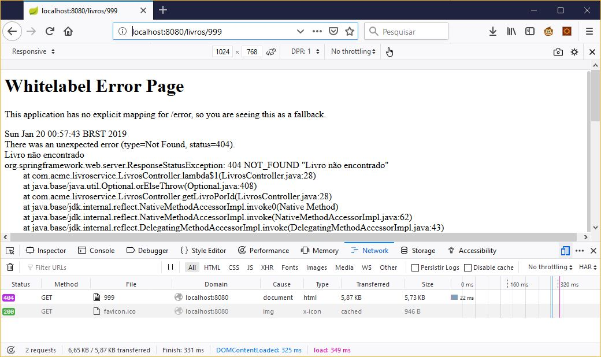

# Recuperando um Recurso

Agora que já temos uma base sólida, podemos começar a criar outras funcionalidades ao nosso microsserviço.

## Recuperando um livro específico

Criaremos um serviço que irá aceitar um request HTTP GET para:

```http://localhost:8080/livros/:id```

E responder com a representação JSON como a seguir:

```json
{
  "id": 1,
  "autor": "Miguel de Cervantes",
  "titulo": "Don Quixote",
  "preco": 44
}
```

## Criar mais um método no controlador

Inicialmente vamos apenas incluir um novo método na classe:

- ```src/main/java/com/acme/livroservice/LivrosController.java```

```java
package com.acme.livroservice;

import java.util.ArrayList;
import java.util.List;

// Novidade aqui
import org.springframework.web.bind.annotation.PathVariable;

import org.springframework.web.bind.annotation.RequestMapping;
import org.springframework.web.bind.annotation.RestController;

@RestController
public class LivrosController {

	@RequestMapping("/livros")
	public List<Livro> getLivros() {
		// Código atual omitido
	}
	
  // Novidade aqui
	@RequestMapping("/livros/{id}")
	public Livro getLivroPorId(@PathVariable Long id) {
		System.out.println("id: " + id);
		Livro l = new Livro(1l, "Miguel de Cervantes", "Don Quixote", 144.0);
		return l;
	}
}
```

Vamos fazer o ```System.out.println("id: " + id)``` somente para conferir se realmente o parâmetro está sendo capturado.

Com isso, acessando no navegador o endereço http://localhost:8080/livros/1 obtemos o seguinte JSON:

```json
{
  "id": 1,
  "autor": "Miguel de Cervantes",
  "titulo": "Don Quixote",
  "preco": 144
}
```

Muito bem, mas seria mais interessante que tivessémos uma lista de livros em memória e ela pudesse ser utilizada tanto para listar os livros quanto para pesquisar.

Precisamos deixar uma mesma lista de livros disponível para todos os métodos. Poderíamos pensar em manter uma variável estática, porém, o Spring nos fornece uma maneira mais elegante de fazer isso.

## Beans e Escopos

O escopo de um bean define o ciclo de vida e a visibilidade desse bean nos contextos nos quais ele é usado.

O Spring define seis tipos de escopos:
- ***singleton***: Definir um bean com escopo ***singleton*** significa que o contêiner cria uma única instância desse bean, e todas as solicitações para esse nome de bean retornarão o mesmo objeto, que é armazenado em cache. Quaisquer modificações no objeto serão refletidas em todas as referências ao bean. Este escopo é o valor padrão se nenhum outro escopo for especificado;
- ***prototype***: Um bean com escopo de ***prototype*** retornará uma instância diferente toda vez que for solicitado do contêiner;
- ***request***: O escopo de ***request*** cria uma instância de bean para uma única solicitação HTTP;
- ***session***: O escopo de ***session*** é criado para uma sessão HTTP;
- ***application***: O escopo de ***application*** cria a instância do bean para o ciclo de vida de um ```ServletContext```. Isso é semelhante ao escopo singleton, mas há uma diferença muito importante em relação ao escopo do bean. Quando beans tem escopo ***application***, a mesma instância do bean é compartilhada entre vários aplicativos baseados em servlet em execução no mesmo ```ServletContext```, enquanto os beans com escopo singleton para um único contexto de aplicativo;
- ***websocket***: Os beans do escopo do ```WebSocket``` quando acessados pela primeira vez são armazenados nos atributos da sessão do ```WebSocket```. A mesma instância do bean é então retornada sempre que esse bean é acessado durante toda a sessão do ```WebSocket```. Também podemos dizer que exibe comportamento singleton, mas limitado a uma sessão ```WebSocket``` apenas. 

Os últimos quatro escopos mencionados request, session, application e websocket estão disponíveis apenas para aplicativos web.


## Tornando a lista de livros um ```Singleton```

Agora que já entendemos como funcionam os escopos no Spring, podemos tornar nossa lista de livros um ***singleton*** para que possa ser compartilhada em nosso microsserviço.

Primeiramente devemos criar um método ***fábrica*** que será responsável pela criação do bean quando ele for requisitado. Podemos colocar este método diretamente na classe ```LivroServiceApplication```:

- ```src/main/java/com/acme/livroservice/LivroServiceApplication.java```

```java
package com.acme.livroservice;

import java.util.ArrayList;

import org.springframework.boot.SpringApplication;
import org.springframework.boot.autoconfigure.SpringBootApplication;
import org.springframework.context.annotation.Bean;

@SpringBootApplication
public class LivroServiceApplication {
	
  // Novidade aqui
	@Bean
	public ArrayList<Livro> listaLivros() {
		
		ArrayList<Livro> livros = new ArrayList<Livro>();
		
		Livro l1 = new Livro(1l, "Miguel de Cervantes", "Don Quixote", 144.0);
		Livro l2 = new Livro(2l, "J. R. R. Tolkien", "O Senhor dos Anéis", 123.0);
		Livro l3 = new Livro(3l, "Antoine de Saint-Exupéry", "O Pequeno Príncipe", 152.0);
		Livro l4 = new Livro(4l, "Charles Dickens", "Um Conto de Duas Cidades", 35.0);
		
		livros.add(l1);
		livros.add(l2);
		livros.add(l3);
		livros.add(l4);
		
		return livros;
	}

	public static void main(String[] args) {
		SpringApplication.run(LivroServiceApplication.class, args);
	}

}
```

Agora vamos ajustar nosso ```controller``` para que utilize este bean:

- ```src/main/java/com/acme/livroservice/LivrosController.java```

```java
package com.acme.livroservice;

// Código atual omitido

import javax.annotation.Resource;

@RestController
public class LivrosController {
	
  // Novidade aqui
	@Resource
	private ArrayList<Livro> listaLivros;

	@RequestMapping("/livros")
	public List<Livro> getLivros() {

    // Novidade aqui
		return listaLivros;
	}
	
	@RequestMapping("/livros/{id}")
	public Livro getLivroPorId(@PathVariable Long id) {
    // Novidade aqui
		return listaLivros.stream().filter(l -> l.getId().equals(id)).findFirst().orElse(null);
	}
}
```

Muito bom! Teste agora no navegador e veja que já é possível pesquisar um livro a partir de seu ID, mas o que acontece caso um ID de livro inexistente seja informado?

## Retornando códigos de status customizados

É importante expressar claramente o resultado de uma solicitação para um cliente e usar a semântica completa e rica do protocolo HTTP. Por exemplo, se algo der errado com uma solicitação, enviar um código de erro específico para cada tipo de problema possível permitirá que o cliente exiba uma mensagem de erro apropriada para o usuário.

O Spring fornece algumas maneiras principais de retornar códigos de status personalizados de suas classes do Controller:

- Usando um ```ResponseEntity```;
- Usando a anotação ```@ResponseStatus``` em classes de exceção;

Essas opções não são mutuamente exclusivas; longe disso, eles podem realmente complementar uma a outra.

### Retornando códigos de status por meio de um ```ResponseEntity```

```java
@RequestMapping(value = "/controller", method = RequestMethod.GET)
@ResponseBody
public ResponseEntity sendViaResponseEntity() {
    return new ResponseEntity(HttpStatus.NOT_ACCEPTABLE);
}
```

### Retornando códigos de status por meio de uma exceção

Vamos adicionar um segundo método ao controlador para demonstrar como usar uma exceção para retornar um código de status:

```java
@RequestMapping(value = "/exception", method = RequestMethod.GET)
@ResponseBody
public ResponseEntity sendViaException() {
    throw new ForbiddenException();
}
```

Ao receber uma requisição GET para ```/exception```, o Spring lançará uma ```ForbiddenException```. Esta é uma exceção personalizada que definiremos em uma classe separada:

```java
@ResponseStatus(HttpStatus.FORBIDDEN)
public class ForbiddenException extends RuntimeException {}
```

Nenhum código é necessário nesta exceção. Todo o trabalho é feito pela anotação ```@ResponseStatus```.

Neste caso, quando a exceção é lançada, o controlador que a lançou retorna uma resposta com o código de resposta 403 (Forbidden). Se necessário, você também pode adicionar uma mensagem na anotação que será retornada junto com a resposta.

Nesse caso, a classe ficaria assim:

```java
@ResponseStatus(value = HttpStatus.FORBIDDEN, reason="Para mostrar uma mensagem customizada")
public class ForbiddenException extends RuntimeException {}
```

É importante observar que, embora seja tecnicamente possível fazer uma exceção retornar qualquer código de status, na maioria dos casos, faz sentido usar exceções para códigos de erro (4XX e 5XX).

### ```ResponseStatusException```

```ResponseStatusException``` é uma alternativa programática ao ```@ResponseStatus``` e é a classe base para exceções usadas para aplicar um código de status a uma resposta HTTP. É uma ```RuntimeException``` e, portanto, não precisa ser explicitamente adicionada a uma assinatura de método.

Spring fornece 3 construtores para gerar ```ResponseStatusException```:

```java
ResponseStatusException(HttpStatus status)
ResponseStatusException(HttpStatus status, java.lang.String reason)
ResponseStatusException(
  HttpStatus status, 
  java.lang.String reason, 
  java.lang.Throwable cause
)
```

Argumentos do construtor de ```ResponseStatusException```:

- status - um status HTTP definido para resposta HTTP
- reason - uma mensagem explicando a exceção definida como resposta HTTP
- cause - uma causa ```Throwable``` do ```ResponseStatusException```

Nota: no Spring, o ```HandlerExceptionResolver``` intercepta e processa qualquer exceção gerada e não tratada por um Controller.

Um desses manipuladores, ```ResponseStatusExceptionResolver```, procura por qualquer ```ResponseStatusException``` ou exceções não identificadas anotadas por ```@ResponseStatus``` e, em seguida, extrai o código e a razão HTTP Status e as inclui na resposta HTTP.

O uso de ```ResponseStatusException``` tem alguns benefícios:

- Em primeiro lugar, exceções do mesmo tipo podem ser processadas separadamente e diferentes códigos de status podem ser definidos na resposta, reduzindo o acoplamento;
- Em segundo lugar, evita a criação de classes de exceção adicionais desnecessárias;
- Por fim, ele fornece mais controle sobre o tratamento de exceções, já que as exceções podem ser criadas programaticamente;

## Alterando nosso end-point para retornar o código de erro 404 caso o livro não seja encontrado

Agora que já sabemos como retornar um código de erro, vamos ajustar nosso ```controller``` para que lance a exceção caso o livro não seja encontrado:

- ```src/main/java/com/acme/livroservice/LivrosController.java```

```java
package com.acme.livroservice;

// Código atual omitido

// Novidade aqui
import org.springframework.web.server.ResponseStatusException;

@RestController
public class LivrosController {

	// Código atual omitido

	@RequestMapping("/livros/{id}")
	public Livro getLivroPorId(@PathVariable Long id) {
		return listaLivros.stream().filter(l -> l.getId().equals(id)).findFirst()
      // Novidade aqui
      .orElseThrow(() -> new ResponseStatusException(HttpStatus.NOT_FOUND, "Livro não encontrado: " + id));
	}
}
```

É hora de testarmos este novo recurso de nossa aplicação, acesse http://localhost:8080/livros/9999 :

Vemos que de fato, agora o código de retorno HTTP do serviço passou a ser 404, no entanto, também é retornada uma página de erro desnecessária.


