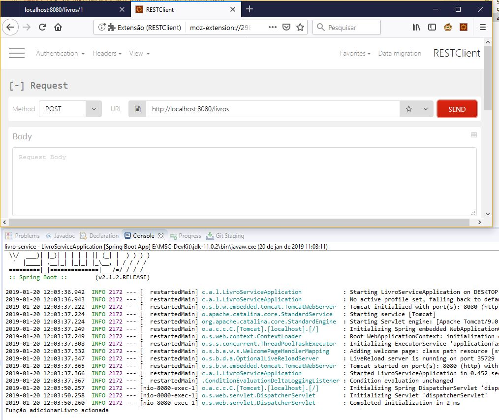
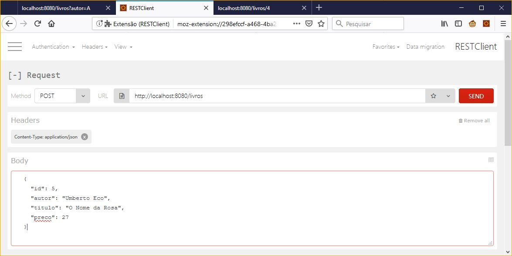

# Incluindo um Recurso

Nosso microsserviço já é capaz de listar os livros e buscar um livro a partir de seu código, além disso, ele retorna códigos de erro HTTP adequados na ocorrência de erros, nosso próximo passo é permitir a inclusão de novos livros.

## Definindo uma URL base padrão para o recurso

Mas antes permitir a inclusão de novos livros, podemos fazer uma melhoria em nosso código, você já deve ter percebido que a URL base do controller irá se repetir em todos os métodos e, para evitar a repetição de código e facilitar a manutenção, podemos centralizar esta configuração:

- `src/main/java/com/acme/livroservice/LivrosController.java`

```java
package com.acme.livroservice;

// Código atual omitido

@RestController
// Novidade aqui
@RequestMapping("/livros")
public class LivrosController {

	@Resource
	private ArrayList<Livro> listaLivros;

	// Novidade aqui
	@RequestMapping
	public List<Livro> getLivros() {
		return listaLivros;
	}

	// Novidade aqui
	@RequestMapping("/{id}")
	public Livro getLivroPorId(@PathVariable Long id) {
		return listaLivros.stream().filter(l -> l.getId().equals(id)).findFirst()
				.orElseThrow(() -> new ResponseStatusException(HttpStatus.NOT_FOUND, "Livro não encontrado: " + id));
	}
}
```

Ótimo, agora se precisarmos alterar a URL base de nosso recurso precisaremos alterar apenas em um local.

## Tratando requisições do tipo POST

Nossa próxima função será algo como:

```java
public void adicionarLivro(Livro livro) {
	listaLivros.add(livro);
}
```

Mas o problema é definir a URL para a qual o recurso será mapeado, pois requisições do tipo GET http://localhost:8080/livros e POST http://localhost:8080/livros devem ser mapeadas para funções diferentes.

Para resolver isso, devemos alterar as anotações `RequestMapping` para anotações mais específicas como `GetMapping` e `PostMapping`.

- `src/main/java/com/acme/livroservice/LivrosController.java`

```java
package com.acme.livroservice;

// Código atual omitido

// Novidade aqui
import org.springframework.web.bind.annotation.GetMapping;
import org.springframework.web.bind.annotation.PostMapping;

@RestController
// Novidade aqui
@RequestMapping("/livros")
public class LivrosController {

	@Resource
	private ArrayList<Livro> listaLivros;

	// Novidade aqui
	@GetMapping
	public List<Livro> getLivros() {
		return listaLivros;
	}

	// Novidade aqui
	@GetMapping("/{id}")
	public Livro getLivroPorId(@PathVariable Long id) {
		return listaLivros.stream().filter(l -> l.getId().equals(id)).findFirst()
				.orElseThrow(() -> new ResponseStatusException(HttpStatus.NOT_FOUND, "Livro não encontrado: " + id));
	}

	// Novidade aqui
	@PostMapping
	public void adicionarLivro(Livro livro) {
		System.out.println("Função adicionarLivro acionada");
	}
}
```

Mas como poderemos testar as chamadas para um end-point que espera o método POST se sempre que colocamos um endereço na navegador ele faz um GET?

## Depurando end-points REST

Para podermos depurar acionamentos a end-points REST podemos utilizar uma série de ferramentas, tanto em linha de comando como ferramentas gráficas, entre elas:

- curl: Ferramenta de linha de comando Linux - https://curl.haxx.se/; 
- RESTClient: Extensão do Firefox - https://addons.mozilla.org/pt-BR/firefox/addon/restclient;
- Postman: - Extensão do Chrome - https://www.getpostman.com/;

Qualquer uma destar ferramentas permite a execução de requisições HTTP arbitrárias, informando a URL, método HTTP, cabeçalhos e um corpo da requisição.



Ótimo, agora podemos testar outros tipos de requisição com a ajuda destas ferramentas, nosso próximo passo é enviar um livro através da requisição REST e recebê-lo em nosso método.

## Enviando dados para o End-Point

Utilizanto a anotação `@RequestBody` podemos anotar um parâmetro da função do controller que será preenchido com os dados da requisição.

- `src/main/java/com/acme/livroservice/LivrosController.java`

```java
package com.acme.livroservice;

// Código atual omitido

// Novidade aqui
import org.springframework.web.bind.annotation.GetMapping;
import org.springframework.web.bind.annotation.PostMapping;

@RestController
// Novidade aqui
@RequestMapping("/livros")
public class LivrosController {

	@Resource
	private ArrayList<Livro> listaLivros;

	// Novidade aqui
	@GetMapping
	public List<Livro> getLivros() {
		return listaLivros;
	}

	// Novidade aqui
	@GetMapping("/{id}")
	public Livro getLivroPorId(@PathVariable Long id) {
		return listaLivros.stream().filter(l -> l.getId().equals(id)).findFirst()
				.orElseThrow(() -> new ResponseStatusException(HttpStatus.NOT_FOUND, "Livro não encontrado: " + id));
	}

	@PostMapping
	public void adicionarLivro(@RequestBody Livro livro) {
		System.out.println("Função adicionarLivro acionada");
	}
}
```

Mas como poderemos enviar os dados do livro? É aí que entra novamente o auxílio do RESTClient. Vamos realizar uma nova requisição contra o end-point http://localhost:8080/livros utilizando o método http POST, mas agora, iremos enviar os dados do livro a ser cadastrado no corpo da requisição como um JSON, não podemos nos esquecer também de incluir um cabeçalho na requisição com `Content-Type: application/json`:



Vamos também ajustar nosso controler para que imprima no console os dados recebidos do livro:

- `src/main/java/com/acme/livroservice/LivrosController.java`

```java
// Código atual omitido

@RestController
@RequestMapping("/livros")
public class LivrosController {

	// Código atual omitido

	@PostMapping
	public void adicionarLivro(@RequestBody Livro livro) {
		System.out.println(livro);
	}
}
```

Ao efetuarmos a chamada POST utilizando o RESTClient devemos ver algo como a linha abaixo no console:

```bash
Livro [id=5, autor=Umberto Eco, titulo=O Nome da Rosa, preco=27.0]
```

Para que o livro possa de fato ser incluído na listagem, devemos encontrar um ID válido para ele e inserir o novo livro em `listaLivros`, faremos isso agora:

- `src/main/java/com/acme/livroservice/LivrosController.java`

```java
// Código atual omitido

@RestController
@RequestMapping("/livros")
public class LivrosController {

	// Código atual omitido

	@PostMapping
	public void adicionarLivro(@RequestBody Livro livro) {
		Long max = listaLivros.stream().mapToLong(l -> l.getId()).max().orElse(0);
		livro.setId(max + 1);
		System.out.println(livro);
		listaLivros.add(livro);
	}
}
```

Faça alguns testes incluindo mais livros, não é necessário invormar o campo ID no JSON, pois ele será calculado.

Mas ainda temos espaço para melhorar, pois na realidade, a resposta adequada a um método POST de inclusão bem sucedido é 201, e, ele deve retornar a entidade que acabou de ser incluída:

- `src/main/java/com/acme/livroservice/LivrosController.java`

```java
// Código atual omitido

// Novidade aqui
import org.springframework.http.HttpStatus;
import org.springframework.web.bind.annotation.ResponseStatus;

@RestController
@RequestMapping("/livros")
public class LivrosController {

	// Código atual omitido

	@PostMapping
	@ResponseStatus(HttpStatus.CREATED)
	public Livro adicionarLivro(@RequestBody Livro livro) {
		Long max = listaLivros.stream().mapToLong(l -> l.getId()).max().orElse(0);
		livro.setId(max + 1);
		System.out.println(livro);
		listaLivros.add(livro);
		return livro;
	}
}
```

Neste momento não validaremos as entidades, isso será feito nos próximos capítulos.

## Logs no Spring Boot

<!-- https://www.baeldung.com/spring-boot-logging -->

Deixar códigos do tipo `System.out.println` espalhados em nosso projeto não é uma boa prática de programação, no entanto, as informações obtidas são muito importantes, tanto durante a fase de desenvolvimento da aplicação quanto no momento de operação para identificarmos eventuais erros que podem estar ocorrendo.

Neste ponto, o Spring Boot é um framework muito útil pois nos permite esquecer a maioria das definições de configuração, muitas das quais ele autonomiza com propriedade.

No caso de log, a única dependência obrigatória é o Apache Commons Logging.

Não precisaremos nem incluí-lo como dependência pois no Spring 5 (Spring Boot 2.x) ele é fornecido pelo módulo spring-jcl do Spring Framework.

O nível de log padrão do Logger é predefinido para INFO, o que significa que as mensagens TRACE e DEBUG não estão visíveis.

Para ativá-los sem alterar a configuração, podemos passar os argumentos –debug ou –trace na linha de comando:

```bash
java -jar target/spring-boot-logging-0.0.1-SNAPSHOT.jar --trace
```

O Spring Boot também nos dá acesso a uma configuração de nível de log mais refinada por meio de variáveis de ambiente que podem ser configuradas no arquivo `application.properties`:

```
logging.level.root=WARN
logging.level.com.baeldung=TRACE
```

Abaixo, temos um exemplo de como realizar o log de informações em um controller:

```java
@RestController
public class LoggingController {
 
    Logger logger = LoggerFactory.getLogger(LoggingController.class);
 
    @RequestMapping("/")
    public String index() {
        logger.trace("A TRACE Message");
        logger.debug("A DEBUG Message");
        logger.info("An INFO Message");
        logger.warn("A WARN Message");
        logger.error("An ERROR Message");
 
        return "Howdy! Check out the Logs to see the output...";
    }
}
```

## Melhorando nossos Logs

Agora que já sabemos como exibir corretamente as mensagens de log usando o Spring Boot, vamos ajustar nosso controller com mensagens de log adequadas:

- `src/main/java/com/acme/livroservice/LivrosController.java`

```java
// Código atual omitido

// Novidade aqui
import org.slf4j.Logger;
import org.slf4j.LoggerFactory;

@RestController
@RequestMapping("/livros")
public class LivrosController {
	
	// Novidade aqui
	Logger logger = LoggerFactory.getLogger(LivrosController.class);

	@Resource
	private ArrayList<Livro> listaLivros;

	@GetMapping
	public List<Livro> getLivros() {

		// Novidade aqui
		logger.info("getLivros");

		return listaLivros;
	}

	@GetMapping("/{id}")
	public Livro getLivroPorId(@PathVariable Long id) {
		
		// Novidade aqui
		logger.info("getLivroPorId: " + id);

		return listaLivros.stream().filter(l -> l.getId().equals(id)).findFirst()
				.orElseThrow(() -> new ResponseStatusException(HttpStatus.NOT_FOUND, "Livro não encontrado: " + id));
	}

	@PostMapping
	@ResponseStatus(HttpStatus.CREATED)
	public Livro adicionarLivro(@RequestBody Livro livro) {

		// Novidade aqui
		logger.info("adicionarLivro: " + livro);

		Long max = listaLivros.stream().mapToLong(l -> l.getId()).max().orElse(0);
		livro.setId(max + 1);
		listaLivros.add(livro);
		
		// Novidade aqui
		logger.info("adicionarLivro: " + livro + " adicionado com sucesso");

		return livro;
	}
}
```
