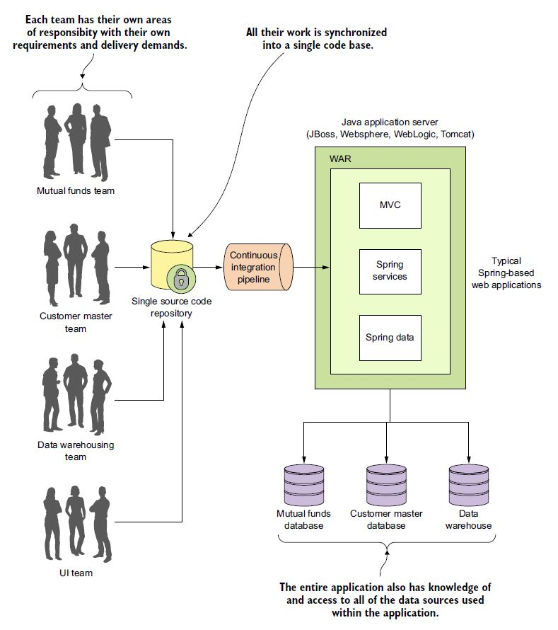
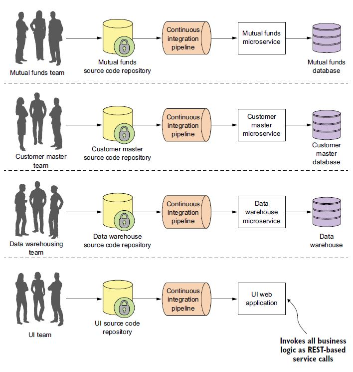
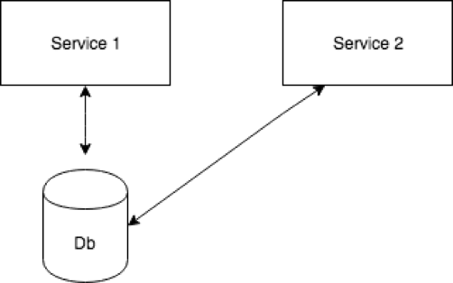
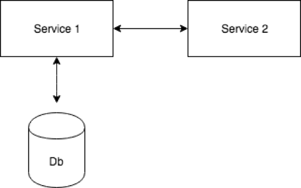
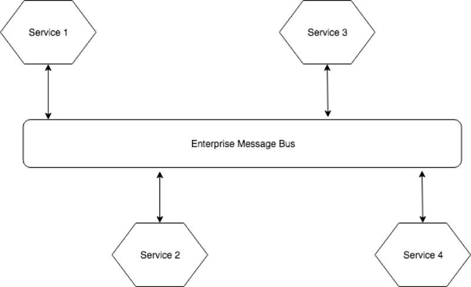
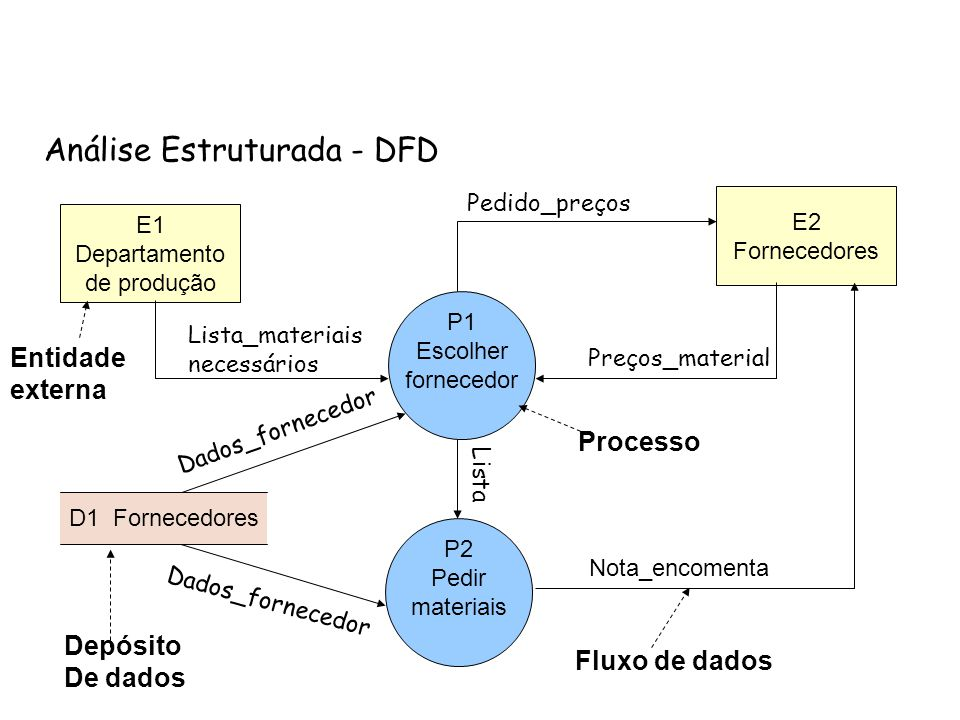
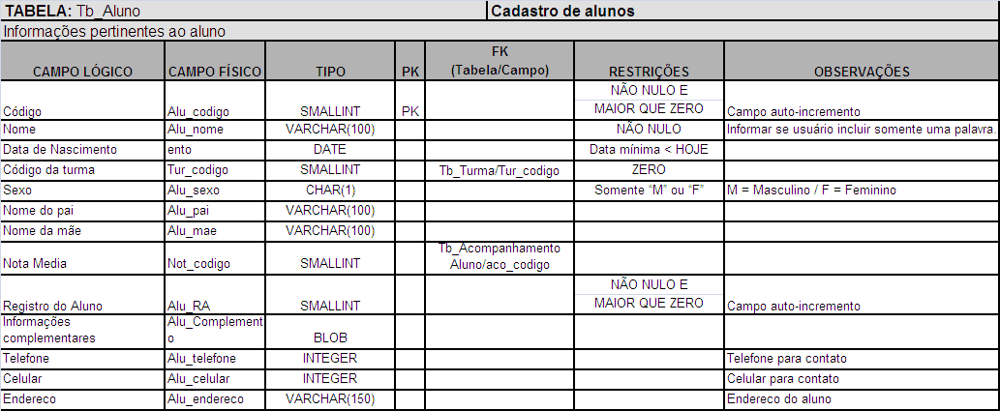
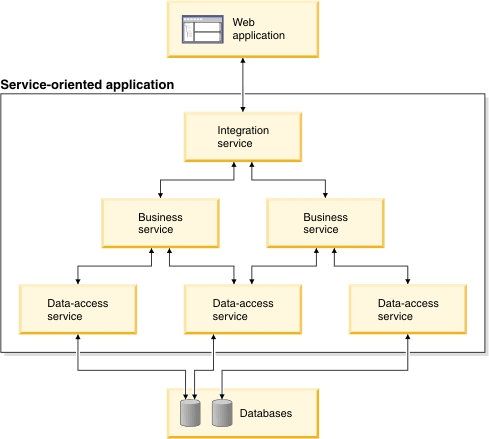
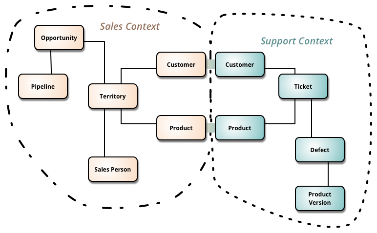

# Microsserviços

## Definição de Microsserviços

Microsserviços são uma abordagem arquitetural para a criação de aplicações. O que diferencia a arquitetura de microsserviços das abordagens monolíticas tradicionais é como ela decompõe a aplicação por funções básicas. Cada função é denominada um serviço e pode ser criada e implantada de maneira independente. Isso significa que cada serviço individual pode funcionar ou falhar sem comprometer os demais.


Pense na última vez em que você acessou um site de vendas no varejo. Provavelmente, você usou a barra de pesquisa do site para procurar produtos. Essa pesquisa representa um serviço. Talvez você também tenha visto recomendações de produtos relacionados, extraídas de um banco de dados das preferências dos compradores. Isso também é um serviço. Você adicionou algum item ao carrinho de compras? Isso mesmo, esse é mais um serviço.

Portanto, um microsserviço é uma função essencial de uma aplicação e é executado independentemente dos outros serviços. No entanto, a arquitetura de microsserviços é mais complexa do que o mero acoplamento flexível das funções essenciais de uma aplicação. Trata-se da restruturação das equipes de desenvolvimento e da comunicação entre serviços de modo a preparar a aplicação para falhas inevitáveis, escalabilidade futura e integração de recursos novos.

Como isso é possível? Com a adaptação dos fundamentos da arquitetura orientada a serviço (SOA) para a implantação de microsserviços.

Uma abordagem monolítica:


Uma abordagem de microsserviços:


### Quais são os benefícios da arquitetura de microsserviços?

Com os microsserviços, suas equipes e tarefas rotineiras podem ser tornar mais eficientes por meio do desenvolvimento distribuído. Além disso, é possível desenvolver vários microsserviços ao mesmo tempo. Isso significa que você pode ter mais desenvolvedores trabalhando simultaneamente na mesma aplicação, o que resulta na redução do tempo gasto com desenvolvimento.

- **Lançamento no mercado com mais rapidez**: Como os ciclos de desenvolvimento são reduzidos, a arquitetura de microsserviços é compatível com implantações e atualizações mais ágeis.

- **Altamente escalável**: À medida que a demanda por determinados serviços aumenta, você pode fazer implantações em vários servidores e infraestruturas para atender às suas necessidades.

- **Resiliente**: Os serviços independentes, se construídos corretamente, não afetam uns aos outros. Isso significa que, se um elemento falhar, o restante da aplicação permanece em funcionamento, diferentemente do modelo monolítico.

- **Fácil de implantar**: Como as aplicações baseadas em microsserviços são mais modulares e menores do que as aplicações monolíticas tradicionais, as preocupações resultantes dessas implantações são invalidadas. Isso requer uma coordenação maior, mas as recompensas podem ser extraordinárias.

- **Acessível**: Como a aplicação maior é decomposta em partes menores, os desenvolvedores tem mais facilidade para entender, atualizar e aprimorar essas partes. Isso resulta em ciclos de desenvolvimento mais rápidos, principalmente quando também são empregadas as tecnologias de desenvolvimento ágil.

- **Mais aberta**: Devido ao uso de APIs poliglotas, os desenvolvedores têm liberdade para escolher a melhor linguagem e tecnologia para a função necessária.

<!--

## What - Why - How no contexto de Negócio e Desenvolvimento

### O que é arquitetura? (What)

*A arquitetura é organizar blocos de maneira modular e estruturada. Arquitetura é arte e arquiteto é o artista.*

Tudo requer arquitetura. Todos somos arquitetos em nosso dia a dia. Em nossa casa, estamos organizando nosso material, livros, utensílios de cozinha, tudo o que organizamos de maneira correta é arquitetura. O lojista arruma a loja. Tudo organizado de maneira modular e estruturada é *arquitetura* .

*Arquitetura é uma arte, e na arte temos padrões e estilos. Os estilos e padrões são alterados com base no contexto, domínio e problema.*

A arquitetura de software é "o conjunto de estruturas necessárias para raciocinar sobre o sistema, que incluem elementos de software, relações entre eles e propriedades de ambos".

Uma boa arquitetura de software é descrever os padrões, camadas ou níveis aplicados que são usados ​​para definir a clara separação de interesses do seu negócio.

### Por que é necessário? (Why)

Menos é mais. "O objetivo da arquitetura é identificar os requisitos que afetam a estrutura da aplicação. Uma boa arquitetura reduz os riscos de negócios associados à criação de uma *solução técnica*."

Boa arquitetura é fácil de entender e barata de modificar. O sucesso dos negócios depende da arquitetura.

#### Benefícios da arquitetura

Benefícios que nós sempre nos interessam. Sem benefícios, não há negócios.

Abaixo estão os benefícios que você obterá se seguir estilos e padrões arquiteturais:

1. Alta produtividade
1. Melhor manutenabilidade
1. Alta adaptabilidade
1. Torna mais fácil avaliar e gerenciar mudanças
1. Segurança e escalaboçodade
1. Entregas de maior qualidade a um custo menor

A arquitetura define um conjunto de regras e restrições específicas para um sistema ou projeto. Arquitetura permite o atributo de qualidade do sistema ou podemos dizer que define a qualidade a cada ação.

### Como nós projetamos uma boa arquitetura? (How)

Para se tornar um especialista, precisamos praticar. Prática leva a perfeição.

Existem alguns princípios importantes que precisam ser considerados ao projetar a arquitetura.

1. Senso comum: - (O que é isso?) É uma habilidade básica para perceber, entender e julgar as coisas
1. *O sistema deve ser construído para mudar em vez de construir para durar*
1. Aprenda com sua experiência passada e tendências de tecnologia atuais
1. Há mais jeito do que um para fazer isso. (É útil encontrar a solução otimizada)
1. Entenda o contexto do usuário final e o domínio do negócio
1. Siga os padrões e estilos de design
1. Siga as práticas recomendadas de codificação
1. Entenda o módulo de negócios, submódulo, considere componentes e camadas (camadas) para abstraí-los e identificar as principais interfaces
1. *Use a abordagem iterativa ao projetar a arquitetura*

*Arquitetura de software e design de software são duas coisas diferentes, não se deve misturá-las. A arquitetura de software é o esqueleto, enquanto o design de software é carne.*

Arquitetura de software é sobre o alto nível de abstração e design de software é sobre componentes, classes ou módulos.

Um exemplo de arquitetura de software é o padrão MV*. E exemplos de design de software são DAO e Factory.

Qualquer arquitetura de software possui dois componentes principais.

1. **Padrões de Arquitetura**: Define as estratégias de implementação dos componentes;
1. **Estilo de Arquitetura**: Define os componentes e conectores;

-->

## O What, Why, e How de uma arquitetura de microsserviços

Há muitos anos que estamos construindo sistemas e melhorando-os. Diversas tecnologias, padrões de arquitetura e melhores práticas surgiram ao longo desses anos. Os microsserviços são um desses padrões de arquitetura que surgiram do mundo do design orientado a domínio, entrega contínua, automação de plataforma e infraestrutura, sistemas escalonáveis, programação poliglota e persistência.

### O que é uma arquitetura de microsserviços em poucas palavras? (What)

Robert C. Martin cunhou o termo princípio da responsabilidade única que afirma "reunir as coisas que mudam pela mesma razão e separar as coisas que mudam por diferentes razões".

Uma arquitetura de microsserviços usa essa mesma abordagem e a estende aos serviços fracamente acoplados que podem ser desenvolvidos, implantados e mantidos de forma independente. Cada um desses serviços é responsável por tarefas discretas e pode se comunicar com outros serviços por meio de APIs simples para resolver um problema de negócios complexo e maior.

### Principais benefícios de uma arquitetura de microsserviços (Why)

Como os serviços constituintes são pequenos, eles podem ser construídos por uma ou mais equipes pequenas desde o início, separadas por limites de serviço, o que facilita a expansão do esforço de desenvolvimento, se necessário.

Uma vez desenvolvidos, esses serviços também podem ser implantados independentemente uns dos outros e, portanto, é fácil identificar serviços ativos e escaloná-los independentemente do aplicativo inteiro. Os microsserviços também oferecem isolamento aprimorado de falhas, em que, no caso de um erro em um serviço, todo o aplicativo não deixa necessariamente de funcionar. Quando o erro é corrigido, a correção pode ser efetuada apenas para o respectivo serviço, em vez de reimplementar um aplicativo inteiro.

Outra vantagem que uma arquitetura de microsserviços traz é facilitar a escolha da pilha de tecnologia (linguagens de programação, bancos de dados, etc.) que é mais adequada para a funcionalidade necessária (serviço) em vez de ser mais padronizada, solução "bala de prata".

### Como eu começo com uma arquitetura de microsserviços? (How)

Espero que agora você esteja convencido de que uma arquitetura de microsserviços pode oferecer algumas vantagens exclusivas em relação às arquiteturas tradicionais e você começou a pensar nesse tipo de abordagem para o seu próximo projeto.

A próxima pergunta que vem à mente é "Como eu começo?" - e - "Existe um conjunto padrão de princípios que eu possa seguir para me ajudar a construir uma arquitetura de microsserviços de uma maneira melhor?"

Bem, receio que a resposta seja "não".

Embora isso possa não parecer tão promissor, há, no entanto, alguns temas comuns que muitas organizações que adotaram arquiteturas de microsserviços seguiram e com as quais acabaram encontrando sucesso. Vou discutir alguns desses temas comuns abaixo.

### 1 - Decompor
Uma das maneiras de tornar nosso trabalho mais fácil pode ser realizar a definição de serviços correspondentes aos recursos de negócios. Uma capacidade de negócios é algo que uma empresa faz para fornecer valor a seus usuários finais.

Identificar os recursos de negócios e os serviços correspondentes requer um alto nível de compreensão dos negócios. Por exemplo, os recursos de negócios para um aplicativo de compras on-line podem incluir o seguinte:

- Gerenciamento do catálogo de produtos
- Gerenciamento de estoque
- Gerenciamento de pedidos
- Gerenciamento de entrega
- Gerenciamento de usuários
- Recomendações de produtos
- Gerenciamento de avaliações de Produto

Depois que os recursos de negócios forem identificados, os serviços necessários podem ser construídos correspondendo a cada um desses recursos de negócios identificados.

Cada serviço pode pertencer a uma equipe diferente que se torna especialista nesse domínio específico e a um especialista nas tecnologias mais adequadas para esses serviços específicos. Isso geralmente leva a limites de API mais estáveis ​​e equipes mais estáveis.

### 2 - Construindo e Implantando

Depois de decidir sobre os limites de serviço desses pequenos serviços, eles podem ser desenvolvidos por uma ou mais equipes pequenas usando as tecnologias mais adequadas para cada finalidade. Por exemplo, você pode optar por criar um Serviço do Usuário em Java com um banco de dados MySQL e um Serviço de Recomendação do Produto com o Scala / Spark.

Uma vez desenvolvidos, os pipelines CI/CD podem ser configurados com qualquer um dos servidores de CI disponíveis (Jenkins, TeamCity, Go, etc.) para executar os casos de teste automatizados e implantar esses serviços independentemente em diferentes ambientes (integração, controle de qualidade, preparação e produção).

### 3 - Projetar os serviços individuais com cuidado

Ao projetar os serviços, defina-os cuidadosamente e pense no que será exposto, quais protocolos serão usados ​​para interagir com o serviço, etc.

É muito importante ocultar qualquer complexidade e detalhes de implementação do serviço e apenas expor o que é necessário para os clientes do serviço. Se detalhes desnecessários forem expostos, torna-se muito difícil mudar o serviço mais tarde, pois haverá muito trabalho para determinar quem está confiando nas várias partes do serviço. Além disso, muita flexibilidade é perdida em poder implantar o serviço de forma independente.

O diagrama abaixo mostra um dos erros comuns no projeto de microsserviços:



Como você pode ver no diagrama, aqui estamos pegando um serviço (Serviço 1) e armazenando todas as informações necessárias para o serviço em um banco de dados. Quando outro serviço (Serviço 2) é criado, o qual precisa dos mesmos dados, acessamos esses dados diretamente do banco de dados.

Essa abordagem pode parecer razoável e lógica em certos casos - talvez seja fácil acessar dados em um banco de dados SQL ou gravar dados em um banco de dados SQL ou talvez as APIs necessárias ao Serviço 2 não estejam prontamente disponíveis.

Assim que essa abordagem é adotada, o controle é imediatamente perdido para determinar o que está oculto e o que não está. Posteriormente, se o esquema precisar ser alterado, a flexibilidade para fazer essa alteração será perdida, já que você não saberá quem está usando o banco de dados e se a alteração interromperá o Serviço 2 ou não.

Uma abordagem alternativa, e gostaria de apresentar o caminho certo para resolver isso, está abaixo:



O Serviço 2 deve acessar o Serviço 1 e evitar ir diretamente ao banco de dados, preservando assim a máxima flexibilidade para várias alterações de esquema que possam ser necessárias. A preocupação com outras partes do sistema é eliminada desde que você tenha certeza de que os testes para as APIs expostas serão aprovados.

Como mencionado, escolha cuidadosamente os protocolos para comunicação entre serviços. Por exemplo, se o Java RMI for escolhido, o usuário da API não apenas ficará restrito ao uso de uma linguagem baseada em JVM, mas, além disso, o protocolo é bastante frágil porque é difícil manter a compatibilidade com a API.

<!-- 

Por fim, ao fornecer bibliotecas clientes aos clientes para usar o serviço, pense com cuidado, porque é melhor evitar a repetição do código de integração. Se esse erro for cometido, ele também poderá restringir as alterações feitas na API se os clientes confiarem em detalhes desnecessários.

-->

### 4 - Descentralizar

Existem organizações que obtiveram sucesso com microsserviços e seguiram um modelo em que as equipes que constroem os serviços cuidam de tudo relacionado a esse serviço. São eles que desenvolvem, implantam, mantêm e suportam. Não há equipes separadas de suporte ou manutenção.

Outra maneira de conseguir o mesmo é ter um modelo interno de código aberto. Ao adotar essa abordagem, o desenvolvedor que precisa de mudanças em um serviço pode verificar o código, trabalhar em um recurso e enviar um *pool-request* em vez de esperar que o proprietário do serviço receba e trabalhe nas alterações necessárias.

Para que este modelo funcione adequadamente, é necessária a documentação técnica adequada, juntamente com instruções de configuração e orientação para cada serviço, para facilitar a coleta e o trabalho do usuário.

Outra vantagem oculta dessa abordagem é que ela mantém os desenvolvedores focados em escrever códigos de alta qualidade, pois eles sabem que os outros estarão olhando para ela.

Existem também alguns padrões arquiteturais que podem ajudar a descentralizar as coisas. Por exemplo, você pode ter uma arquitetura em que a coleção de serviços estejam se comunicando por meio de um barramento de mensagens central.

Esse barramento manipula o roteamento de mensagens de diferentes serviços. Agentes de mensagens como o RabbitMQ são um bom exemplo.



O que tende a acontecer com o tempo é que as pessoas começam a colocar mais e mais lógica nesse barramento central e começa a saber mais e mais sobre o seu domínio. À medida que se torna mais inteligente, isso pode realmente se tornar um problema, pois torna-se difícil fazer mudanças que exigem coordenação entre equipes dedicadas separadas.

Meu conselho geral para esses tipos de arquiteturas seria mantê-los relativamente "estúpidos" e deixá-los apenas lidar com o roteamento. Arquiteturas baseadas em eventos parecem funcionar bem nesses cenários.

### 5 - Implantação (deploy)

É importante escrever Contratos Direcionados ao Consumidor [^1] para qualquer API que esteja sendo dependente. Isso garante que novas alterações nessa API não interrompam sua API.

[^1]: https://reflectoring.io/7-reasons-for-consumer-driven-contracts , https://spring.io/guides/gs/contract-rest

Nos contratos orientados ao consumidor, cada API do consumidor captura suas expectativas do provedor em um contrato separado. Todos esses contratos são compartilhados com o fornecedor para que eles obtenham informações sobre as obrigações que devem cumprir para cada cliente individual.

Os contratos orientados pelo consumidor devem passar por testes antes de serem implantados e antes que qualquer alteração seja feita na API. Também ajuda o provedor a saber quais serviços estão dependendo e como outros serviços dependem dele.

Quando se trata de implantar microsserviços independentes, existem dois modelos comuns de implantação.

#### Vários microsserviços por sistema operacional

Primeiro, **vários microsserviços por sistema operacional** podem ser implantados. Com esse modelo, o tempo é salvo na automação de determinados itens, por exemplo, o host de cada serviço não precisa ser provisionado.

A desvantagem dessa abordagem é que ela limita a capacidade de alterar e dimensionar os serviços de forma independente. Também cria dificuldades no gerenciamento de dependências. Por exemplo, todos os serviços no mesmo host terão que usar a mesma versão do Java se forem escritos em Java. Além disso, esses serviços independentes podem produzir efeitos colaterais indesejados para outros serviços em execução, o que pode ser um problema muito difícil de reproduzir e resolver.

#### Um microsserviço por sistema operacional

Devido ao desafio acima, o segundo modelo, no qual um microsserviço por sistema operacional é implantado, é a escolha preferida.

Com esse modelo, o serviço é mais isolado e, portanto, é mais fácil gerenciar dependências e dimensionar serviços de forma independente. Mas você pode se perguntar "não é caro"? Bem, na verdade não.

A solução tradicional para resolver esse problema é usar o Hypervisors, pelo qual várias máquinas virtuais são provisionadas no mesmo host. Essa abordagem de solução pode ser custosa, já que o próprio processo do hipervisor está consumindo alguns recursos e, é claro, quanto mais VMs forem provisionadas, mais recursos serão consumidos. E é aí que o modelo de contêiner recebe boa tração e é o preferido. O Docker é uma implementação desse modelo.

### Fazendo alterações nas APIs de microsserviço existentes enquanto em produção

Outro problema comum tipicamente enfrentado com um modelo de microsserviços é determinar como fazer alterações nas APIs de microsserviço existentes quando outras pessoas a estão usando em produção. Fazer alterações na API de microserviço pode quebrar o microsserviço que é dependente dele.

Existem diferentes maneiras de resolver esse problema.

Primeiro, versione a sua API e quando as alterações são necessárias para a API, implante a nova versão da API enquanto mantém a primeira versão atualizada. Os serviços dependentes podem ser atualizados em seu próprio ritmo para usar a versão mais recente. Depois que todos os serviços dependentes forem migrados para usar a nova versão do microsserviço alterado, ele poderá ser desativado.

Um problema com esta abordagem é que se torna difícil manter as várias versões. Quaisquer novas alterações ou correções de erros devem ser feitas em ambas as versões.

Por essa razão, uma abordagem alternativa pode ser considerada na qual outro *end-point*  é implementado no mesmo serviço quando as mudanças são necessárias. Depois que o novo *end-point* estiver sendo totalmente utilizado por todos os serviços, o *end-point* antigo poderá ser excluído.

A vantagem dessa abordagem é que é mais fácil manter o serviço, pois sempre haverá apenas uma versão da API em execução.

### 6 - Padrões

Quando várias equipes cuidam de diferentes serviços de forma independente, é melhor introduzir alguns padrões e melhores práticas - tratamento de erros, por exemplo. Como seria de se esperar, os padrões e as melhores práticas não são fornecidos, cada serviço provavelmente lidaria com erros de maneira diferente e, sem dúvida, uma quantidade significativa de código desnecessário seria gravada.

Criar padrões como o Guia de Estilo da API do PayPal é sempre útil em longo prazo. Também é importante informar aos outros o que uma API faz e a documentação da API sempre deve ser feita ao criá-la. Existem ferramentas como o Swagger, que são muito úteis para auxiliar no desenvolvimento em todo o ciclo de vida da API, desde o design e a documentação até o teste e a implantação. A capacidade de criar metadados para sua API e permitir que os usuários aproveitem, permite que eles saibam mais e usem-na com mais eficiência.

### Dependências de serviços

Em uma arquitetura de microsserviços, ao longo do tempo, cada serviço começa dependendo de mais e mais serviços. Isso pode introduzir mais problemas à medida que os serviços aumentam, por exemplo, o número de instâncias de serviço e seus locais (host + porta) podem mudar dinamicamente. Além disso, os protocolos e o formato em que os dados são compartilhados podem variar de serviço para serviço.

É aqui que os Gateways de API e a Descoberta de serviços se tornam muito úteis. A implementação de um gateway de API se torna um ponto de entrada único para todos os clientes, e os gateways de API podem expor uma API diferente para cada cliente.

O gateway de API também pode implementar segurança, como verificar se o cliente está autorizado a executar a solicitação. Existem algumas ferramentas como o Zookeeper, que podem ser usadas para a Descoberta de Serviço (embora não tenha sido construída para esse propósito). Existem muito mais ferramentas modernas, como o etcd e o Cônsul de Hashicorp, que tratam a Descoberta de Serviços como um cidadão de primeira classe e definitivamente vale a pena olhar para esse problema.

### 7 - Falhas

Um ponto importante a entender é que os microsserviços não são resilientes por padrão. Haverá falhas nos serviços. Falhas podem acontecer devido a falhas nos serviços dependentes. Além disso, as falhas podem surgir por vários motivos, como erros no código, tempos limite de rede, etc.

O que é crítico em uma arquitetura de microsserviços é garantir que todo o sistema não seja afetado ou diminua quando houver erros em uma parte individual do sistema.

Existem padrões como Bulkhead e Circuits Breaker, que podem ajudar você a obter uma melhor resiliência.

#### Bulkhead (Anteparo)

O padrão Bulkhead isola os elementos de um aplicativo em pools, de modo que, se um deles falhar, os outros continuarão a funcionar. O padrão é chamado Bulkhead porque se assemelha às partições seccionadas do casco de um navio. Se o casco de um navio estiver comprometido, apenas a seção danificada se enche de água, o que impede que o navio afunde.

#### Circuit Breaker (Disjuntor)

O padrão de disjuntor envolve uma chamada de função protegida em um objeto de disjuntor, que monitora falhas. Uma vez que uma falha atravessa o limite, o disjuntor desarma e todas as outras chamadas para o disjuntor retornam com um erro, sem que a chamada protegida seja feita para um determinado tempo limite configurado.

Depois que o tempo limite expira, algumas chamadas são permitidas pelo disjuntor para passar e, se elas tiverem êxito, o disjuntor retomará um estado normal. Durante o período em que o disjuntor falhou, os usuários podem ser notificados de que uma determinada parte do sistema está quebrada e o restante do sistema ainda pode ser usado.

Esteja ciente de que fornecer o nível necessário de resiliência para um aplicativo pode ser um desafio multidimensional.

### 8 - Monitoramento e Logging

Os microsserviços são distribuídos por natureza e o monitoramento e o registro de serviços individuais podem ser um desafio. É difícil passar e correlacionar logs de cada instância de serviço e descobrir erros individuais. Assim como nas aplicações monolíticas, não há um único local para monitorar microsserviços.

#### Agregação de Log

Para resolver esses problemas, uma abordagem preferencial é aproveitar um serviço de registro centralizado que agregue logs de cada instância de serviço. Os usuários podem pesquisar por esses registros a partir de um ponto centralizado e configurar alertas quando certas mensagens aparecerem.

Ferramentas padrão estão disponíveis e amplamente utilizadas por várias empresas. O ELK Stack é a solução usada com mais freqüência, onde o daemon de registro, o Logstash , coleta e agrega logs que podem ser pesquisados ​​por meio de um painel do Kibana indexado pelo Elasticsearch.

#### Agregação de Estatísticas

Semelhante à agregação de logs, a agregação de estatísticas, como CPU e uso de memória, também pode ser aproveitada e armazenada centralmente. Ferramentas como o Graphite fazem um bom trabalho ao empurrar para um repositório central e armazená-lo de maneira eficiente.

Quando um dos serviços downstream é incapaz de lidar com solicitações, deve haver uma maneira de acionar um alerta, e é aí que a implementação de APIs de verificação de integridade em cada serviço se torna importante - elas retornam informações sobre a integridade do sistema.

Um cliente de verificação de integridade, que poderia ser um serviço de monitoramento ou um balanceador de carga, chama o nó de extremidade para verificar periodicamente a integridade da instância do serviço em um determinado intervalo de tempo. Mesmo que todos os serviços downstream sejam saudáveis, ainda pode haver um problema de comunicação downstream entre os serviços. Ferramentas como o projeto Hystrix da Netflix permitem a capacidade de identificar esses tipos de problemas.

### Uma última coisa

Agora que abordamos o que é uma arquitetura de microsserviços, e você deseja implantar uma arquitetura de microsserviços e está pensando sobre como começar, gostaria de oferecer um conselho final:

> Comece pequeno

Quando você estiver apenas começando a desenvolver microsserviços, comece modestamente com apenas um ou dois serviços, aprenda com eles e, com o tempo e a experiência, adicione mais.

## Desenvolvimento de Softwares

### Análise Estruturada

A análise estruturada é uma atividade de construção de modelos. Utiliza uma notação que é particular ao método de análise estruturada para com a finalidade de retratar o fluxo e o conteúdo das informações utilizadas pelo sistema, dividir o sistema em partições funcionais e comportamentais e descrever a essência daquilo que será construído.

A análise estruturada é muito difícil de ser modelada, rastrear e gerenciar mudanças manualmente. Por essas e outras razões, as ferramentas DFD tornaram-se uma abordagem preferida. Para uma pré-elaboração de um projeto de desenvolvimento de software. A análise estruturada também contém gráficos que possibilitam ao analista criar modelos de fluxo de informação, com uma heurística para o uso dos símbolos, juntamente com um dicionário de dados, e narrativas de processamentos como o complemento aos modelos defluxo de informação. Um modelo de fluxo pode ser criado para qualquer sistema baseado em computador, independentemente do tamanho e complexidade.

O dicionário de dados é uma listagem organizada de todos os elementos de dados que são pertinentes ao sistema, com definições precisas e rigorosas, de forma que tanto o usuário como os analistas de sistemas tenham uma compreensão comum das tarefas, das saídas, dos componentes dos depósitos e (até mesmo) dos cálculos intermediários. Atualmente, isto é inserido quase sempre como parte de uma ferramenta de projeto e análise estruturada.

#### Principais Ferramentas

- Diagrama de Fluxo de Dados (DFD)
- Dicionário de dados (DD)
- Linguagem estruturada
- Tabelas de Decisão
- Diagrama Entidade-Relacionamento (DER)
- Diagrama de Transição de Estados (DTE)

- Diagrama de Fluxo de Dados - DFD


- Dicionário de Dados - DD


### Orientada a Objetos

A programação orientada a objetos é diferente da programação estruturada. Na programação orientada a objeto, funções e os dados estão juntos, formando o objeto. Essa abordagem cria uma nova forma de analisar, projetar e desenvolver programas, é uma forma mais abstrata, e genérica, que permite um maior reaproveitamento dos códigos, e facilita a sua manutenção.

Observe que a modelagem orientada a objeto, não é somente uma nova forma de programar, mas uma nova forma de pensar um problema, de forma abstrata, utilizando conceitos do mundo real e não conceitos computacionais. Na programação orientada a objeto o conceito de objeto deve acompanhar todo o ciclo de desenvolvimento do software.

A POO também inclui uma nova notação e exige do analista/programador o conhecimento dessa notação (diagramas de classe, diagramas de interação, diagramas de sequência, etc.). Atualmente existem centenas de bibliotecas, cuidadosamente desenhadas, para dar suporte aos programadores menos sofisticados. Desta forma os programadores podem montar seus programas unindo as bibliotecas externas com alguns objetos que criaram, ou seja, poderão montar suas aplicações rapidamente, contando com módulos pré-fabricados.

O usuário final verá todos os ícones e janelas da tela como objetos e associará a manipulação desses objetos visuais à manipulação dos objetos reais que eles representam. Enxerga o mundo como objetos com estrutura de dados e comportamentos.

O objetivo é desenvolver uma série de modelos de análise, satisfazendo um conjunto de requisitos definidos pelo cliente. O problema não está em aprender como programar em uma linguagem OO, mas sim em aprender a explorar as vantagens que as linguagens OO oferecem. Portanto, para o sucesso de um projeto OO é necessário seguir boas práticas de engenharia discutidas na literatura e pesquisando padrões já consolidados e aprovados.

- Diagrama de Classes


### SOA - Service-oriented architecture

**A arquitetura orientada a serviços (SOA) é uma maneira de organizar software.**

SOA envolve a implantação de serviços, que são unidades lógicas executadas em rede. 

Um serviço tem as seguintes características:

- Lida com um processo de negócios, como calcular uma cotação de seguro ou distribuir e-mail; lida com uma tarefa técnica, como acessar um banco de dados; ou fornece dados de negócios e detalhes técnicos para construir uma interface gráfica;
- Pode acessar outro serviço. Com a tecnologia de *runtime* apropriada, ele pode acessar um programa tradicional e responder a diferentes tipos de solicitantes, como aplicações da Web;
- É relativamente independente de outro software. As alterações feitas a um solicitante exigem poucas ou nenhuma alteração no serviço. Alterações na lógica interna de um serviço exigem poucas ou nenhuma alteração no solicitante. A independência relativa do serviço e outro software é chamada de **baixo acoplamento**;

Um serviço pode lidar com interações dentro de sua empresa e entre sua empresa e seus fornecedores, parceiros e clientes.

A SOA implica um estilo de desenvolvimento focado no negócio como um todo, na modularidade e reutilização. SOA não é apenas para novas aplicações. Você pode migrar aplicações existentes nos seguintes casos:
- As aplicações são monolíticas, combinando a lógica da interface com o usuário, o processamento de negócios e o acesso a dados, de forma que a atualização de um tipo de lógica requer que sua empresa teste vários tipos de comportamentos;
- As aplicações são difíceis de entender porque sua lógica é monolítica e foi repetidamente corrigida em vez de reescrita à medida que os requisitos foram alterados. As atualizações levam tempo extra enquanto os desenvolvedores tentam decifrar a lógica; e à medida que a complexidade aumenta, erros adicionais acompanham as atualizações;
- O inventário de aplicações possui lógica duplicada. Pedidos de mudança são perturbadores, exigindo mudanças em vários lugares;

Do ponto de vista de um desenvolvedor, uma mudança para orientação a serviços é uma mudança na ênfase, e muitos aspectos da tarefa de desenvolvimento não são afetados.

#### Aplicações orientadas a serviços

Uma aplicação orientado a serviços é uma aplicação composta principalmente de serviços, que geralmente estão em uma hierarquia.



O nível mais alto contém um ou mais serviços de integração, cada um dos quais controla um fluxo de atividades, como o processamento de uma solicitação do cliente para cobertura de seguro. Cada serviço de integração invoca um ou mais serviços de negócios.

O segundo nível é composto de serviços que cada um cumpre uma tarefa de negócios de nível relativamente baixo. Por exemplo, um serviço de integração pode invocar uma série de serviços de negócios para verificar os detalhes fornecidos por um agente de apólices de seguros. Se os serviços de negócios retornarem valores considerados como "emita uma apólice", o serviço de integração chamará outro serviço de negócios. O segundo serviço de negócios calcula uma cotação e retorna a cotação para o software, como uma aplicação da Web, que chamou a aplicação orientada a serviços.

O terceiro nível consiste em serviços de acesso a dados, cada um dos quais lida com a tarefa relativamente técnica de ler e gravar em áreas de armazenamento de dados, como bancos de dados e filas de mensagens. Um serviço de acesso a dados é mais frequentemente invocado a partir da camada de negócios, mas o fácil acesso dos serviços permite diferentes usos. Por exemplo, um solicitante desse tipo de aplicação da Web pode acessar um serviço de acesso a dados para atribuir valores iniciais em um formulário.

O ponto central é a flexibilidade. Alguns serviços de integração fornecem diferentes operações para diferentes solicitantes e alguns invocam outros serviços de integração. Além disso, um solicitante pode acessar diferentes tipos de serviços de dentro de uma aplicação orientada a serviços. O solicitante pode acessar um serviço de integração em um ponto e um serviço de negócios em outro.

#### Web e troca de dados binários

Qual é a característica que define de um serviço da web? Para algumas pessoas, a resposta é que o serviço troca dados em um formato baseado em texto chamado SOAP. Outras pessoas insistem que a característica que define de um serviço web é que o serviço troca dados na World Wide Web por meio do software de comunicações Hypertext Transfer Protocol (HTTP).

Para entender os diferentes estilos de serviços da Web, considere a estrutura de uma mensagem de solicitação HTTP, onde os dados são transmitidos de um navegador para um servidor da Web, e a estrutura da mensagem de resposta HTTP, se houver, que retorna.

A mensagem de solicitação HTTP possui três componentes:
1. A mensagem começa com um método HTTP para identificar o que o destinatário deve fazer com a mensagem;
1. Várias dados que estão no cabeçalho e fornecem informações que não são específicas dos dados da sua empresa. Por exemplo, essas informações podem ser os detalhes sobre o agente do usuário (ou seja, o navegador solicitante). Cada cabeçalho é um par de nome e valor:
```User-Agent: Mozilla/4.0 ...```
1. O corpo da entidade é o dado da solicitação, se houver. Se o método HTTP for GET (uma solicitação de dados), o entity-body estará vazio na maioria dos casos.

A mensagem de resposta HTTP possui três componentes:
1. A mensagem começa com um código de resposta HTTP para indicar se os dados da solicitação foram processados;
2. Várias dados que estão no cabeçalhos, incluindo um, ```Content-Type```, que identifica o formato dos dados no corpo da entidade da resposta. O formato é específico; por exemplo, um é para uma imagem do tipo JPEG. Se o formato for Hypertext Markup Language (HTML), a resposta será uma página da web. Pelo menos três outros tipos de conteúdo fornecem dados de negócios para uso em uma aplicação da Web ou outro solicitante: Extensible Markup Language (XML); SOAP, que é um dialeto XML; e JavaScript Object Notation (JSON), que são dados que são facilmente processados ​​pelo JavaScript;
1. O corpo da entidade são os dados de resposta, se houver;

A frase *serviço da Web* implica a transmissão de dados em um formato baseado em texto. Por outro lado, um serviço de troca binária troca dados em um formato associado a uma linguagem de computador específica ou a um fornecedor específico.

O uso de serviços de troca binária fornece vários benefícios:
- Permite uma resposta em tempo de execução mais rápida do que é possível com serviços da Web;
- Evita a necessidade de manter arquivos de configuração;
- Evita a necessidade de aprender as tecnologias relacionadas aos serviços da Web tradicionais;

A desvantagem do uso de serviços de trocas binárias é a acessibilidade reduzida. Um serviço de troca binária está diretamente acessível apenas ao software que transmite dados no formato binário esperado pelo serviço.

#### Implicações do SOA nos negócios

SOA tem várias implicações importantes para os negócios. Primeiro, quando cada componente é uma unidade relativamente autônoma, sua empresa pode responder a mudanças comerciais ou tecnológicas mais rapidamente e com menos gastos e confusão.

A capacidade de uma empresa responder rapidamente e bem à mudança é conhecida como agilidade. Um SOA bem elaborado aumenta a agilidade ao longo do tempo.

SOA também afeta como as pessoas colaboram. Além dos serviços mais técnicos, um serviço bem escrito tem baixa granularidade. Em um serviço de baixa granularidade, a área de preocupação é ampla o suficiente para que os demandantes do negócio possam entender o propósito do serviço, mesmo que saibam pouco sobre software. Quando uma coleção de serviços de baixa granularidade lida com os procedimentos comerciais de uma empresa, os analistas de negócios e profissionais de software podem compartilhar informações com conhecimento, incluir usuários em deliberações precoces sobre o objetivo e escopo de cada serviço e entender as implicações de mudar um procedimento de negócios. A facilidade da comunicação humana é um benefício importante da SOA; Este fato sugere que a arquitetura pode se tornar o principal princípio organizador do processamento de negócios.

Serviços bem projetados têm maior probabilidade de serem reutilizáveis. As empresas podem se beneficiar da reutilização de pelo menos duas maneiras: evitando as despesas de desenvolvimento de novos softwares e aumentando a confiabilidade do inventário de software ao longo do tempo. Você pode fazer testes menos extensivos se um serviço existente for colocado em um novo aplicativo, em comparação com os testes necessários para implantar o software que foi escrito do zero.

Você pode usar o SOA para tornar os processos de negócios e os dados mais disponíveis. Por exemplo, imagine agentes em uma empresa de seguros sentados em estações de trabalho e invocando um processo de mainframe para cotar preços de seguro para clientes específicos. Em resposta à pressão da concorrência, a empresa quer permitir que os clientes solicitem cotações na web, que tradicionalmente não tem link direto com um mainframe. O que é necessário ser feito antes que a empresa possa aceitar dados pessoais de clientes em um navegador, processar os dados por meio de software analítico no mainframe e responder ao cliente? A solução inclui o desenvolvimento de novos serviços para lidar com a interação entre o navegador e o software analítico.

### Microsserviços

O estilo arquitetural de microsserviços é semelhante ao da arquitetura orientada para serviços (SOA), que já é consagrado no desenvolvimento de aplicações.

Nos primórdios do desenvolvimento de aplicações, até mesmo as alterações mais insignificantes em uma aplicação pronta exigiam uma atualização de toda a aplicação, com um ciclo próprio de garantia da qualidade (QA). Isso, provavelmente, atrasava o trabalho de muitas subequipes. Muitas vezes, essa abordagem é chamada de "monolítica" porque o código-fonte da aplicação toda era incorporado em uma única unidade de implantação, como .war ou .ear. Se a atualização de alguma das partes causasse erros, era necessário desativar a aplicação inteira e corrigir o problema. Embora essa abordagem ainda seja viável para aplicações menores, as empresas em ampla expansão não podem se dar ao luxo de sofrer com tempo de inatividade.

A arquitetura orientada a serviço serve pra resolver essa questão, pois estrutura as aplicações em serviços distintos e reutilizáveis que se comunicam por meio de um Enterprise Service Bus (ESB). Nessa arquitetura, os serviços individuais, cada um deles organizado em torno de um processo de negócios específico, aderem a um protocolo de comunicação, como SOAP, ActiveMQ ou Apache Thrift, para que sejam compartilhados por meio do ESB. Quando reunidos, esse pacote de serviços, integrados por meio de um ESB, formam uma aplicação.

Por um lado, isso permite criar, testar e ajustar os serviços de maneira simultânea, eliminando os ciclos de desenvolvimento monolíticos. No entanto, por outro lado, o ESB representa um ponto único de falha no sistema inteiro. Portanto, todo o esforço empregado para eliminar uma estrutura monolítica, de certo modo, serviu apenas para criar outra: o ESB, que potencialmente pode congestionar toda a organização.

### Então, qual é a diferença entre a SOA e a arquitetura de microsserviços?

Os microsserviços podem se comunicar entre si, normalmente sem monitoração de estado. Portanto, as aplicações criadas dessa maneira podem ser mais tolerantes a falhas e depender menos de um único ESB. Além disso, as equipes de desenvolvimento podem escolher as ferramentas que desejarem, pois os microsserviços podem se comunicar por meio de interfaces de programação de aplicações (APIs) independentes de linguagem.

Levando em consideração a história da SOA, os microsserviços não são uma ideia completamente nova. Porém, eles se tornaram mais viáveis graças aos avanços nas tecnologias de containerização. Com os containers Linux, agora é possível executar várias partes de uma aplicação de maneira independente no mesmo hardware e com um controle muito maior sobre os componentes individuais e ciclos de vida.

O maior desafio para a adoção de qualquer arquitetura nova é dar o primeiro passo. Você quer criar aplicações novas ou transformar as antigas? Em ambos os casos, é bom refletir sobre os benefícios e os desafios de criar microsserviços.

## Fatores Chaves de Sucesso para Implementação de Microsserviço

Se a sua organização pretende migrar para a arquitetura de microsserviços, tenha em mente que será necessário implementar mudanças não somente nas aplicações, mas também no modo como as pessoas trabalham. As mudanças organizacionais e culturais podem ser, em parte, consideradas como desafios, porque cada equipe terá um ritmo próprio de implantação e será responsável por um serviço exclusivo, com um conjunto próprio de clientes. Talvez essas não sejam preocupações típicas para os desenvolvedores, mas elas serão essenciais para o sucesso da arquitetura de microsserviços.

Além das mudanças na cultura e nos processos, a complexidade e a eficiência são outros dois grandes desafios da arquitetura baseada em microsserviços. John Frizelle, arquiteto de plataformas do Red Hat Mobile, definiu as oito categorias de desafios a seguir em sua palestra no Red Hat Summit de 2017:

1. ***Compilação***: é necessário dedicar um tempo à identificação das dependências entre os serviços. É preciso estar ciente de que concluir uma compilação pode gerar muitas outras devido a essas dependências. Também é necessário levar em consideração como os microsserviços afetam os dados.
1. ***Testes***: os testes de integração, assim como os testes end-to-end, podem ser mais difíceis e importantes como jamais foram. Saiba que uma falha em uma parte da arquitetura pode provocar outra mais adiante, dependendo de como os serviços foram projetados para embasar uns aos outros.
1. ***Controle de versão***: ao atualizar para versões novas, lembre-se de que a compatibilidade com as versões anteriores pode ser rompida. É possível resolver esse problema usando a lógica condicional, mas isso pode se tornar outra complicação rapidamente. Como alternativa, você pode colocar no ar várias versões ativas para clientes diferentes, mas essa solução é mais complexa em termos de manutenção e gerenciamento.
1. ***Implantação***: sim, isso também é um desafio, pelo menos na configuração inicial. Para facilitar a implantação, primeiro é necessário investir bastante na automação, pois a complexidade dos microsserviços é demais para a implantação manual. Pense sobre como e em que ordem os serviços serão implementados.
1. ***Geração de logs***: com os sistemas distribuídos, é necessário ter logs centralizados para unificar tudo. Caso contrário, é impossível gerenciar o escalonamento.
1. ***Monitoramento***: é crítico ter uma visualização centralizada do sistema para identificar as fontes de problemas.
1. ***Depuração***: a depuração remota não é uma opção e não funciona com centenas de serviços. Infelizmente, no momento não há uma única resposta para como realizar depurações.
1. ***Conectividade***: considere a detecção de serviços, seja de maneira centralizada ou integrada.


## Fontes

- https://www.redhat.com/pt-br/topics/microservices/what-are-microservices
- https://medium.com/@maheshwar.ligade/software-architecture-what-why-how-34061f105dc2
- http://grupotads2014.blogspot.com/2014/04/analise-estruturada-vs-orientada-objetos.html
- https://www.ibm.com/support/knowledgecenter/en/SSMQ79_9.5.1/com.ibm.egl.pg.doc/topics/pegl_serv_overview.html

<!-- 
https://medium.com/@maheshwar.ligade/software-architecture-what-why-how-34061f105dc2

http://grupotads2014.blogspot.com/2014/04/analise-estruturada-vs-orientada-objetos.html
http://www.luiztools.com.br/post/microservices-vs-soa-entenda-as-diferencas/


https://pt.slideshare.net/DustinRuehle/success-factors-for-a-mature-microservices-implementation
https://techbeacon.com/app-dev-testing/5-fundamentals-successful-microservice-design
https://dzone.com/articles/microservices-keys-to-success

(Fonte https://martinfowler.com/bliki/BoundedContext.html)

O Contexto Delimitado é um padrão central no Design Dirigido por Domínio. É o foco da seção de design estratégico do DDD, que trata de grandes modelos e equipes. O DDD lida com grandes modelos dividindo-os em diferentes contextos limitados e sendo explícito sobre suas inter-relações.



DDD é sobre projetar software baseado em modelos do domínio. Um modelo funciona como uma "Linguagem Ubíqua" (prática de construir uma linguagem comum e rigorosa entre desenvolvedores e usuários) para ajudar na comunicação entre desenvolvedores de software e especialistas em domínio. Ele também atua como a base conceitual para o design do próprio software - como ele é dividido em objetos ou funções. Para ser eficaz, um modelo precisa ser unificado - isto é, ser internamente consistente para que não haja contradições dentro dele.

À medida que você tenta modelar um domínio maior, fica cada vez mais difícil construir um único modelo unificado. Diferentes grupos de pessoas usarão vocabulários sutilmente diferentes em diferentes partes de uma grande organização. A precisão da modelagem acorre rapidamente a isso, muitas vezes levando a muita confusão. Normalmente, essa confusão se concentra nos conceitos centrais do domínio. No início de minha carreira trabalhei com um utilitário de eletricidade - aqui a palavra "metro" significava coisas sutilmente diferentes para diferentes partes da organização: era a conexão entre a rede e um local, a rede e um cliente, o próprio medidor físico ( que pode ser substituído se estiver com defeito). Esses polissemes sutis poderiam ser suavizados na conversa, mas não no mundo preciso dos computadores. Repetidamente, vejo essa confusão se repetir com polissêmicos como "Cliente" e "Produto".

Naqueles dias mais jovens, fomos aconselhados a construir um modelo unificado de toda a empresa, mas a DDD reconhece que aprendemos que "a unificação total do modelo de domínio para um sistema grande não será viável ou econômica" [1]. Então, ao invés disso, o DDD divide um sistema grande em Contextos Limitados, cada um dos quais pode ter um modelo unificado - essencialmente uma maneira de estruturar o MultipleCanonicalModels.

Os contextos limitados têm conceitos não relacionados (como um ticket de suporte existente apenas em um contexto de suporte ao cliente), mas também compartilham conceitos (como produtos e clientes). Contextos diferentes podem ter modelos completamente diferentes de conceitos comuns, com mecanismos para mapear esses conceitos polissêmicos para integração. Vários padrões de DDD exploram relações alternativas entre contextos.

Vários fatores desenham limites entre os contextos. Normalmente o dominante é a cultura humana, já que os modelos funcionam como Linguagem Ubíqua, você precisa de um modelo diferente quando a linguagem muda. Você também encontra vários contextos dentro do mesmo contexto de domínio, como a separação entre os modelos de banco de dados na memória e relacional em um único aplicação. Esse limite é definido pela maneira diferente como representamos os modelos.

O design estratégico da DDD segue descrevendo uma variedade de formas de relacionamento entre os Contextos Limitados. Geralmente vale a pena descrevê-los usando um mapa de contexto.
-->

<!--
https://hackernoon.com/microservices-bounded-context-cohesion-what-do-they-have-in-common-1107b70342b3
https://www.eduardopires.net.br/2016/03/ddd-bounded-context/
https://docs.microsoft.com/pt-br/dotnet/standard/microservices-architecture/microservice-ddd-cqrs-patterns/microservice-domain-model
http://www.pedromendes.com.br/2016/01/02/microservicos/ - Microsserviços, por Martin Fowler e James Lewis
-->
