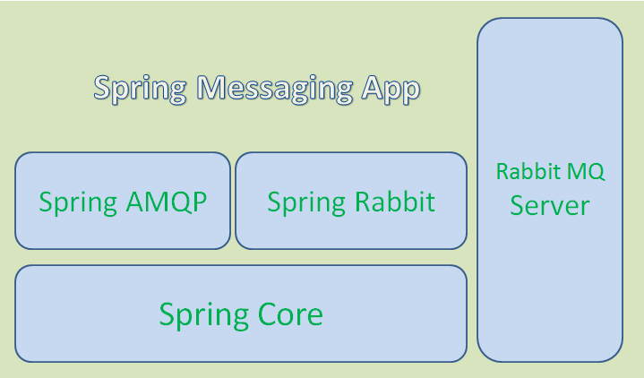

# Cadastrando um livro de forma assíncrona

## Spring AMQP

O projeto Spring AMQP aplica os principais conceitos do Spring ao desenvolvimento de soluções de mensagens baseadas no AMQP. Ele fornece um "modelo" como uma abstração de alto nível para enviar e receber mensagens. Ele também fornece suporte para POJOs orientados por mensagens com um "listener container". Essas bibliotecas facilitam o gerenciamento de recursos do AMQP enquanto promovem o uso de injeção de dependência e configuração declarativa.

O projeto consiste em duas partes; O spring-amqp é a abstração base e o spring-rabbit é a implementação do RabbitMQ.



## Criando um cadastro de livro que "demora"

Em nosso controller vamos adicionar um método que cadastra um livro mas que demora a responder:

Agora vamos ajustar o controller de fato:

- ```src/main/java/com/acme/livroservice/LivrosController.java```

```java
// Código atual omitido
import java.util.concurrent.TimeUnit;

@RestController
@RequestMapping("/livros")
public class LivrosController {

    // Código atual omitido
	@PostMapping("/demorado")
	@ResponseStatus(HttpStatus.CREATED)
	public Livro adicionarLivroDemorado(@RequestBody Livro livro) throws InterruptedException {
		return salvarLivroDemorado(livro);
	}
	
	public Livro salvarLivroDemorado(Livro livro) throws InterruptedException {
		logger.info("adicionarLivroDemorado iniciou: " + livro);
		TimeUnit.SECONDS.sleep(3);
		Livro livroSalvo = repository.save(livro);
		logger.info("adicionarLivroDemorado terminou: " + livroSalvo);
		return livroSalvo;
	}
}
```

Utilizando o RESTClient do Firefox, veja se realmente o livro está sendo salvo mas a requisição deve estar demorando 3 segundos para responder.

## Um cenário para a utilização de filas

Vamos imaginar que temos um problema que é o tempo de processamento do salvamento dos livros está demorando, para resolver isso, podemos fazer com que nossa aplicação, ao receber a solicitação de cadastramento de um livro, envie esta solicitação para uma fila e responda imediatamente ao solicitante. A fila será processada na medida da disponibilidade dos recursos. Utilizaremos o RabbitMQ para esta funcionalidade.

## Adicionando Dependências ao ```pom.xml``` de Nossa Aplicação

Vamos incluir as depenências ```spring-boot-starter-amqp``` em nosso ```pom.xml```:

- ```pom.xml```

```xml
  <!-- Código anterior omitido -->
  <dependencies>
    
    <!-- Dependências atuais omitidas -->
    <dependency>
        <groupId>org.springframework.boot</groupId>
        <artifactId>spring-boot-starter-amqp</artifactId>
    </dependency>

  </dependencies>
  <!-- Código posterior omitido -->
```

## Crie um receptor de mensagem RabbitMQ

Com qualquer aplicativo baseado em mensagens, você precisa criar um receptor que responda às mensagens publicadas.

- ```src/main/java/com/acme/livroservice/Receiver.java```

```java
package com.acme.livroservice;

import java.util.concurrent.TimeUnit;

import org.slf4j.Logger;
import org.slf4j.LoggerFactory;
import org.springframework.stereotype.Component;

@Component
public class Receiver {
	Logger logger = LoggerFactory.getLogger(LivrosController.class);

    public void receiveMessage(String message) throws InterruptedException {
    	logger.info("Recebeu <" + message + ">");
         TimeUnit.SECONDS.sleep(3);
         logger.info("Processou <" + message + ">");
    }
}
```

O ```Receiver``` é um POJO simples que define um método para receber mensagens. Poderia ser utilizado qualquer outro nome desejado.

## Registre o listener e envie uma mensagem

O RabbitTemplate do Spring AMQP fornece tudo o que você precisa para enviar e receber mensagens com o RabbitMQ. Especificamente, você precisa configurar:

- Um contêiner do listener de mensagens;
- Declarar a fila, a *exchange* e o *binding* entre eles;

O Spring Boot cria automaticamente um *connection factory* e um RabbitTemplate, reduzindo a quantidade de código que você precisa escrever.
Você usará o RabbitTemplate para enviar mensagens e registrará um Receiver com o contêiner do listener de mensagens para receber mensagens. O connection factory aciona ambos, permitindo que eles se conectem ao servidor RabbitMQ.

- ```src/main/java/com/acme/livroservice/LivroServiceApplication.java```

```java
package com.acme.livroservice;

import org.springframework.amqp.core.Binding;
import org.springframework.amqp.core.BindingBuilder;
import org.springframework.amqp.core.Queue;
import org.springframework.amqp.core.TopicExchange;
import org.springframework.amqp.rabbit.connection.ConnectionFactory;
import org.springframework.amqp.rabbit.listener.SimpleMessageListenerContainer;
import org.springframework.amqp.rabbit.listener.adapter.MessageListenerAdapter;
import org.springframework.boot.SpringApplication;
import org.springframework.boot.autoconfigure.SpringBootApplication;
import org.springframework.context.annotation.Bean;

@SpringBootApplication
public class LivroServiceApplication {

	static final String TOPIC_EXCHANGE_NAME = "livro-service-exchange";
	static final String QUEUE_NAME = "livro-service-queue";
	static final String MATRICULA = "NNNNNNNN";
	static final String ROUTING_KEY = "livro-service.cadastrar." + MATRICULA;
	
    @Bean
    public Queue queue() {
        return new Queue(QUEUE_NAME, false);
    }

    @Bean
    public TopicExchange exchange() {
        return new TopicExchange(TOPIC_EXCHANGE_NAME);
    }

    @Bean
    public Binding binding(Queue queue, TopicExchange exchange) {
        return BindingBuilder.bind(queue).to(exchange).with(ROUTING_KEY);
    }

    @Bean
    public SimpleMessageListenerContainer container(ConnectionFactory connectionFactory,
            MessageListenerAdapter listenerAdapter) {
        SimpleMessageListenerContainer container = new SimpleMessageListenerContainer();
        container.setConnectionFactory(connectionFactory);
        container.setQueueNames(QUEUE_NAME);
        container.setMessageListener(listenerAdapter);
        return container;
    }
    

    @Bean
    MessageListenerAdapter listenerAdapter(Receiver receiver) {
        return new MessageListenerAdapter(receiver, "receiveMessage");
    }
    
	public static void main(String[] args) {
		SpringApplication.run(LivroServiceApplication.class, args);
	}
}
```

O bean definido no método ```listenerAdapter()``` é registrado como um listener de mensagens no contêiner definido em ```container()```. Ele escutará as mensagens na fila "livro-service-queue". Como a classe Receiver é um POJO, ela precisa ser agrupada no MessageListenerAdapter, em que você especifica que invoque receiveMessage.

O método ```queue()``` cria uma fila AMQP. O método ```exchange()``` cria uma *exchange* de tópicos. O método ```binding()``` associa estes dois, definindo o comportamento que ocorre quando o RabbitTemplate publica em uma *exchange*.

O Spring AMQP requer que o Queue, o TopicExchange e o Binding sejam declarados como beans Spring de nível superior para serem configurados corretamente.

Nesse caso, usamos uma *exchange* de tópicos e a fila é vinculada à chave de roteamento "livro-service.cadastrar.NNNNNN" (onde NNNNNN é a matrícula do usuário).  Que significa qualquer mensagem enviada com uma chave de roteamento "livro-service.cadastrar.NNNNNN" será encaminhado para a fila.

## Enviando as mensagens

Agora, ajustaremos nosso controller para que envie as mensagens ao *broker*:

- ```src/main/java/com/acme/livroservice/LivrosController.java```

```java
package com.acme.livroservice;

import java.util.List;
import java.util.Optional;
import java.util.concurrent.TimeUnit;

import org.slf4j.Logger;
import org.slf4j.LoggerFactory;
import org.springframework.amqp.rabbit.core.RabbitTemplate;
import org.springframework.data.jpa.domain.Specification;
import org.springframework.http.HttpStatus;
import org.springframework.web.bind.annotation.DeleteMapping;
import org.springframework.web.bind.annotation.GetMapping;
import org.springframework.web.bind.annotation.PathVariable;
import org.springframework.web.bind.annotation.PostMapping;
import org.springframework.web.bind.annotation.PutMapping;
import org.springframework.web.bind.annotation.RequestBody;
import org.springframework.web.bind.annotation.RequestMapping;
import org.springframework.web.bind.annotation.RequestParam;
import org.springframework.web.bind.annotation.ResponseStatus;
import org.springframework.web.bind.annotation.RestController;
import org.springframework.web.server.ResponseStatusException;

@RestController
@RequestMapping("/livros")
public class LivrosController {

	Logger logger = LoggerFactory.getLogger(LivrosController.class);

	private final LivroRepository repository;
	
    // Novidade aqui
	private final RabbitTemplate rabbitTemplate;

    // Novidade aqui
	LivrosController(LivroRepository repository, RabbitTemplate rabbitTemplate) {
		this.repository = repository;
		this.rabbitTemplate = rabbitTemplate;
	}

    // Código atual omitido
	
    // Novidade aqui
	@PostMapping("/assincrono")
	@ResponseStatus(HttpStatus.CREATED)
	public void adicionarLivroAssincrono(@RequestBody Livro livro) throws InterruptedException {
		logger.info("adicionarLivroAssincrono iniciou: " + livro);
		rabbitTemplate.convertAndSend(LivroServiceApplication.TOPIC_EXCHANGE_NAME, LivroServiceApplication.ROUTING_KEY, livro.toString());
        logger.info("adicionarLivroAssincrono terminou");
	}
	
}
```

## Configurando o endereço do broker

A configuração do endereço do broker é feita no arquivo ```application.properties```, deixaremos o log com nível ```DEBUG``` para que possamos ver as mensagens que estão sendo enviadas.

- ```/src/main/resources/application.properties```

```
logging.level.org.springframework.amqp=DEBUG
spring.rabbitmq.host=[IP-DO-HOST]
```

## Testando o envio de mensagens

Ótimo, agora já é possível ver as mensagens sendo enviadas e processadas por nossa aplicação.

```
2019-01-26 15:41:12.746 DEBUG 22796 --- [nio-8080-exec-1] o.s.amqp.rabbit.core.RabbitTemplate      : Publishing message (Body:'Livro [id=null, autor=Miguel de Cervantes, titulo=Don Quixote, preco=144.0]' MessageProperties [headers={}, contentType=text/plain, contentEncoding=UTF-8, contentLength=75, deliveryMode=PERSISTENT, priority=0, deliveryTag=0])on exchange [livro-service-exchange], routingKey = [livro-service.cadastrar.NNNNNNNN]
```

## Envio de objetos na mensagem

Um payload de uma mensagem é um array de bytes, deste modo, podemos enviar representações serializadas do objeto e recebê-las para facilitar o processamento, vamos fazer uma alteração e permitir que o objeto "Livro" seja enviado serializado na mensagem.

O primeiro passo é tornar o Livro um objeto serializável:

- ```/src/main/java/com/acme/livroservice/Livro.java```

```java
package com.acme.livroservice;

import java.io.Serializable;

import javax.persistence.Entity;
import javax.persistence.GeneratedValue;
import javax.persistence.Id;

@Entity
// Novidade aqui
public class Livro implements Serializable {
	private static final long serialVersionUID = 1L;

    // Código atual omitido
}
```

Vamos ajustar em seguida a classe ```LivrosController``` para que faça o envio de uma instância do próprio Livro e não sua representação textual:

- ```src/main/java/com/acme/livroservice/LivrosController.java```

```java
// Código atual omitido
public class LivrosController {

    // Código atual omitido
    @PostMapping("/assincrono")
	@ResponseStatus(HttpStatus.CREATED)
	public void adicionarLivroAssincrono(@RequestBody Livro livro) throws InterruptedException {
		logger.info("adicionarLivroAssincrono iniciou: " + livro);
		rabbitTemplate.convertAndSend(LivroServiceApplication.TOPIC_EXCHANGE_NAME, LivroServiceApplication.ROUTING_KEY, livro);
	}
}
```

O ```Receiver``` também deve ser ajustado, e agora, já poderá fazer a persistência do objeto recebido:

- ```src/main/java/com/acme/livroservice/Receiver.java```

```java
package com.acme.livroservice;

import java.util.concurrent.TimeUnit;

import org.slf4j.Logger;
import org.slf4j.LoggerFactory;
import org.springframework.stereotype.Component;

@Component
public class Receiver {

	Logger logger = LoggerFactory.getLogger(LivrosController.class);

	private final LivroRepository repository;

	Receiver(LivroRepository repository) {
		this.repository = repository;
	}

	public void receiveMessage(Livro livro) throws InterruptedException {
		logger.info("Recebeu <" + livro.toString() + ">");
		TimeUnit.SECONDS.sleep(3);
		repository.save(livro);
		logger.info("Processou <" + livro.toString() + ">");
	}
}
```

Se consultar o log, verá que agora o conteúdo enviado é bem diferente, em especial o ```contentType```:

```
Received message: (Body:'[B@57e45b61(byte[261])' MessageProperties [headers={}, contentType=application/x-java-serialized-object, contentLength=0, receivedDeliveryMode=PERSISTENT, priority=0, redelivered=true, receivedExchange=livro-service-exchange, receivedRoutingKey=livro-service.cadastrar.NNNNNNNN, deliveryTag=2, consumerTag=amq.ctag-zAyzUsjDXcANxFYigaP4dA, consumerQueue=livro-service-queue])
```

Conseguimos enviar o objeto ao *broker*, recebê-lo em seguida e fazer sua persistência no banco. Porém estamos trafegando dados binários, o que dificulta a integração de nossa aplicação com outras tecnologias (talvez um serviço Node poderia enviar o livro para persistência).

Para evitar este problema, iremos alterar novamente o projeto para que o Livro seja enviado no formato JSON.

Algumas alterações são necessárias, primeiro no ```Receiver```:

- ```src/main/java/com/acme/livroservice/Receiver.java```

```java
// Código atual omitido

@Component
public class Receiver {

	// Código atual omitido

	@RabbitListener(queues = LivroServiceApplication.QUEUE_NAME)
    public void receiveMessage(final Livro livro) throws InterruptedException {
		logger.info("Recebeu <" + livro.toString() + ">");
		TimeUnit.SECONDS.sleep(3);
		repository.save(livro);
		logger.info("Processou <" + livro.toString() + ">");
    }
}
```

Em ```LivroServiceApplication``` devemos excluir (ou comentar) os métodos ```container``` e ```listenerAdapter``` e incluir os métodos abaixo:

- ```src/main/java/com/acme/livroservice/LivroServiceApplication.java```

```java

// Código atual omitido

@SpringBootApplication
public class LivroServiceApplication {

    // Código atual omitido

    @Bean
    public RabbitTemplate rabbitTemplate(final ConnectionFactory connectionFactory, MessageConverter producerJackson2MessageConverter) {
        final RabbitTemplate rabbitTemplate = new RabbitTemplate(connectionFactory);
        rabbitTemplate.setMessageConverter(producerJackson2MessageConverter);
        return rabbitTemplate;
    }
    
    @Bean
    public Jackson2JsonMessageConverter producerJackson2MessageConverter() {
        return new Jackson2JsonMessageConverter();
    }
}
```

Tudo deve continuar funcionando como antes, porém, ao incluirmos um livro, a saída do log deve conter algo como:

```
2019-01-26 17:02:42.892 DEBUG 18736 --- [cTaskExecutor-1] o.s.a.r.listener.BlockingQueueConsumer   : Received message: (Body:'{"id":null,"autor":"Miguel de Cervantes","titulo":"Don Quixote","preco":144.0}' MessageProperties [headers={__TypeId__=com.acme.livroservice.Livro}, contentType=application/json, contentEncoding=UTF-8, contentLength=0, receivedDeliveryMode=PERSISTENT, priority=0, redelivered=false, receivedExchange=livro-service-exchange, receivedRoutingKey=livro-service.cadastrar.NNNNNNNN, deliveryTag=1, consumerTag=amq.ctag-AvOxDohdkBt6IgVdpToobQ, consumerQueue=livro-service-queue])
```

Perceba que o conteúdo do ```Body``` é um JSON e ```contentType``` agora é ```application/json```.

> Para desabilitar temporariamente o RabbitMQ e evitar erros de conexão durante o restante do treinamento, anote a classe Receiver com ```@Profile("disabled")```

## Fontes

- https://spring.io/projects/spring-amqp
- https://spring.io/guides/gs/messaging-rabbitmq/
- https://thepracticaldeveloper.com/2016/10/23/produce-and-consume-json-messages-with-spring-boot-amqp/
