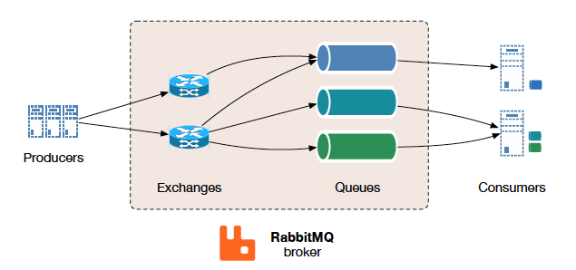

# RabbitMQ

RabbitMQ é um servidor de mensageria de código aberto (open source) desenvolvido em Erlang, implementado para suportar mensagens em um protocolo denominado *Advanced Message Queuing Protocol (AMQP)*. Ele possibilita lidar com o tráfego de mensagens de forma rápida e confiável, além de ser compatível com diversas linguagens de programação, possuir interface de administração nativa e ser multiplataforma.

Dentre as aplicabilidades do RabbitMQ estão possibilitar a garantia de assincronicidade entre aplicações, diminuir o acoplamento entre aplicações, distribuir alertas, controlar fila de trabalhos em background.

## Outras características do RabbitMQ:

- É desenvolvido em Erlang;
- É considerado rápido e confiável;
- Compatível com os principais sistemas operacionais;
- Suporta diversas plataformas de desenvolvimento. Bibliotecas de conexão com o RabbitMQ estão disponíveis em diversas linguagens de programação;

## Visão Geral

O RabbitMQ é um *message broker*: recebe e encaminha mensagens. Você pode pensar como uma agência dos correios: quando você coloca a carta que deseja postar em uma caixa postal, pode ter certeza de que o carteiro entregará a correspondência ao seu destinatário. Nessa analogia, o RabbitMQ é uma caixa postal, um correio e um carteiro.

A principal diferença entre o RabbitMQ e os correios é que ele não lida com papel, ao invés disso ele aceita, armazena e envia dados binários - mensagens.

<!--

O *broker* é uma entidade que recebe mensagens de *publishers* - ou seja, clientes que produzem mensagens - e encaminha mensagens a *consumers*, que são clientes que recebem (consomem) mensagens. Assim, o AMQP é um protocolo bi-direcional onde um cliente pode enviar e receber mensagens de outros clientes através do broker.

Ao publicar uma mensagem, o cliente *publisher* encaminha esta mensagem a outra entidade denominada *exchange*, que de acordo com regras específicas (e programáveis!) denominadas *bindings* as encaminham para filas (*queues*) que, por sua vez, podem estar sendo consumidas por um outro cliente, o *consumer*. *Broker*, *publishers*, *consumers*, *exchanges*, *bindings* e *queues* são as palavras chaves para entender o funcionamento do protocolo. O AMQP é um grande canivete suíço: ele oferece uma grande variedade de regras que podem ser altamente personalizadas de acordo com a finalidade de nossa aplicação.

De forma simples e resumida, o funcionamento do AMQP pode ser comparado a um sistema de correios conforme mostra a figura abaixo: o cliente *Publisher* escreve uma mensagem e a encaminha para um *exchange*, que se assemelha a uma caixa de correio. A seguir, já no *broker* - que pode ser entendido como os Correios, por exemplo - esta mensagem é encaminhada de acordo com regras específicas (*bindings*) através de rotas a uma *queue*, que pode ser entendida como uma caixa postal, por exemplo. Finalmente, um cliente *Consumer* monitora a *queue* (caixa postal) para, então, ler a mensagem.

- Diagrama do Funcionamento do Exchange tipo Direto no AMQP.
 

Uma das principais características do AMQP é que o *publisher* jamais publica uma mensagem diretamente em uma fila. A mensagem sempre é encaminhada ao *exchange* que, de acordo com seu tipo e com as configurações especificadas através de *bindings*, a encaminha para determinada fila ou a descarta.

### Protocolo Programável (e Exchanges!)

Rotas, exchanges, filas e outras entidades podem ser programadas diretamente pelas aplicações (clientes). A função de administração do sistema passa a ser somente no sentido de criar regras de acesso e permissões para determinadas ações. Dessa forma, o AMQP 0-9-1 é um protocolo "programável", deixando boa parte das ações a cargo dos usuários/clientes.

Esse grande "canivete suíço" que é o AMQP 0-9-1 proporciona aos desenvolvedores grande liberdade ao desenvolver aplicações específicas e personalizáveis. No entanto, o esforço concentra-se em compreender as especificidades do protocolo, bem como a correta utilização de suas entidades.

Falaremos agora de uma dessas entidades, os Exchanges!

#### Por que é importante conhecer os Exchanges e seus tipos?

O exchange é uma entidade que recebe as mensagens que chegam ao broker vindas de aplicações clientes. Estas aplicações desconhecem a existência das filas. É através do *Exchange* que determinada mensagem é roteada para uma ou mais filas a partir de regras denominadas bindings. Há alguns tipos de *Exchanges* que implementam diferentes características de roteamento das mensagens recebidas. A saber, são tipos de *Exchanges*: Direct, Fanout, Topic e Headers. Além do tipo, outros parâmetros definem um Exchange: nome, durabilidade, auto-delete, argumentos, etc.

As mensagens que são publicadas no broker e as mensagens que são consumidas possuem um parâmetro chamado *routing key*, que no caso de filas que são atreladas a um *exchange*, também pode ser chamado de *binding key*. Este parâmetro nada mais é do que um identificador do caminho da mensagem e serve de base para armazenar corretamente as mensagens em filas. Este conceito ficará mais claro a seguir, quando apresentarmos o Exchange do tipo Direto (Direct) e do tipo Tópico (Topic).

#### Direct Exchange

O Exchange do tipo Direto entrega mensagens às filas de acordo com o *routing key* da mensagem. Isto é, se uma fila foi bounded (roteada) a um exchange com determinado *routing key (binding key)*, toda mensagem que chegar ao broker destinada a um exchange do tipo Direct com determinado routing key, será redirecionada à fila associada a este mesmo *routing key (binding key)*. Este tipo de exchange é utilizado principalmente para a distribuição de tarefas entre diversos consumidores.

- Diagrama do Funcionamento do Exchange tipo Direto.

Supondo-se o caso de uma tarefa complexa que deseja-se distribuir entre diversos consumidores (workers, neste caso), a figura acima exibe o funcionamento do Exchange do tipo direto: a mensagem é enviada ao broker contendo uma operação a ser realizada em uma imagem e, de acordo com o routing key da mensagem, o exchange do tipo Direct encaminha a mensagem para as filas que estão atreladas (bounded) ao exchange com o mesmo routing key (também conhecido como binding key, no caso das filas).

#### Topic Exchange

O Exchange do tipo Tópico (Topic) é utilizado para comunicação no padrão publica/subscreve (publish/subscribe) e, assim, é utilizado para monitorar mensagens de acordo com padrões no routing key da mensagem, ou seja, o consumidor pode "escolher" que tipo de mensagem deseja receber e, simetricamente, quem publica a mensagem no Exchange indica um assunto/tópico - através do routing key - ao qual a mensagem se refere.

Como um exemplo de aplicação, suponha que gostaríamos de implementar um sistema de logs no qual os consumidores monitoram mensagens de log de diferentes origens/módulos (kernel do sistema, gerenciamento de usuários, rede) e de diferentes níveis (informação, alertas, erros). Cada mensagem gerada contém tanto a origem (kernel/users/network) como o nível do log (info/warning/error) representados como uma lista de dois elementos (poderiam ser mais!) separados por pontos (".") no routing key. Por exemplo, a mensagem que contém o routing key igual a "ker.info" representa uma mensagem de log gerada pelo kernel do sistema e representa um nível informacional.

Consumidores destas mensagens podem monitorar determinado routing key (ou binding key, uma vez que estão associadas a uma fila) e executar ações específicas. Por exemplo, o consumidor A, que é responsável pela saúde de todo o sistema, está interessado em monitorar todas as mensagens de log de erros, independente do módulo que gerou a mensagem. Outro consumidor (B, por exemplo) está interessado somente nas mensagens do módulo de gerenciamento de usuários (users) independente do nível (info/warning/error). Para tal roteamento das mensagens, o exchange do tipo Topic permite a utilização de caracteres especiais no binding key das filas associadas ao exchange. Por fim, o consumidor C está interessado em todas as mensagens de log. Assim:

- "\*" pode substituir uma palavra no binding key;
- "#" pode substituir uma ou mais palavras no binding key.

Para o consumidor A, este poderia consumir da fila com binding key igual a "\*.error", enquanto que o consumidor B consome de "users.\*" e o consumidor C de "\*.\*". Observe que o consumidor C poderia consumir também de "#", porém no primeiro caso ("\*.\*") o consumidor C receberia mensagens publicadas com exatamente duas palavras no routing key, enquanto que no segundo caso ("#") consumiria qualquer mensagem publicada no exchange, independente da quantidade de palavras no routing key. Vejamos alguns exemplos.

A figura a seguir exibe a representação do fluxo de uma mensagem de log do tipo "users.error". Neste caso, os consumidores A, B e C - associados às filas com bindings para "*.error", "users.*" e "*.*", respectivamente - recebem a mensagem de log com routing key "users.error", uma vez que os critérios para estes bindings são todos satisfeitos:

- Diagrama do Roteamento de uma Mensagem de Log "users.error" em um Topic Exchange.

A figura a seguir representa o roteamento para uma mensagem com routing key igual a "users.info". Observe que, para este caso, o binding key da fila 1 não é satisfeito e, portanto, a mensagem não é entregue ao consumidor A:

- Diagrama do Roteamento de uma Mensagem de Log “users.info” em um Topic Exchange.

Finalmente, a figura a seguir exibe o roteamento para uma mensagem com routing key igual a "kern.warning". Observe que somente o Consumidor C recebe a mensagem, uma vez que é o único consumidor da fila que possui um binding compatível com a mensagem.

- Diagrama do Roteamento de uma Mensagem de Log "kern.warning" em um Topic Exchange.

Com esta breve introdução, pudemos ver um pouco do funcionamento do AMQP 0-9-1. O roteamento das mensagens, a criação de filas atreladas a determinado exchange de acordo com regras (bindings), a definição do tipo do exchange e até mesmo a criação de um exchange podem ser realizados pelos clientes. Assim, confirmando o que já dissemos, o AMQP 0-9-1 é um protocolo que possibilita bastante personalização através do lado das aplicações.

### Resumo

*Produzir* significa nada mais que enviar. Um programa que envia mensagens é um *produtor*:

Uma *fila* (queue) é o nome de uma caixa postal que vive no RabbitMQ. Embora as mensagens fluam pelo RabbitMQ e suas aplicações, elas só podem ser armazenadas em uma fila. Uma fila só é limitada pelos limites de memória e disco do host, é essencialmente um grande buffer de mensagem. Muitos *produtores* podem enviar mensagens para uma fila e muitos *consumidores* podem tentar receber dados de uma fila. É assim que representamos uma fila:

*Consumir* tem um significado semelhante ao receber. Um consumidor é um programa que espera principalmente receber mensagens:

Observe que o produtor, o consumidor e o broker não precisam residir no mesmo host; na verdade, na maioria das aplicações eles não residem. Uma aplicação pode ser produtora e consumidora também.

No diagrama abaixo, "P" é nosso produtor e "C" é nosso consumidor. A caixa no meio é uma fila - um buffer de mensagem que o RabbitMQ mantém para o consumidor.

-->

<!--

-----------------------------------------

https://www.rabbitmq.com/install-windows-manual.html

docker run --hostname my-rabbit --name some-rabbit rabbitmq:3

"Olá Mundo"
(usando o cliente Java)
Nesta parte do tutorial, vamos escrever dois programas em Java; um produtor que envia uma única mensagem e um consumidor que recebe mensagens e as imprime. Vamos passar alguns detalhes na API Java, concentrando-nos nesta coisa muito simples apenas para começar. É um "Hello World" de mensagens.

(P) -> [|||] -> (C)
A biblioteca cliente Java
O RabbitMQ fala vários protocolos. Este tutorial usa o AMQP 0-9-1, que é um protocolo aberto de uso geral para mensagens. Existem vários clientes para o RabbitMQ em muitos idiomas diferentes. Usaremos o cliente Java fornecido pelo RabbitMQ.

Baixe a biblioteca cliente e suas dependências (SLF4J API e SLF4J Simple). Copie esses arquivos em seu diretório de trabalho, junto aos arquivos Java dos tutoriais.

Observe que o SLF4J Simple é suficiente para tutoriais, mas você deve usar uma biblioteca de registro completa como o Logback em produção.

(O cliente RabbitMQ Java também está no repositório central do Maven, com o groupId com.rabbitmq e o artifactId amqp-client.)

Agora temos o cliente Java e suas dependências, podemos escrever algum código.

Envio
(P) -> [|||]
Vamos ligar para o nosso editor de mensagens (remetente) Enviar e nossa mensagem consumidor (receptor) Recv. O editor se conectará ao RabbitMQ, enviará uma única mensagem e sairá.

Em Send.java, precisamos de algumas classes importadas:

import com.rabbitmq.client.ConnectionFactory;
import com.rabbitmq.client.Connection;
import com.rabbitmq.client.Channel;
Configure a classe e nomeie a fila:

public class Enviar {
  sequência final privada estática QUEUE_NAME = "olá";
  public static void main (String [] argv) gera exceção {
      ...
  }
}
então podemos criar uma conexão com o servidor:

ConnectionFactory factory = novo ConnectionFactory ();
factory.setHost ("localhost");
tente (Connection connection = factory.newConnection ();
     Canal canal = connection.createChannel ()) {

}
A conexão abstrai a conexão do soquete e cuida da negociação e autenticação da versão do protocolo e assim por diante. Aqui nos conectamos a um corretor na máquina local - daí o localhost. Se quiséssemos nos conectar a um corretor em uma máquina diferente, nós simplesmente especificaríamos seu nome ou endereço IP aqui.

Em seguida, criamos um canal, que é onde reside a maior parte da API para fazer as coisas. Note que podemos usar uma instrução try-with-resources porque Connection e Channel implementam java.io.Closeable. Dessa forma, não precisamos fechá-los explicitamente em nosso código.

Para enviar, devemos declarar uma fila para nós enviarmos para; então podemos publicar uma mensagem na fila, tudo isso na declaração try-with-resources:

channel.queueDeclare (QUEUE_NAME, false, false, false, null);
String message = "Olá mundo!";
channel.basicPublish ("", QUEUE_NAME, null, message.getBytes ());
System.out.println ("[x] Enviados" "+ mensagem +" '");
Declarar uma fila é idempotente - ela só será criada se já não existir. O conteúdo da mensagem é uma matriz de bytes, para que você possa codificar o que quiser.

Aqui está toda a classe Send.java.

Envio não funciona!
Se esta é sua primeira vez usando RabbitMQ e você não vê o "Enviado"

-->

## Fontes

- https://www.rabbitmq.com/tutorials/amqp-concepts.html
- https://www.rabbitmq.com/tutorials/tutorial-one-java.html
- https://spring.io/guides/gs/messaging-rabbitmq/

<!--
- https://www.embarcados.com.br/amqp-protocolo-de-comunicacao-para-iot/
http://localhost:15672/#/ guest/guest
https://www.cloudamqp.com/docs/usecases.html
https://spring.io/understanding/AMQP
https://grokonez.com/spring-framework/spring-amqp/rabbitmq-sendreceive-java-object-messages-spring-rabbitmq-springboot
-->
