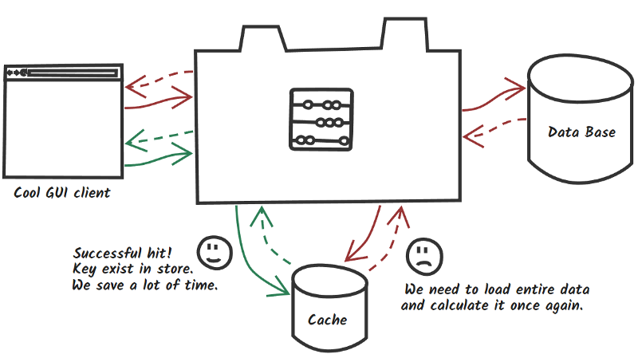
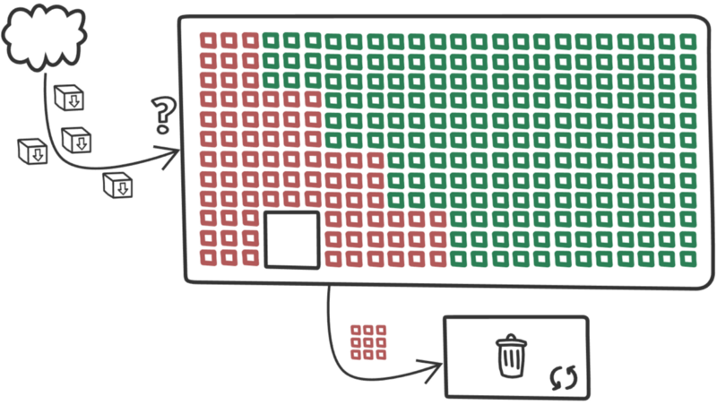

# Cache com Redis

## Introdução ao Redis

Redis é uma **estrutura de dados em memória** open source (licenciado pelo BSD), usado como banco de dados, cache e message broker. Ele suporta estruturas de dados como  strings, hashes, lists, sets, sorted sets com range queries, bitmaps, hyperloglogs, geospatial indexes com radius queries e streams. O Redis possui replicação integrada, suporte a script Lua, transações e diferentes níveis de persistência em disco, e fornece alta disponibilidade via Redis Sentinel e particionamento automático com o Redis Cluster.

Você pode executar **operações atômicas** nesses dados, como anexar a uma string; incrementar o valor em um hash; incluir um elemento em uma lista; calcular um conjunto de intersecção, união e diferença; ou obter o membro com a classificação mais alta em um conjunto classificado.

Para alcançar seu excelente desempenho, o Redis trabalha com um conjunto de **dados na memória**. Dependendo do seu caso de uso, você pode persistir despejando o conjunto de dados no disco de vez em quando ou anexando cada comando a um log. A persistência pode ser opcionalmente desativada, se você precisar apenas de um cache em memória rico em recursos e em rede.

O Redis também suporta replicação assíncrona master-slave para a configuração, com primeira sincronização não bloqueante muito rápida, reconexão automática com ressincronização parcial em divisão de rede.

Outras características incluem:

- Transações
- Pub/Sub
- Scripting Lua
- Chaves com tempo de vida limitado
- Failover automático

Você pode usar o Redis com a maioria das linguagens de programação.

O Redis é escrito em ANSI C e funciona na maioria dos sistemas POSIX, como Linux, *BSD, OS X, sem dependências externas. Linux e OSX são os dois sistemas operacionais nos quais o Redis é desenvolvido e mais testado, e recomendamos o uso do Linux para implantação. O Redis pode funcionar em sistemas derivados do Solaris, como o SmartOS, mas o suporte é o melhor esforço. Não há suporte oficial para o Windows, mas a Microsoft desenvolve e mantém um port Win-64 do Redis.

## Vantagens

Seguem-se algumas vantagens do Redis.

- **Excepcionalmente rápido** - o Redis é muito rápido e pode realizar cerca de 110000 SETs por segundo, cerca de 81000 GETs por segundo;
- **Suporta tipos de dados avançados** - O Redis suporta nativamente a maioria dos tipos de dados que os desenvolvedores já conhecem, como list, set, sorted set, e hashes. Isso facilita a solução de diversos problemas, pois sabemos qual problema pode ser melhor tratado por qual tipo de dados;
- **As operações são atômicas** - Todas as operações do Redis são atômicas, o que garante que, se dois clientes acessarem simultaneamente, o servidor Redis receberá o valor atualizado;
- **Ferramenta multiserviços** - Redis é uma ferramenta com vários utilitários e pode ser usada em vários casos de uso, como armazenamento em cache, filas de mensagens (Redis suporta nativamente Pub/Sub), quaisquer dados de curta duração em seu aplicativo, como web sessões de aplicativos, contagens de acessos a páginas da Web, etc.

## Cache Spring Boot com Redis

Cada um de nós encontrou a situação quando uma aplicação funciona lentamente. Mesmo o melhor código sofrerá com carga alta. O cache pode ser uma maneira rápida e relativamente barata de aumentar o desempenho e reduzir o tempo de resposta.



De maneira simplificada, o armazenamento em cache é uma das estratégias de desempenho utilizada quando nos deparamos com serviços de longa duração. O resultado da invocação pode ser colocado dentro de um armazenamento rápido na memória e usado na próxima vez sem a dispendiosa execução do método. Seguindo o fluxo "verde", você pode perceber que se encontrarmos dados solicitados no cache (chamados "cache hit"), economizamos tempo e recursos. O fluxo vermelho representa o pior cenário (chamado de "cache miss") quando o cache não armazena os dados esperados e você precisa carregá-lo e recalculá-lo desde o início com uma viagem extra para o cache, o que aumenta o tempo de resposta. Então, como este sistema funciona?



Com uma grande simplificação quando novos dados chegam, eles são colocados no primeiro *bucket* vazio, mas quando o cache está cheio, o processo de limpeza é executado de acordo com o algoritmo de evicção selecionado. Alguns dados são salvos pois são usados com muita frequência ou satisfazem outras condições para o algoritmo escolhido. O resto dos dados são candidatos a serem removidos. No mundo ideal, o cache irá despejar apenas dados antigos até encontrar lugar para novos dados. Com o Spring e o Redis, podemos criar um aplicativo simples e considerar como diferentes fatores podem afetar nossa camada de armazenamento em cache.

## Instalação

Para podermos utilizar o Redis em nosso projeto, primeiro precisamos instalar seu executávem e em seguida ativar o serviço em: Windows -> Serviços -> Redis -> Iniciar

Em seguida, é possível obter informações sobre a instância do Redis em execução pelo utilitário "Redis Client", para isso, inicie a aplicação "Redis Client" e no prompt de comando que se abrirá digite "info":

```
127.0.0.1:6379> info
# Server
redis_version:3.2.100
redis_git_sha1:00000000
redis_git_dirty:0
redis_build_id:dd26f1f93c5130ee
redis_mode:standalone
os:Windows
arch_bits:64
...
```

Um comando útil do Redis Client é a limpeza de cache, que pode ser feita com o comando "flushall":

```
127.0.0.1:6379> flushall
OK
```

O comando "monitor" nos permite monitorar a atividade do cache e é interessante ativá-lo em nossa estação em tempo de desenvolvimento:

```
127.0.0.1:6379> monitor
OK
1548598467.605571 [0 127.0.0.1:50299] "INFO"
1548598477.617364 [0 127.0.0.1:50299] "INFO"
1548598487.631003 [0 127.0.0.1:50299] "INFO"
1548598497.644296 [0 127.0.0.1:50299] "INFO"
1548598498.403433 [0 127.0.0.1:50384] "GET" "livros::3"
1548598498.407438 [0 127.0.0.1:50384] "SET" "livros::3" "\xac\xed\x00\x05sr\x00\x1bcom.acme.livroservice.Livro\x00\x00\x00\x00\x00\x00\x00\x01\x02\x00\x04L\x00\x05autort\x00\x12Ljava/lang/String;L\x00\x02idt\x00\x10Ljava/lang/Long;L\x00\x05precot\x00\x12Ljava/lang/Double;L\x00\x06tituloq\x00~\x00\x01xpt\x00\x19Antoine de Saint-Exup\xc3\xa9rysr\x00\x0ejava.lang.Long;\x8b\xe4\x90\xcc\x8f#\xdf\x02\x00\x01J\x00\x05valuexr\x00\x10java.lang.Number\x86\xac\x95\x1d\x0b\x94\xe0\x8b\x02\x00\x00xp\x00\x00\x00\x00\x00\x00\x00\x03sr\x00\x10java.lang.Double\x80\xb3\xc2J)k\xfb\x04\x02\x00\x01D\x00\x05valuexq\x00~\x00\a@c\x00\x00\x00\x00\x00\x00t\x00\x13O Pequeno Pr\xc3\xadncipe" "PX" "5000"
1548598507.660697 [0 127.0.0.1:50299] "INFO"
1548598517.677073 [0 127.0.0.1:50299] "INFO"
1548598522.057056 [0 127.0.0.1:50384] "KEYS" "livros::*"
1548598527.693947 [0 127.0.0.1:50299] "INFO"
1548598534.540792 [0 127.0.0.1:50384] "GET" "livros::3"
1548598534.543111 [0 127.0.0.1:50384] "SET" "livros::3" "\xac\xed\x00\x05sr\x00\x1bcom.acme.livroservice.Livro\x00\x00\x00\x00\x00\x00\x00\x01\x02\x00\x04L\x00\x05autort\x00\x12Ljava/lang/String;L\x00\x02idt\x00\x10Ljava/lang/Long;L\x00\x05precot\x00\x12Ljava/lang/Double;L\x00\x06tituloq\x00~\x00\x01xpt\x00\x19Antoine de Saint-Exup\xc3\xa9rysr\x00\x0ejava.lang.Long;\x8b\xe4\x90\xcc\x8f#\xdf\x02\x00\x01J\x00\x05valuexr\x00\x10java.lang.Number\x86\xac\x95\x1d\x0b\x94\xe0\x8b\x02\x00\x00xp\x00\x00\x00\x00\x00\x00\x00\x03sr\x00\x10java.lang.Double\x80\xb3\xc2J)k\xfb\x04\x02\x00\x01D\x00\x05valuexq\x00~\x00\a@c\x00\x00\x00\x00\x00\x00t\x00\x13O Pequeno Pr\xc3\xadncipe" "PX" "5000"
```

## Habilitando Cache em Nosso Projeto

O primeiro passo é nos certificarmos que a classe que será armazenada em cache (Livro) implementa a interface ```Serializable```:

**Livro**

```java
@Entity
public class Livro implements Serializable {
	private static final long serialVersionUID = 1L;
	
	private @Id @GeneratedValue Long id;
	private String autor;
	private String titulo;
	private Double preco;
    
    // Código atual omitido
}
```

## Configuração e Dependências

Precisamos colocar ```spring-boot-started-data-redis``` como dependência do projeto. A configuração básica pode ser definida no arquivo de propriedades:

```
spring.cache.type=redis
spring.redis.host=192.168.99.100
spring.redis.port=6379
```

## Abstração de cache

O Spring Framework fornece uma camada de abstração com um conjunto de anotações para suporte a cache que pode operar em conjunto com várias implementações de cache, como Redis, EhCache, Hazelcast, Infinispan e muito mais. O baixo acoplamento é sempre muito bem vindo :)

```@Cacheable``` - Preencher o cache após a execução do método, a próxima chamada com os mesmos argumentos será omitida e o resultado será carregado do cache. Anotação fornece recurso útil chamado cache condicional. Em alguns casos, nem todos os dados devem ser armazenados em cache, por ex. Você quer armazenar na memória apenas posts mais populares.

```@CachePut``` - A anotação permite atualizar a entrada no cache e suportar as mesmas opções, como a anotação em cache.

```@CacheEvict``` - Remove entrada do cache, pode ser tanto condicional quanto global para todas as entradas no cache específico.

```@EnableCaching``` - Anotação assegura que o post processor irá verificar todos os beans que tentam encontrar métodos demarcados e criará proxy para interceptar todas as chamadas;

```@Caching``` - Agrega várias anotações do mesmo tipo quando, por exemplo, você precisa usar diferentes condições e caches.

```@CacheConfig``` - A anotação em nível de classe permite especificar valores globais para anotações como nome do cache ou gerador de chaves.

## Pontos de Atenção

**Dados obsoletos**: Dados muito dinâmicos tornam-se desatualizados rapidamente. Sem atualização ou mecanismo de expiração, o cache servirá conteúdo obsoleto.

**Grande memória nem sempre é igual a maior taxa de acertos**: Quando você atingir uma quantidade específica de memória, a taxa de acertos não aumentará. Neste ponto, muitas coisas dependerão das políticas de despejo e da natureza dos dados.

**Otimização prematura**: Vamos testar seus serviços sem cache, pode ser que seus medos se provem infundados, *"A otimização prematura é a raiz de todo o mal"*.

**Escondendo mau desempenho**: Cache nem sempre é uma resposta para serviços lentos, tente otimizá-los antes, porque quando você os coloca após a camada de cache, você irá esconder possíveis erros de arquitetura.

**Não compartilhe seu cache de redis**: Redis funciona em uma única thread. Outras equipes podem usar seu armazenamento para outras finalidades extensivas. Todas as colisões de dados, comandos pesados ​​(KEYS, SORT, etc.) podem bloquear seu cache e aumentar o tempo de execução. Em caso de problemas de desempenho, verifique o comando SLOWLOG.

**Parâmetro de configuração [maxmemory]**: Se você considera executar seu cache com persistência de captura instantânea, deverá usar menos da metade da memória disponível como *maxmemory* para evitar erros de memória.

**Monitorização**: Você deve monitorar seu cache, de tempos em tempos o INFO não gerará problemas de desempenho, mas o MONITOR pode reduzir drasticamente o throughput.

## Cacheando os Livros

O primeiro passo é incluir a dependência ```spring-boot-starter-data-redis``` em nosso **pom.xml**:

**pom.xml**

```xml
<dependency>
    <groupId>org.springframework.boot</groupId>
    <artifactId>spring-boot-starter-data-redis</artifactId>
</dependency>
```

Agora, vamos colocar em nosso arquivo de propriedades as configurações básicas de cache:

**application.properties**

```
spring.cache.type=redis
spring.redis.host=localhost
spring.redis.port=6379
```

Em seguinda, adicionamos a anotação ```@EnableCaching``` na classe ```LivroServiceApplication```:

**LivroServiceApplication.java**

```java
package com.acme.livroservice;

// Código atual omitido
import org.springframework.cloud.client.discovery.EnableDiscoveryClient;

@SpringBootApplication
@EnableDiscoveryClient
// Novidade aqui
@EnableCaching
public class LivroServiceApplication {
    // Código atual omitido
}
```

Agora, em nosso controller, devemos decorar os métodos que interagem com o cache:

```java
package com.acme.livroservice;

// Código atual omitido
import org.springframework.cache.annotation.CacheEvict;
import org.springframework.cache.annotation.CachePut;
import org.springframework.cache.annotation.Cacheable;

@RestController
@RequestMapping("/livros")
public class LivrosController {

	// Código atual omitido

	@GetMapping("/{id}")
    // Novidade aqui
	@Cacheable(value = "livros", key = "#id")
	public Livro getLivroPorId(@PathVariable Long id) {
		logger.info("getLivroPorId: " + id);
		return repository.findById(id)
				.orElseThrow(() -> new ResponseStatusException(HttpStatus.NOT_FOUND, "Livro não encontrado: " + id));
	}

	@PutMapping("/{id}")
    // Novidade aqui
	@CachePut(value = "livros", key = "#id")
	public Livro atualizarLivro(@RequestBody Livro livro, @PathVariable Long id) {
		logger.info("atualizarLivro: " + livro + " id: " + id);
		return repository.findById(id).map(livroSalvo -> {
			livroSalvo.setAutor(livro.getAutor());
			livroSalvo.setTitulo(livro.getTitulo());
			livroSalvo.setPreco(livro.getPreco());
			return repository.save(livroSalvo);
		}).orElseThrow(() -> new ResponseStatusException(HttpStatus.NOT_FOUND, "Livro não encontrado: " + id));
	}

	@DeleteMapping("/{id}")
    // Novidade aqui
	@CacheEvict(value = "livros", allEntries=true)
	@ResponseStatus(HttpStatus.NO_CONTENT)
	public void excluirLivro(@PathVariable Long id) {
		logger.info("excluirLivro: " + id);
		repository.deleteById(id);
	}
}
```

Execute o projeto e faça algumas solicitações para os livros, você verá que a primeira solicitação para detalhar um livro de fato aciona o método, mas da segunda solicitação em diante o método não é acionado, sendo retornado o conteúdo que está cacheado.

Para incluir um TTL (time to live) do cache, adicione a propriedade ```spring.cache.redis.time-to-live``` ao arquivo de propriedades:

**application.properties**

```
spring.cache.redis.time-to-live=5000
```

Um toque final interessante é configurar o cache para ser desabilitado durante a execução dos testes, uma vez que o teste pode ser realizado em um ambiente de CI/CD onde o servidor Redis pode estar indisponível, para isso, adicione a propriedade ```spring.data.redis.repositories.enabled=false``` no arquivo **application.properties** da pasta ```/src/test/resources```:

**application.properties**

```
spring.data.redis.repositories.enabled=false
```

## Fontes

- https://redis.io/topics/introduction
- https://www.tutorialspoint.com/redis/
- https://www.baeldung.com/spring-data-redis-tutorial
- https://medium.com/@MatthewFTech/spring-boot-cache-with-redis-56026f7da83a
