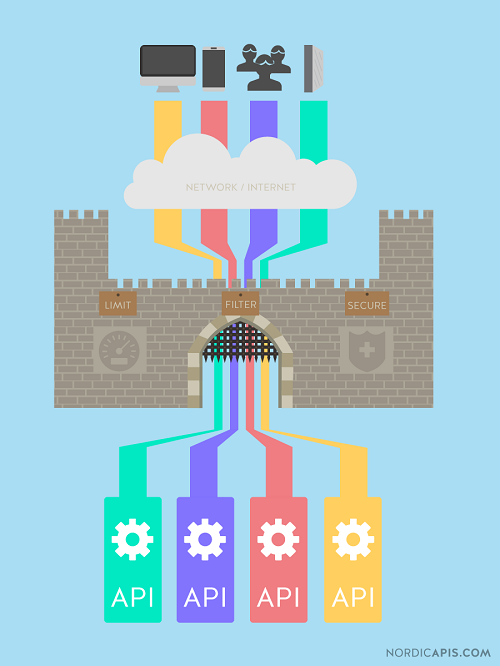
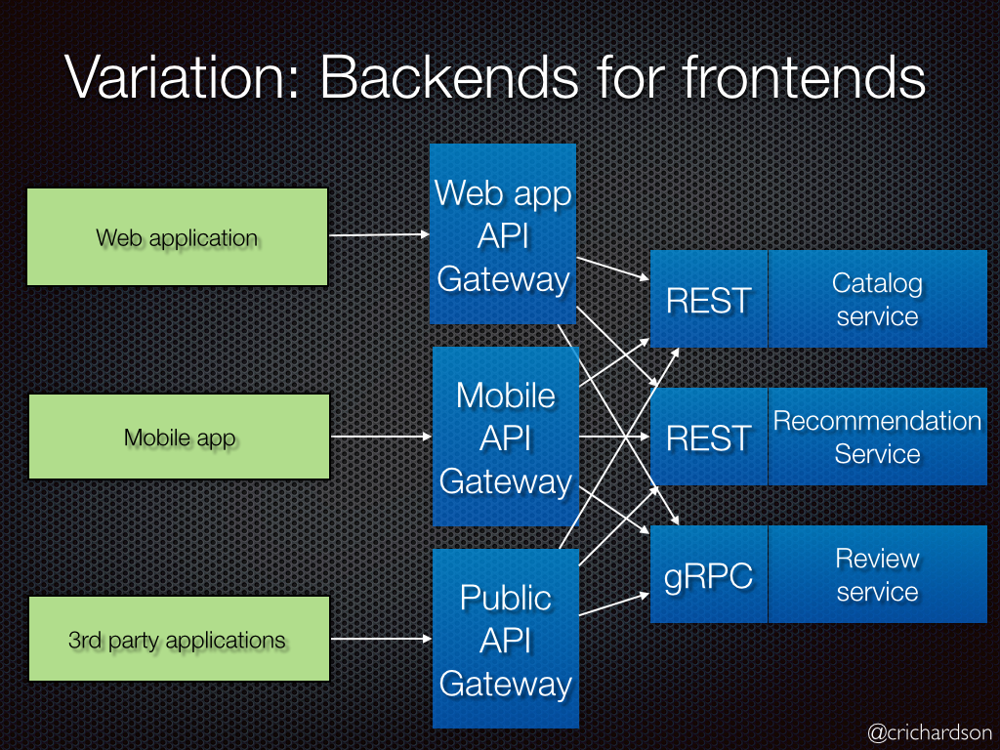

# Gateway

Em tempos em que centenas de dispositivos interagem com Microserviços e servidores baseado em APIs, um Gateway de APIs pode se ser uma porta de entrada única para a sua arquitetura interna.

Vale lembrar que ter um Gateway de APIs é uma escolha óbvia quando falamos de aumentar segurança, experiência do usuário e facilidade para construção de um ecossistema digital.

## Necessidades

- A granularidade das APIs fornecidas pelos microsserviços é frequentemente diferente do que um cliente precisa. Os microsserviços geralmente fornecem APIs refinadas, o que significa que os clientes precisam interagir com vários serviços. Por exemplo, um cliente que precisa dos detalhes de um produto precisa buscar dados de vários serviços.
- Clientes diferentes precisam de dados diferentes. Por exemplo, a versão do navegador de desktop de uma área de trabalho de página de detalhes do produto é tipicamente mais elaborada do que a versão para celular.
- O desempenho da rede é diferente para diferentes tipos de clientes. Por exemplo, uma rede móvel é normalmente muito mais lenta e tem latência muito maior do que uma rede não móvel. E, claro, qualquer WAN é muito mais lenta que uma LAN. Isso significa que um cliente móvel nativo usa uma rede que possui características de desempenho muito diferentes de uma LAN usada por um aplicativo da Web do lado do servidor. O aplicativo da Web do lado do servidor pode fazer várias solicitações para serviços de back-end sem afetar a experiência do usuário, pois um cliente móvel pode fazer apenas alguns.
- O número de instâncias de serviço e suas localizações (host + porta) muda dinamicamente
- Particionar em serviços pode mudar ao longo do tempo e deve ser escondido dos clientes
- Os serviços podem usar um conjunto diversificado de protocolos, alguns dos quais podem não ser amigáveis ​​para a web

## O que é um API Gateway?

Basicamente, o Gateway é uma interface que recebe as chamadas para seus sistemas internos, sendo uma grande porta de entrada.

Ele pode atuar de cinco diferentes maneiras:

- **Filtro** para o tráfego de chamadas dos diferentes meios (web, mobile, cloud, entre outros);
- **Única porta de entrada** para as diversas APIs que você deseja expor;
- **Componente essencial** do gerenciamento de APIs, como no API Suite;
- **Roteador** do tráfego nas APIs e de Rate Limit;
- **Mecanismo de segurança**, com autenticação, log e muito mais;

O acesso para o Gateway pode ser feito de muitos dispositivos diferentes. Por isso, ele deve possuir o poder de unificar as chamadas feitas e conseguir entregar ao usuário um conteúdo que pode ser acessado de qualquer tipo de navegador e sistema.

## Diferenças entre API Gateway e API Management

Quando a discussão sobre APIs chega no nível de controle e gerenciamento, sempre existem dúvidas quanto a Gateway e Management.

O Gateway é responsável por criar uma **camada sobre suas APIs**, para uma arquitetura unificada.

O Management por sua vez possui um **escopo mais amplo**, pois enquanto o Gateway é responsável pelo "redirecionamento" e filtro de chamadas, uma solução de Management conta com analytics, controle de versão, business data, entre outras coisas.

Sendo assim, o Gateway acaba sendo uma parte da solução mais completa (como o Management), para um controle total de suas APIs.

## Os 6 Benefícios de um API Gateway

Seguem 6 benefícios de se ter um Gateway como a porta de entrada de APIs:

1. Separação de Camada de Aplicação e diferentes requisições: Um dos melhores benefícios dessa camada é que um Gateway consegue separar claramente APIs e microserviços implementados, das pessoas que irão efetivamente utilizar elas.
1. Aumento de simplicidade para o consumidor: Utilizando um Gateway, você consegue mostrar ao seu usuário final um front-end único com sua coleção de APIs, podendo ser muito mais transparente com os usuários da API;
1. Melhoria no desenvolvimento: Separação das funcionalidades e propósitos não apenas faz com que o desenvolvimento dê muito mais foco ao que realmente é necessário, mas também ajuda o servidor a aguentar a demanda de informação pelos serviços utilizados; Por exemplo: um serviço que é chamado poucas vezes durante o dia precisa de menos recursos do que o chamado a toda hora, aproveitando melhor a performance de sua máquina.
1. Buffer Zone contra ataques: Com a utilização de vários serviços independentes e controlados pelo Gateway, qualquer ataque em sua aplicação não irá afetar o seu sistema como um todo, apenas aquele serviço, mantendo tudo funcionando perfeitamente. Isso é a Buffer Zone. Além da segurança, essa estratégia deixa tudo muito mais simples para o usuário, pois todas as outras funcionalidades mantém-se normais, não causando "stress".
1. Dedicação de Serviços em favor de User Experience: Com a estratégia de independência dos serviços das APIs, um desenvolvedor consegue ter toda a documentação necessária para a utilização de maneira muito mais simplificada, podendo otimizar o seu tempo e se dedicando exclusivamente a sua atividade. Deste modo, você consegue ter SDKs de utilização para cada API separadamente de modo a deixar sua documentação o mais específica possível;
1. Log de Atividades antecipando erros: Como todas as chamadas aos seus serviços passarão pelo Gateway, o controle de todas elas é muito simples. Esse tipo de log consegue dar um poder altíssimo para o dono da API. Com ele, é possível achar todos os erros que podem derrubar seu serviço, e até mesmo quem é o responsável por um bom consumo da API. Assim, você consegue prever a quantidade de chamadas possíveis evitando qualquer tipo de problema para o seu usuário.

## Gateways como uma feature de Segurança

No universo das APIs, um dos assuntos mais abordados é sempre a segurança, e possuir um Gateway de APIs é uma das melhores soluções no mercado para conseguir ter o controle integral de sua API.

Digo isso, pois essa ferramenta contempla o chamado CID de forma quase impecável (a sigla em inglês é CIA: Confidentiality, Integrity, Availability).

### Confidencialidade

Ao isolar os servidores que possuem cada tipo de informação do seu sistema utilizando um API Gateway, a confidencialidade dos dados é garantida evitando muitos tipos de ataque em sua aplicação.

Os seus servidores são desenhados e criados para resistir a invasões e manipulação de dados.

Segregando os dados na exposição da API, você consegue criar um estreitamento no caminho da informação, e neste caminho você possui total controle, sabendo até mesmo os dados que irão ser levados como resposta antes mesmo dele deixar seu servidor.

### Integridade

Quando você possui um API Gateway, todos os dados de chamada e de retorno são controlados de forma automática, fazendo com que você possua garantia de que cada request em seu servidor irá ser tratado de forma única.

Deste modo, a integridade dos dados é uma certeza dentro do seu domínio.

### Disponibilidade

Um dos maiores desafios de uma API é a disponibilidade 100%. Esse é um desafio de todo fornecedor de serviços.

Mesmo se sua API não estiver tão suscetível a ataques, os servidores podem sofrer perda de energia, queda da conexão e até erros humanos específicos.

É impossível imunizar totalmente a API, obviamente. Porém, se a sua API for atacada ou sofrer quedas constantes, um API Gateway possui uma segurança excelente, e pode ajudar a aumentar drasticamente sua Disponibilidade.

Você ainda consegue distribuir os seus Gateways perante os servidores dos microserviços, e possuir um roteamento de chamadas tão elaborado que fica praticamente impossível as quedas afetarem e derrubarem a sua API.

## O seu Gateway

Com certeza, um API Gateway é uma das ferramentas no mercado mais efetivas para segurança, controle e desenvolvimento de sua API.

Para um melhor aproveitamento de toda sua estratégia digital, utilizar uma ferramenta como essa lado a lado do conceito de microserviços faz com que sua arquitetura seja totalmente governada e controlada, te levando um passo a frente de seus concorrentes.

## Variação: backend para front-end

Uma variação desse padrão é o padrão Backend for Front-End. Ele define um gateway de API separado para cada tipo de cliente.

Neste exemplo, existem três tipos de clientes: aplicativo da web, aplicativo móvel e aplicativo externo de terceiros. Existem três gateways de API diferentes. Cada um deles fornece uma API para seu cliente.

---------------

8080 -> livro-service
8081 -> avaliacao-service
8888 -> config-server
8500 -> Consul
15672 -> RabbitMQ

## Fontes
- https://nordicapis.com/api-gateways-direct-microservices-architecture/
- https://microservices.io/patterns/apigateway.html
- https://www.baeldung.com/spring-cloud-gateway
- https://www.baeldung.com/spring-cloud-gateway-pattern
