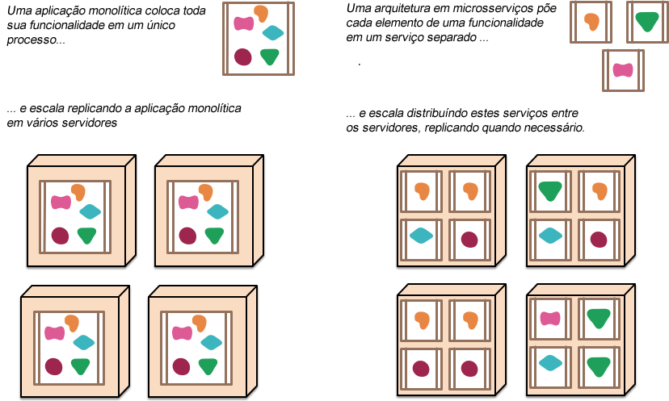
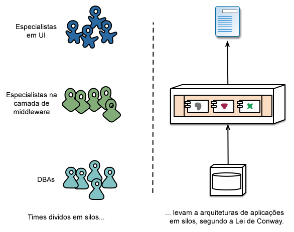
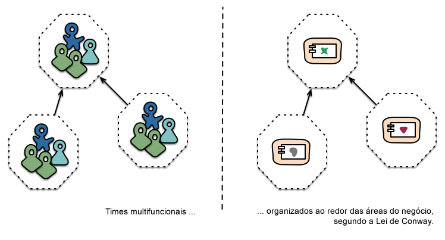
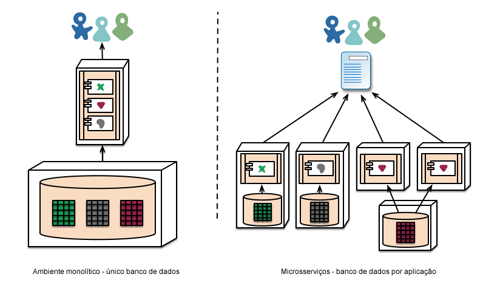
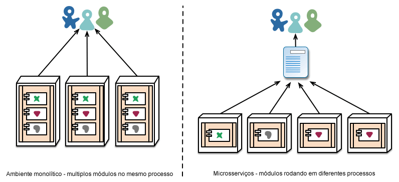

# Características da Arquitetura Orientada a Microsserviço

"Microsserviços" – um novo nome nas populosas ruas da arquitetura de software. Embora nossa tendência natural é ignorar estas novidades com um olhar de desprezo, essa nova terminologia descreve um estilo de sistema que achamos cada vez mais atraente. Temos visto muitos projetos usando este formato nos últimos anos e os resultados tem sido positivos, tanto que para muitos dos nossos colegas esta se tornou a forma padrão para desenvolver aplicações empresariais. Infelizmente, entretanto, não existe muita informação que descreva o que são microsserviços e como implementá-los.

Em resumo, microsserviço é uma abordagem para desenvolver uma única aplicação como uma suíte de serviços, cada um rodando em seu próprio processo e se comunicando através de mecanismos leves, geralmente através de uma API HTTP. Estes serviços são construídos através de pequenas responsabilidades e publicados em produção de maneira independente através de processos de deploys automatizados. Existe um gerenciamento centralizado mínimo destes serviços, que podem serem escritos em diferentes linguagens e usarem diferentes tecnologias para armazenamento de dados.

Para começar explicando o que é o padrão de microsserviços, podemos compara-lo ao padrão monolítico: uma aplicação monolítica é feita como uma única unidade. Aplicações empresariais são geralmente construídas em três partes principais: uma interface para o cliente (tais como páginas HTML e Javascript rodando em um navegador no computador do usuário), um banco de dados (várias tabelas em um mesmo lugar, geralmente um sistema de banco de dados relacional) e uma aplicação server-side. A aplicação server-side irá manipular as requisições HTTP, executar toda lógica de domínio, receber e atualizar os dados da base de dados e por fim, selecionar e popular os blocos HTML para enviar ao navegador. Esta aplicação server-side é monolítica – uma única unidade lógica executável. Qualquer mudança no sistema consiste em publicar uma nova versão da aplicação server-side.

Este tipo de servidor monolítico é uma forma natural de construir um sistema. Toda sua lógica para manipular uma requisição é executada em um único processo, permitindo que você use as características básicas da sua linguagem para separar sua aplicação em classes, funções e namespaces. Com algum cuidado, você pode rodar e testar a aplicação no computador do desenvolvedor e usar uma seqüência de integração para garantir que todas as mudanças sejam propriamente testadas e implantadas em produção. Você pode escalar uma aplicação monolítica horizontalmente rodando diversas instâncias através de um *load-balancer*.

Aplicações monolíticas podem ser bem-sucedidas, porém as pessoas começarão a ficar frustradas – especialmente quando muitas aplicações começarem a serem implantadas na nuvem. Ciclos de mudanças começam a ficar amarrados – uma pequena alteração feita em uma parte pequena do software faz com que toda a aplicação monolítica necessite ser republicada. Com o passar do tempo ficará cada vez mais difícil manter uma estrutura modular, sendo difícil separar as mudanças que deveriam afetar somente um módulo. Para escalar é necessário escalar toda a aplicação, ao invés de escalar somente as partes que necessitem de maiores recursos.

- Figura 1: Aplicações monolíticas e microsserviços.

Estas frustrações levaram ao padrão de microsserviços: aplicações como uma suíte de serviços. Além do fato de que os serviços são implantados e escalam de maneiras independentes, cada serviço também provê uma fronteira bem definida entre os módulos, permitindo até mesmo que diferentes serviços sejam escritos em diferentes linguagens de programação. Eles podem inclusive ser administrados por times diferentes.

Nós não tomamos o padrão de microsserviços como algo novo, suas raízes remetem no mínimo aos princípios de design do próprio Unix. Porém nós cremos que poucas pessoas consideram uma arquitetura de microsserviços e que o desenvolvimento de muitos softwares seriam melhores se adotassem esse padrão.

<!-- 

### Características de uma arquitetura em microsserviços

-->

Não podemos dizer que existe uma definição formal para uma arquitetura em micro serviços, mas podemos tentar descrever o que temos visto como características comuns em arquiteturas que caibam no padrão. Como em qualquer definição que descreva características em comum, nem todas as arquiteturas em microsserviços tem todas as características, mas nós acreditamos que a maioria das arquiteturas em microsserviços exibam a maior parte das características a serem citadas. Como membros ativos na comunidade sobre este tema, temos tentado descrever o que temos visto em nosso próprio trabalho e através de esforços semelhantes em times que nós temos conhecimento.

## Componentização via serviços

Vemos na indústria de softwares um desejo de construir sistemas plugando componentes entre si, tal como vemos as coisas serem feitas no mundo físico. Durante as últimas décadas, percebemos progressos consideráveis através de várias bibliotecas que fazem parte da maior parte das plataformas de desenvolvimento.

Quando falamos sobre componentes, encontramos a dificuldade em definir o que é um componente. Nossa definição é que um componente é uma unidade de software que é substituída ou atualizada de maneira independente.

Arquiteturas em microsserviços usarão bibliotecas, mas buscam primeiramente organizar seu próprio software dividindo em serviços. Nós definimos bibliotecas como componentes que são usados em um programa através de chamadas de função diretamente em memória, enquanto serviços são componentes em processos diferentes que se comunicam através de mecanismos tais como requisições via web services ou chamadas de código remotas (este é um conceito diferente de objeto de serviço, encontrado em muitas linguagens orientadas a objeto).

Uma das principais razões para usar serviços como componentes (ao invés de bibliotecas) é que serviços são publicados de maneira independente. Se você tem uma aplicação que consiste em diversas bibliotecas em um único processo, uma mudança em qualquer componente resulta em ter que republicar toda sua aplicação. Mas se esta aplicação é divida em múltiplos serviços, você pode esperar que diversas mudanças em um único serviço exijam uma republicação somente no serviço alterado. Isso não é algo absoluto, pois algumas mudanças criam alterações nas interfaces entre os serviços, mas o dever de uma boa arquitetura em microsserviços é minimizar este impacto, criando interfaces coesas e mecanismos para evolução entre os serviços.

Outra conseqüência em usar serviços como componentes é ter uma interface mais explícita. A maioria das linguagens não tem uma boa forma de definir explicitamente uma interface do tipo *Published Interface*. Freqüentemente só conseguimos impedir uma violação no encapsulamento de um componente através da documentação e muita disciplina, o que leva a um alto acoplamento entre os componentes. Serviços ajudam a evitar esse problema, usando mecanismos de chamadas remotas.

Usar serviços desta forma tem alguns efeitos colaterais. Chamadas remotas são mais custosas que chamadas dentro do mesmo processo e APIs remotas precisam ser granulares, o que torna ainda mais complicado para usar. Se você precisa mudar as responsabilidades entre os componentes, tais mudanças de comportamento são mais difíceis de fazer do que quando você consegue ultrapassar as fronteiras entre os processos.

Em um primeiro momento, nós podemos ver quais serviços apontam para processos em execução, mas isso é só uma primeira impressão. Um serviço pode consistir em diversos processos que serão sempre desenvolvidos e publicados juntos, como uma única aplicação e um banco de dados que é usado por cada serviço.

## Organizado através das áreas do negócio

Quando procuramos dividir uma grande aplicação em partes, o foco geralmente é na camada de tecnologia, levando os times a serem divididos entre aqueles que cuidam da interface, da lógica server-side e do banco de dados. Quando times são divididos desta forma, até mesmo mudanças simples podem exigir bastante tempo e aprovação financeira em projetos que envolvam diversos times. Ao fugir destes problemas, o time pode acabar trazendo a lógica para as aplicações que eles têm acesso. Em outras palavras, lógica em todos os lugares. Este é um exemplo da Lei de Conway em ação.

> Qualquer organização que desenha um sistema (definido de forma ampla) irá produzir um design cuja estrutura é uma cópia da estrutura de comunicação da própria organização.
> — Melvyn Conway, 1967

- Figura 2: Lei de Conway em ação

A abordagem proposta pelos micros-serviços para esta divisão é diferente, ao organizar os times ao redor das **áreas do negócio**. Assim os serviços possuirão uma implementação satisfatória para uma determinada área do negócio, incluindo uma interface com usuário, armazenamento de dados persistente e qualquer outra necessidade externa. Conseqüentemente, os times se tornam multifuncionais, levando toda bagagem necessária para o desenvolvimento: interface com o usuário, banco de dados e o gerenciamento do projeto.

- Figura 3: Limites dos serviços reforçados pelos limites dos times

Uma empresa organizada desta forma é a www.comparethemarket.com. Times multifuncionais ficam responsáveis por construir e operar cada produto e cada produto é quebrado em serviços individuais se comunicando via um barramento de mensagens.

Grandes aplicações monolíticas podem sempre ser modularizadas ao redor das áreas do negócio também, embora nem sempre este seja o caso mais comum. Certamente devemos incentivar um time grande construindo uma aplicação monolítica a se dividir.

## Qual é o tamanho de um microsserviço?

Embora o termo "microsserviço" tenha se tornado um nome popular para este estilo de arquitetura, seu nome remete a um significado infeliz focando no tamanho do serviços e isso se dá por conta da palavra "micro". Nas nossas conversas com aqueles que já usam os microsserviços, temos visto diversos tamanhos de serviços. Os maiores que notamos seguem a noção da Amazon de "Two Pizza Team" (ou seja, o time inteiro consegue ser alimentados por duas pizzas), significando que não pode se ter mais do que uma dúzia de pessoas. Em uma escala menor, vimos cenários onde um time de meia dúzia de pessoas conseguia cuidar de meia dúzia de serviços.

Isto leva a questionar se esta diferença entre "serviços a cada dúzia de pessoas" e "serviços por pessoa" deveria estar debaixo da categoria de microsserviços. Até então pensamos que é melhor agrupá-los, mas é possível que mudemos nossa mente conforme explorarmos este estilo no futuro.

## Produtos e não projetos

Vemos que a maior parte dos esforços para o desenvolvimento de uma aplicação usa um modelo de projeto: onde o dever é entregar algum software que é por si só considerado o fim. Após isso o software é entregue para quem cuidará da manutenção e o time que construiu o software é desfeito.

Microsserviços tentam evitar este modelo, dando preferência a idéia de que um time deve possuir o produto durante todo seu tempo de vida. Uma inspiração para isso é a noção da Amazon de *"you build, you run it"*, onde um time de desenvolvimento tem a responsabilidade completa de um software em produção. Isto traz os desenvolvedores para o contato diário com seus softwares, sabendo como se comportam em produção e tendo contato com seus usuários, uma vez que eles terão que lidar com uma parte do fardo do suporte.

A mentalidade de produto unida com as áreas do negócio. Ao invés de enxergar o software como um conjunto de funcionalidades a serem criadas, existe um comprometimento durante todo o processo de desenvolvimento em como um software pode ajudar seus usuários a desenvolverem as capacidades do negócio.

Não existe um motivo para que esta mesma abordagem não seja adotada em aplicações monolíticas, mas uma granularidade menor dos serviços pode facilitar a relação entre os desenvolvedores de serviços e seus usuários.

## Endpoints inteligentes e fluxo de comunicação simples

Ao construir estruturas para comunicação entre diferentes processos, vimos muitos produtos e abordagens que dificultam a tarefa criando grandes inteligências no mecanismo de comunicação por si só. Um bom exemplo disso é o Enterprise Service Bus (ESB), onde produtos ESB freqüentemente incluem formas sofisticadas de roteamento de mensagens, transformação e aplicação das regras de negócio.

A comunidade que usa os microsserviços propõe uma abordagem alternativa: endpoints inteligentes e fluxos de comunicação simples. Aplicações construídas a partir de microsserviços devem ser tão desacopladas e coesas quanto possível – elas devem possuir seu próprio domínio lógico e agir mais como um filtro de uma forma parecida com o Unix clássico – recebendo uma requisição, aplicando a lógica apropriada e produzindo uma resposta. Isso pode ser gerenciado usando protocolos REST simples ao invés de protocolos complexos como WS-Choreography ou BPEL, ou o gerenciamento através de uma ferramenta central.

Os dois protocolos mais usados são o HTTP usando APIs e um sistema de mensagens simples. A melhor definição para isso é:

> "Seja feito **de** Web, não **atrás** da Web."
> — Ian Robinson

Microsserviços usam os princípios e protocolos que a Web usa (e em um contexto maior, o Unix também). Freqüentemente os recursos usados podem ser cacheados com pouco esforço pelos desenvolvedores e o time que cuida da operação.

A segunda abordagem geralmente usada é a comunicação através de um barramento de mensagens simples. A infraestrutura usada é simples (porque age somente como um roteador de mensagens), tais como o RabbitMQ ou ZeroMQ que não fazem muito mais que prover uma base de assincronismo confiável – a inteligência continua existindo nos endpoints que estão produzindo e consumindo mensagens nos serviços.

Na estrutura monolítica os componentes são executados no mesmo processo e a comunicação entre eles é feita via invocação de métodos ou chamadas de função. O maior problema em mudar de uma estrutura monolítica para de microsserviços está em mudar o padrão de comunicação. A mudança de uma comunicação nativa que usa chamadas de métodos para chamadas remotas pode precisar de muitas iterações – o que não performa bem. Na prática, você precisa substituir uma comunicação que gera muitas iterações para uma abordagem menos granular.

## Governança descentralizada

Uma das conseqüências de governanças centralizadas é a tendência de padronizar tudo em uma única plataforma tecnológica. A experiência mostra que esta abordagem é limitada – nem todo problema é um prego, nem toda solução é um martelo. Nós preferimos usar a ferramenta certa para o trabalho e, embora aplicações monolíticas também possam usar diferentes linguagens, isso não é comum.

Ao quebrar componentes monolíticos em serviços temos a escolha de como construir cada um deles de maneira diferente. Você quer usar Node.js para levantar uma página simples de relatórios? Faça. C++ é uma escolha boa para um componente real-time? Ótimo. Você quer usar diferentes bancos de dados para  ajustar melhor o comportamento de um componente? Nós temos a tecnologia para fazer isso.

Claro que, porque você pode fazer algo, não signifique que você deva fazê-lo – mas particionar o seu sistema desta forma significa que você tem a opção.

Times construindo microsserviços também preferem uma abordagem diferente aos padrões. Ao invés de usar um conjunto definido de padrões escritos em algum papel, eles preferem a idéia de produzir ferramentas úteis que outros desenvolvedores possam usar para resolver problemas similares aos que eles têm enfrentado. Estas ferramentas são extraídas geralmente das próprias implementações e compartilhadas com um grupo maior, algumas vezes usando modelos open sources públicos. Agora que git e github se tornaram o sistema de controle de versão padrão, práticas open sources se tornaram mais e mais comuns nas estruturas internas das empresas.

Netflix é um bom exemplo de uma organização que segue esta filosofia. Compartilhando códigos úteis e acima de tudo, testados em batalha, eles encorajam outros desenvolvedores resolverem problemas similares de forma similar e ainda deixa a porta aberta para adotar abordagens diferentes caso se queira. Bibliotecas compartilhadas tendem a focar em problemas comuns de armazenagem de dados, comunicação entre processos e, como discutiremos logo mais abaixo, automação da infraestrutura.

Para a comunidade que usa microsserviços, serviços que possuem muitas responsabilidades são particularmente indesejados. Isso não significa que essa comunidade não valorize os padrões de contratos entre serviços. Pelo contrário, uma vez usando microsserviços, existem muito mais contratos. O que acontece é que a comunidade está simplesmente procurando uma maneira diferente de gerenciar as responsabilidades em seus serviços. Padrões como Tolerant Reader e o Consumer-Driven Contracts são freqüentemente aplicados aos microsserviços. Estes padrões de contrato entre serviços permitem que tudo se desenvolva de maneira independente. Executar o pattern Consumer Driven como parte da sua aplicação aumenta a confiança e permite um feedback rápido sobre o funcionamento do seus serviços. Conhecemos um time na Austrália que procura construir novos serviços usando o padrão Consumer Driven. Eles usam ferramentas simples que os permitem criar a definição de um serviço. E isto se torna parte da aplicação de maneira automática, antes mesmo que o código do serviço tenha sido sequer criado. O serviço é então construído até o ponto que o contrato venha ser satisfeito, uma forma elegante para evitar o problema de ‘YAGNI’ (é um princípio do Extreme Programming e uma exortação para não adicionar features até você saber que precisa delas) ao construir um novo software. Estas técnicas e as ferramentas criadas ao redor delas limitam a necessidade de um controle central entre os contratos ao diminuir o acoplamento entre os serviços.

Talvez o apogeu desta governança descentralizada é a cultura construa/ponha em execução popularizada pela Amazon. Times são responsáveis por todos os aspectos do software que eles constroem, incluindo a operação na escala 24/7. Este tipo de responsabilidade definitivamente não é uma norma, mas temos visto mais e mais companhias forçando esta tarefa para as equipes de desenvolvimento. Netflix é outra organização que tem adotado esta cultura. Estar acordado toda noite até as 3 horas da madrugada dando suporte a produção é certamente uma forma poderosa de incentivar o foco na qualidade ao escrever o seu código. Estas idéias estão o mais longe possível da forma tradicional de governança centralizada.

## Microsserviços e SOA

Quando falamos de microsserviços uma questão comum é se isso é simplesmente um tipo de Arquitetura Orientada a Serviços (SOA) que nós vimos uma década atrás. Existe mérito nessa dúvida, porque microsserviços é um estilo muito similar ao que os defensores do SOA pregam. O problema é que SOA significa muitas coisas diferentes, e na maior parte do tempo que vamos atrás de algo chamado "SOA", encontramos diferenças significantes ao estilo que temos descrito aqui, devido ao foco nas ESBs usados para integrar aplicações monolíticas.

Temos visto muitas implementações remendadas de orientação a serviços – que vai desde a tendência em ocultar a complexidade das ESBs com longas e fracassadas iniciativas que custam milhões (e entregam nenhum valor) ou mesmo apresentam estruturas centralizadas que inibem ativamente mudanças, sendo algumas das vezes difícil de enxergar até que esses problemas ocorram.

Certamente muitas das técnicas em uso pelos praticantes de microsserviços cresceram das experiências de integração entre serviços feitas por desenvolvedores de grandes organizações. O padrão Tolerant Reader é um exemplo disso  - seja o mais tolerante possível ao ler dados de um serviço, se você está consumindo um arquivo XML, use apenas os elementos de que precisa, ignore tudo o que não precisa. Iniciativas para usar a Web também contribuíram: o uso de protocolos simples é uma outra abordagem vinda destas experiências, que é uma reação contrária aos padrões centralizadores que alcançaram uma complexidade que é, francamente, de tirar o fôlego (Sempre que você precisa de uma analogia para definir outras abstrações você sabe que esta em um grande problema).

Estas práticas comuns do SOA tem levado a alguns defensores de microsserviços a rejeitarem a denominação de SOA completamente, embora outros considerem microsserviços como uma forma de SOA – talvez a orientação a serviços feita da forma certa. De qualquer forma, o fato de que SOA signifique diversas coisas diferentes nos faz pensar que é bom ter um termo que defina melhor esta forma arquitetural que estamos descrevendo.

## Muitas linguagens, muitas opções

O crescimento da JVM como uma plataforma é justamente o exemplo mais recentemente da mistura entre linguagens dentro de uma plataforma comum. Por décadas, tem sido uma prática comum migrar para uma linguagem de mais alto nível para obter vantagens de abstrações de mais alto níveis. Por sua vez, delega-se as linguagens de baixo nível a escrita de códigos mais sensíveis a performance. Entretanto, muitos softwares monolíticos não precisam deste nível de otimização de performance ou sequer DSLs e altos níveis de abstração combinadas. Pelo contrário, softwares monolíticos geralmente usam uma única linguagem e tendem a limitar o número de tecnologias em uso.

## Administração descentralizada de dados

A descentralização da administração de dados pode ser feita de diferentes formas. De forma mais abstrata, isto significa que o modelo conceitual de domínio pode ser diferente entre os sistemas. Este cenário é um problema comum ao fazer integração em uma empresa grande, onde a visão que o setor de vendas tem de um cliente pode ser diferente do ponto de vista do suporte. Algumas coisas que são chamadas de cliente na visão de vendas, podem nem sequer parecer na visualização do suporte. Objetos podem ter diferentes atributos e (pior) atributos em comum, com diferentes significados.

Este é um problema comum entre aplicações, mas podem ocorrer também dentro das aplicações, particularmente quando estas aplicações são divididas em componentes separados. Uma forma útil de pensar a respeito disto é a noção Domain Driven Design de Bounded Context. O DDD divide um domínio complexo em múltiplos contextos limitados e mapeia o relacionamento entre eles. Este processo é útil para ambas arquiteturas monolíticas e de microsserviços, mas existe uma relação natural entre microsserviços e os limites de um contexto que conforme descrevemos anteriormente, reforçam as separações.

Assim como microsserviços descentralizam decisões sobre os modelos conceituais, eles também descentralizam decisões sobre o armazenamento de dados. Enquanto aplicações monolíticas preferem uma única base de dados lógica para a persistência de dados, empresas frequentemente preferem uma única base de dados para uma variedade de aplicações – e muitas destas decisões são dirigidas por modelos comerciais vendidos através de licenças. Microsserviços preferem permitir que cada serviço gerencie sua própria base de dados, quer através de diferentes instâncias usando a mesma tecnologia de banco de dados, ou até mesmo usando diferentes sistemas de banco de dados – uma abordagem chamada Polyglot Persistence. Você pode usar uma persistência poliglota em uma aplicação monolítica, mas isso aparece com mais freqüência com microsserviços.

A responsabilidade descentralizada para os dados através dos microsserviços tem implicações para a administração de atualizações. A abordagem comum para lidar com atualizações tem sido usar transações para garantir a atualização de múltiplos recursos. Esta abordagem é usada freqüentemente em estruturas monolíticas.

O uso de transações como estas ajuda com a consistência, mas impõem um acoplamento temporário significante, que é problemático quando existem múltiplos serviços. Transações distribuídas são nitidamente difíceis para implementar e como conseqüência, arquiteturas em microsserviços enfatizam a coordenação sem transação entre serviços, com o reconhecimento explícito que consistência pode ser somente eventual e os problemas gerados por isto são lidados com operações que compensem esta questão.

A forma de gerenciar estas inconsistências é um novo desafio para muitos times de desenvolvimento. Geralmente as empresas lidam com um certo grau de inconsistência com o objetivo de responder rapidamente a sua demanda, possuindo algum processo para lidar com erros. Esta troca é vantajosa enquanto o custo de corrigir os erros for menor que o custo da perda gerada por ter uma consistência maior.

## Padrões amplamente testados e padrões impostos

Os times que usam microsserviços tendem a desestimular o uso dos padrões simplesmente impostos pelos grupos de arquiteturas enterprise, e tendem a usar alegremente (e até evangelizar) o uso de padrões abertos tais como HTTP, ATOM e outros micro formatos.

A diferença chave é como os padrões são criados e como eles são propostos. Padrões gerenciados por grupos como o IETF somente se tornam padrões quando existirem diversas implementações no ar e projetos open-source bem-sucedidos.

Estes padrões formam um mundo a parte de muitos no ambiente corporativo, que são freqüentemente desenvolvidos por grupos que tem pouca experiência em programação, ou são fortemente influenciados por vendedores.

## Automação da Infraestrutura

Técnicas para automação da infra-estrutura tiveram grande evolução nos últimos anos – como a computação na nuvem e a própria AWS em particular, que permite reduzir a complexidade de construir, publicar e operar microsserviços.

Muitos dos produtos ou sistemas construídos com microsserviços têm sido feitos por times com uma extensa experiência em Continuos Delivery e seu precursor, a Integração Contínua. Times que constroem software desta forma fazem uso intenso das técnicas de automação de infra-estrutura. A imagem abaixo ilustra um processo de build:

- Figura 5: um fluxo básico de build

Uma vez que este não é um artigo de Continuos Delivery, vamos chamar a atenção para somente algumas características chave aqui. Nós queremos o máximo de confiança possível que nosso software esteja funcionando, então rodamos diversos testes automatizados. Publicar um software funcionando significa que automatizamos a implantação para cada novo ambiente.

Uma aplicação monolítica pode ser construída, testada e publicada através destes ambientes facilmente. Você percebe que uma vez automatizadas as etapas que vão até publicação em produção de um aplicação monolítica, publicar mais aplicações não assusta mais. E lembrando que um dos objetivos do Continuous Delivery é fazer que o processo de publicação se torne algo chato – indiferente de ser uma ou três aplicações, uma vez que isto continue sendo chato, não há problemas.

Outra área onde nós vemos times usando uma extensa automação da infra-estrutura é a administração de microsserviços em produção. Em contraste da nossa afirmação acima, que quando o processo de publicação é chato não tem muita diferença entre aplicações monolíticas e microsserviços, o panorama operacional para cada tipo é bem diferente.

- Figura 6: A forma de publicação freqüentemente é diferente.

## Facilite fazer a coisa correta

Um efeito colateral que encontramos no aumento de automação (como uma conseqüência da entrega e publicação contínua) é a criação de ferramentas úteis que ajudem os desenvolvedores e o pessoal da operação. Ferramentas para a criação de artefatos, administração de bases de código, levantamento de serviços ou de monitoramento de logs são muito comuns agora. O melhor exemplo na internet é provavelmente o conjunto de ferramentas open source da Netflix, mas existem outras incluindo o Dropwizard, que temos usado extensamente.

## Projetado para a falha

Uma conseqüência do uso de serviços como componentes é que as aplicações precisam ser desenhadas de maneira que possam tolerar a falha dos serviços. Qualquer chamada de serviço poderá falhar devido a uma indisponibilidade do mesmo, e o cliente precisa responder a isso da maneira mais tranquila possível. Isto é uma desvantagem em comparação ao design monolítico porque introduz uma complexidade adicional ao ter que administrar esta situação. Como consequência, os times que usam microsserviços constantemente tem que refletir sobre como as falhas dos serviços podem afetar a experiência do usuário. O Simian Army da Netflix leva os serviços e até mesmos os datacenters a falha durante o dia para testar tanto a resiliência da aplicação quanto o monitoramento.

Esta forma de testar de maneira automática o ambiente em produção pode ser o suficiente para dar ao pessoal de suporte o tipo de arrepios que precedem a uma semana intensa de trabalho. Não queremos dizer que os padrões de arquiteturas monolíticas não são capazes de ter configurações sofisticadas de monitoramento – somente afirmamos que isto é menos comum em nossa experiência.

Uma vez que os serviços podem falhar a qualquer momento, é importante ser capaz de detectar falhas rapidamente e, se possível, restaurar o serviço automaticamente. Microsserviços põe bastante ênfase no monitoramento em tempo real, checando elementos de arquitetura (por exemplo, quantas requisições por segundo o banco de dados esta tendo) e métricas relevantes ao negócio (como quantos pedidos por minutos são recebidos). O monitoramento semântico pode prover um alerta antecipado de algo indo mal e levar os times de desenvolvimento a investigar o caso.

Isto é particularmente importante para uma arquitetura em microsserviços porque elas dão preferência a adaptação e a colaboração entre eventos, que são resultados de um comportamento de emergência. Enquanto muitos especialistas se alegram ao descobrir situações de emergência por acaso, a verdade é que esse comportamento pode levar a coisas ruins. Monitoramento é vital para identificar rapidamente um comportamento errado e assim conseguir corrigi-lo.

Aplicações monolíticas podem ser construídas para serem transparentes como um microsserviço – na verdade, elas deveriam ser. A diferença é que você precisa obrigatoriamente saber quando os serviços que rodam em diferentes processos são desconectados. Com bibliotecas dentro do mesmo processo este tipo de transparência é menos útil.

Times que praticam microsserviços esperam ver monitoramentos sofisticados e configurações individuais de log para cada serviço, em dashboards exibindo status de execução (up/down) e uma variedade de métricas relevantes para a operação do negócio. Detalhes sobre o status dos disjuntores (circuit breakers), taxa de transferência atual e latência são outros exemplos que freqüentemente encontramos no mundo real.

## O Circuit Breaker e o código pronto para a produção.

O padrão Circuit Breaker (disjuntor) aparece no Release It! junto com outros padrões como o Bulkhead e o Timeout. Implementados juntos, estes padrões são cruciais quando construímos aplicações que se comunicam. Este post no blog da Netflix realiza um grande trabalho ao explicar como eles aplicam estes padrões.

## Considerando chamadas síncronas prejudiciais.

Sempre que você tem um certo número de chamadas síncronas entre serviços você vai encontrar um efeito multiplicador na lentidão. Esta lentidão no seu sistema é simplesmente o produto da lentidão de componentes individuais. Você deve tomar uma decisão: transformar suas chamadas em assíncronas ou gerenciar esta lentidão. No www.guardian.co.uk eles implementaram uma regra simples em sua nova plataforma – uma chamada síncrona por requisição do usuário, enquanto na Netflix, seu redesign na API transformou toda a criação de APIs em recursos assíncronos.

## Design que evolui

Times que trabalham com microsserviços geralmente possuem uma experiência em desenhar aplicações para evoluírem e enxergam na decomposição dos serviços uma ferramenta avançada que permite controlar mudanças em suas aplicações sem necessidade de evitá-las. Controlar mudanças não significa necessariamente reduzi-las – com atitudes e ferramentas corretas você pode fazer frequentes, rápidas e precisas mudanças em seu software.

Sempre que você quebra um sistema em componentes, você se vê diante da decisão de como dividi-lo em partes – quais são os princípios em que vamos decidir esta divisão da aplicação? A propriedade chave de um componente é a noção da sua atualização acontecer de maneira independente – o que implica em olharmos para pontos onde imaginamos reescrever o componente sem afetar nada a sua volta. Desenvolvedores que utilizam microsserviços avançam ainda mais neste ponto ao esperarem explicitamente que muitos serviços sejam destruídos no futuro, ao invés de ser permanentes a longo prazo.

O site do The Guardian é um bom exemplo de como uma aplicação foi desenhada e construída como uma aplicação monolítica, mas evoluiu em direção aos microsserviços. O sistema monolítico ainda existe como o coração do website, mas eles preferem adicionar novas features usando microsserviços que consomem a API no sistema monolítico. Esta abordagem é particularmente útil para features que são herdadas temporariamente, como páginas específicas de um evento esportivo. Tal parte do site pode ser facilmente criada usando linguagens de desenvolvimento rápido e removidas uma vez que o evento termine. Temos visto abordagens similares em uma instituição financeira onde novos serviços são adicionados para uma oportunidade de mercado e descartados após alguns meses ou mesmo semanas.

Esta ênfase de que os serviços possam ser substituíveis é, em um caso especial, um princípio mais amplo de design que obtém sua modularidade através do padrão de mudança. Você deseja manter coisas que mudam ao mesmo tempo dentro do mesmo módulo. Partes de um sistema que muda raramente devem estar em diferentes serviços. Se você se encontrar repetidamente mudando dois serviços ao mesmo tempo, isto é um sinal que eles devem ser unidos.

Colocar componentes em serviços permite um planejamento de lançamento mais granular. Em um sistema monolítico, qualquer mudança requer uma publicação da aplicação por inteiro. Com microsserviços, entretanto, você precisa somente republicar o serviço que foi modificado. Isto simplifica e agiliza o processo de publicação. Em contrapartida, você tem que se preocupar com as mudanças que possam quebrar os serviços que as consomem. A abordagem tradicional de integração é tentar lidar com esse problema usando versionamento, mas a preferência no mundo dos microsserviços é usar o versionamento como último recurso. Podemos evitar diversos versionamentos ao desenhar serviços para serem tolerantes a mudanças em seus fornecedores o máximo possível.

## Microsserviços são o futuro?

Nosso principal objetivo neste artigo é explicar as maiores idéias e princípios por trás dos microsserviços. Ao gastar tempo fazendo isto, nós pensamos claramente que o estilo arquitetural dos microsserviços é algo importante – digno de sérias considerações voltadas para aplicações empresariais. Recentemente construímos diversos sistemas usando este estilo e sabemos de outros que usaram e aprovaram esta abordagem.

Entre aqueles que, até onde temos conhecimento, são de certa forma pioneiros neste estilo arquitetural estão a Amazon, Netflix, The Guardian, o Serviço Digital Governamental do Reino Unido, realstate.com.au e o comparethemarket.com. O circuito de conferências em 2013 foi cheio de exemplos de companhias que caminharam para algo que pode ser classificado como microsserviços – incluindo o Travis CI. Além disso existem diversas organizações que há bastante tempo tem usado algo que chamamos de microsserviços, mas que sequer utilizam este nome (frequentemente isso é chamado de SOA, embora, como falamos, SOA aparece em diversas formas contraditórias.)

Temos a certeza que microsserviços são a futura direção para as arquiteturas de software. Embora nossas experiências tenham sido até então positivas em comparação as aplicações monolíticas, nós estamos conscientes do fato que não se passou tempo o suficiente para um julgamento final.

Em geral, as verdadeiras conseqüências das suas decisões de arquitetura se tornam evidentes somente anos depois que você as tomou. Temos visto projetos onde um bom time, com um forte desejo por modularidade, que constrói uma arquitetura monolítica que se deteriora com os anos. Muitas pessoas acreditam que este problema é menos provável com microsserviços, desde que os limites dos serviços sejam explícitos. Enquanto não tivermos vistos vários sistemas com idade suficiente, nós não podemos avaliar verdadeiramente quão maduras são as arquiteturas em microsserviços.

Existem certos motivos pelos quais algumas pessoas podem esperar que os microsserviços amadureçam de maneira tímida. Qualquer esforço para componentizar um sistema depende de como o software é adaptado para os componentes. É difícil imaginar exatamente onde o limite de cada componente deva ser definido. Designs que evoluem devem reconhecer a dificuldade de definir corretamente seus limites e por isso a importância de ser fácil refatora-los.

Outro problema é que caso os componentes não sejam divididos de maneira clara, tudo que você está fazendo é tirando a complexidade de dentro de um componente para as conexões entre eles. E isso não move simplesmente a complexidade de lugar, mas põe em um lugar é que menos explícito e difícil de controlar. É fácil pensar que as coisas são melhores quando você as encontra dentro de um componente pequeno e simples, abrindo mão de ter conexões complexas entre os serviços.

Finalmente, há o fator da maturidade do time. Novas técnicas tendem a ser adotadas por times mais capacitados. Mas uma técnica que é mais efetiva para um time mais capacitado não vai necessariamente funcionar para times menos capazes. Nós vimos muitos casos de times menos capacitados construírem arquiteturas monolíticas bagunçadas, porém, leva tempo para ver o que acontece quando este tipo de bagunça acontece com microsserviços. Um time pobre irá sempre criar um sistema pobre – e é muito difícil dizer se os microsserviços neste caso reduzem a bagunça ou a deixa pior.

Um argumento razoável que ouvimos é que você não deve começar com uma arquitetura em microsserviços. Ao invés de começar com uma arquitetura monolítica, mantenha-a modular, e divida em microsserviços uma vez que a arquitetura monolítica se torne um problema (embora este conselho não seja o ideal, uma vez que uma interface em processo de mudança não é geralmente uma boa interface para os serviços).

## Fonte

- https://martinfowler.com/articles/microservices.html
