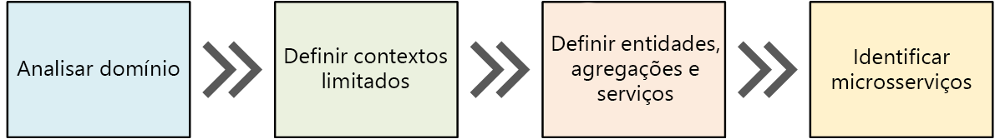

# Análise de domínio

Um dos maiores desafios de microsserviços é definir os limites de serviços individuais. A regra geral é que um serviço deve fazer "algo" — mas colocar essa regra em prática requer uma consideração cuidadosa. Não há nenhum processo mecânico que produz o design "certo". Você precisa pensar profundamente em suas metas, requisitos e domínio de negócios. Caso contrário, você pode terminar com um design aleatório que exibe algumas características indesejáveis, como dependências ocultas entre serviços, acoplamento rígido ou então interfaces mal projetadas.

Microsserviços devem ser criados em torno de capacidades comerciais, não de camadas horizontais como acesso a dados ou mensagens. Além disso, eles devem ter um acoplamento flexível e alta coesão funcional. Os microsserviços serão acoplados flexivelmente se você puder alterar um serviço sem a necessidade de outros serviços serem atualizados simultaneamente. Um microsserviço é coeso se ele tem uma finalidade única e bem definida, como gerenciar contas de usuário ou acompanhar o histórico de entrega. Um serviço deve encapsular o conhecimento do domínio e abstrair esse conhecimento de clientes. Por exemplo, um cliente deve ser capaz de agendar um serviço de drone sem conhecer os detalhes do algoritmo de agendamento ou como a frota de drones é gerenciada.

O DDD (design orientado a domínio) fornece uma estrutura que pode ajudar você pela maior parte do processo de obtenção de um conjunto de microsserviços bem projetado. O DDD tem duas fases diferentes, a estratégica e a tática. No DDD estratégico, você está definindo a estrutura em grande escala do sistema. O DDD estratégico ajuda a garantir que sua arquitetura permaneça concentrada em capacidades comerciais. O DDD tático fornece um conjunto de padrões de design que você pode usar para criar o modelo de domínio. Esses padrões incluem entidades, agregações e serviços de domínio. Esses padrões táticos lhe ajudarão a criar microsserviços que são acoplados flexivelmente e também coesos.

- Diagrama de um processo de design orientado por domínio (DDD)

1. Comece analisando o domínio corporativo para entender os requisitos funcionais do aplicativo. A saída desta etapa é uma descrição informal do domínio, que pode ser redefinido em um conjunto mais formal de modelos de domínio.
1. Em seguida, defina os *contextos limitados* do domínio. Cada contexto limitado contém um modelo de domínio que representa um subdomínio específico do aplicativo maior.
1. Dentro de um contexto limitado, aplique padrões DDD táticos para definir entidades, agregações e serviços de domínio.
1. Use os resultados da etapa anterior para identificar os microsserviços em seu aplicativo.

É importante lembrar que DDD é um processo iterativo e em andamento. Limites de serviço não são fixos de forma imutável. Conforme um aplicativo evolui, você pode decidir dividir um serviço em vários serviços menores.

## Analisar o domínio

Usar uma abordagem DDD lhe ajudará a criar microsserviços de modo que cada serviço se adeque naturalmente a um requisito de negócios funcional. Ele pode lhe ajudar a evitar a armadilha de permitir que os limites organizacionais ou opções de tecnologia ditem o seu design.

Antes de escrever qualquer código, será necessária uma vista panorâmica do sistema que você está criando. O DDD começa modelando o domínio corporativo e criando uma modelo de domínio. O modelo de domínio é um modelo abstrato do domínio corporativo. Destila e organiza os dados de conhecimento do domínio e fornece uma linguagem comum para desenvolvedores e especialistas de domínio.

Iniciar o mapeamento de todas as funções de negócios e as respectivas conexões. Isso provavelmente será um esforço colaborativo envolvendo especialistas de domínio, arquitetos de software e outros stakeholders. Você não precisa usar nenhum formalismo específico. Esboce um diagrama ou desenhe em quadro de comunicações.

Conforme você preencher o diagrama, poderá começar a identificar subdomínios discretos. Quais funções estão intimamente relacionadas? Quais funções são essenciais para os negócios e quais fornecem serviços complementares? O que é o grafo de dependência? Durante a fase inicial, você não se importa com tecnologias ou detalhes de implementação. Dito isso, você deverá tomar nota do local em que o aplicativo precisará se integrar com sistemas externos como CRM, processamento do pagamento ou sistemas de cobrança.

## Entrega por Drones: analisando o domínio corporativo

Após algumas análises de domínio iniciais, a equipe da Fabrikam criou um esboço aproximado que representa o domínio de Entrega por Drones.

- Diagrama de um domínio de Entrega por Drones

- **Remessa** é colocado no centro do diagrama, já que é essencial para os negócios. Tudo no diagrama existe para habilitar essa funcionalidade.
- **Gerenciamento de drones** também é importante para os negócios. Funcionalidades que estão intimamente relacionada ao gerenciamento de drones incluem o reparo de drones e o uso de análise preditiva para prever quando drones precisam de manutenção e reparo.
- A **análise de ETA** fornece estimativas de tempo para coleta e entrega.
- O **transporte de terceiros** permitirá que o aplicativo agende métodos de transporte alternativos se um pacote não puder ser enviado inteiramente por drone.
- **Compartilhamento de drones** é uma possível extensão do negócio principal. A empresa pode ter capacidade de drones excedente durante determinadas horas e pode alugar drones que, caso contrário, ficariam ociosos. Este recurso não estará na versão inicial.
- **Vigilância por vídeo** é outra área para a qual empresa pode expandir mais tarde.
- **Contas de usuário**, **Faturamento** e **Call center** são subdomínios que dão suporte ao negócio principal.

Observe que neste momento no processo, não tomamos nenhuma decisão sobre implementação ou tecnologias. Alguns dos subsistemas podem envolver sistemas externos de software ou serviços de terceiros. Mesmo assim, o aplicativo deve interagir com esses sistemas e serviços, portanto, é importante incluí-los no modelo de domínio.

> Observação: Quando um aplicativo depende de um sistema externo, há um risco de que a API ou o esquema de dados do sistema externo vaze dados para seu aplicativo, comprometendo consequentemente o design de arquitetura. Isso é especialmente verdadeiro com sistemas legados que podem não seguir práticas recomendadas modernas e que podem usar esquemas de dados complicados ou APIs obsoletas. Nesse caso, é importante ter um limite bem definido entre esses sistemas externos e o aplicativo. Considere o uso do Padrão do Estrangulador (Migrar incrementalmente um sistema herdado substituindo gradualmente partes específicas de funcionalidade por serviços e aplicativos novos) ou Padrão de Camada Anticorrupção (Implememtar uma camada de fachada ou de adaptador entre diferentes subsistemas que não compartilham a mesma semântica) para essa finalidade.

## Definir contextos limitados

O modelo de domínio inclui representações de objetos reais no mundo — usuários, drones, pacotes e assim por diante. Mas isso não significa que todas as partes do sistema precisam usar as mesmas representações para as mesmas coisas.

Por exemplo, subsistemas que manipulam análise preditiva e reparo de drones precisarão representar muitas características físicas dos drones, como seu histórico de manutenção, quilometragem, idade, número do modelo, características de desempenho e assim por diante. Porém, quando é hora de agendar uma entrega, esses elementos não importam. O subsistema de agendamento só precisa saber se um drone está disponível e o ETA para coleta e entrega.

Se tentássemos criar um único modelo para ambos esses subsistemas, ele seria desnecessariamente complexo. Também seria mais difícil para o modelo evoluir ao longo do tempo, porque as alterações precisariam atender a várias equipes trabalhando em subsistemas separados. Portanto, geralmente é melhor criar modelos separados que representam a mesma entidade do mundo real (nesse caso, um drone) em dois contextos diferentes. Cada modelo contém apenas os recursos e os atributos que são relevantes no contexto específico dele.

É aqui que o conceito DDD de contextos limitados entra em cena. Um contexto limitado é simplesmente o limite em um domínio em que um modelo de domínio específico se aplica. Examinando o diagrama anterior, é possível agrupar as funcionalidades dependendo de várias funções compartilharem ou não um único modelo de domínio.

- Diagrama de contextos limitados

Contextos limitados não são necessariamente isolados uns dos outros. Neste diagrama, as linhas sólidas, conectando os contextos limitados representam lugares onde dois contextos limitados interagem. Por exemplo, a *Remessa* depende de contas de usuário obterem informações sobre os clientes e do gerenciamento de drones agendar drones da frota.

No livro *Domain Driven Design*, Eric Evans descreve vários padrões para manter a integridade de um modelo de domínio quando ele interage com outro contexto limitado. Um dos principais princípios de microsserviços é que os serviços se comunicam por meio de APIs bem definidas. Essa abordagem corresponde a dois padrões que Evans chama de serviço de host aberto e linguagem de programação publicada. A ideia de serviço de host aberto é que um subsistema define um protocolo formal (API) para outros subsistemas se comunicarem com ele. A linguagem de programação publicada estende essa ideia publicando a API de uma forma que outras equipes podem usar para escrever código de clientes. 

Para o restante dessa jornada, nos concentraremos no contexto limitado de *Remessa*.

## DDD tático

Durante a fase estratégica de DDD, você está mapeando fora do domínio corporativo e definindo contextos limitados para seus modelos de domínio. DDD tático é quando você define os modelos de domínio com mais precisão. Os padrões táticos são aplicados dentro de um único contexto limitado. Em uma arquitetura de microsserviços, estamos interessados principalmente nos padrões de entidade e de agregação. Aplicar esses padrões nos ajudará a identificar limites naturais para os serviços em nosso aplicativo. Como um princípio geral, um microsserviço não deve ser menor do que uma agregação e não pode exceder um contexto limitado. Primeiro, examinaremos os padrões táticos. Em seguida, os aplicaremos ao contexto limitado de remessa no aplicativo de entrega por drones.

### Visão geral dos padrões táticos

- Diagrama de padrões táticos no design orientado por domínio

**Entidades**. Uma entidade é um objeto com uma identidade exclusiva que persiste ao longo do tempo. Por exemplo, em um aplicativo de serviços bancários, clientes e contas seriam entidades.

- Uma entidade tem um identificador exclusivo no sistema, que pode ser usado para pesquisar pela entidade ou recuperá-la. Isso não significa que o identificador é sempre exposto diretamente aos usuários. Ele pode ser um GUID ou uma chave primária em um banco de dados.
- Uma identidade pode abranger vários contextos limitados e pode durar mais que o tempo de vida do aplicativo. Por exemplo, números de conta bancária ou IDs emitidas pelo governo não estão vinculados ao tempo de vida de um aplicativo específico.
- Os atributos de uma entidade podem se alterar ao longo do tempo. Por exemplo, o nome ou endereço de uma pessoa pode ser alterado, mas ela ainda é a mesma pessoa.
- Uma entidade pode conter referências a outras entidades.

**Objetos de valor**. Um objeto de valor não tem identidade. Ele é definido somente pelos valores de seus atributos. Objetos de valor também são imutáveis. Para atualizar um objeto de valor, você sempre cria uma nova instância para substituir a antiga. Objetos de valor podem ter métodos que encapsulam a lógica do domínio, mas esses métodos não devem ter efeitos colaterais sobre o estado do objeto. Exemplos comuns de objetos de valor incluem valores de datas e horas, moedas e cores.

**Agregações**. Uma agregação define um limite de consistência em torno de uma ou mais entidades. Exatamente uma entidade em uma agregação é a raiz. A pesquisa é feita usando o identificador da entidade raiz. Quaisquer outras entidades na agregação são filhas da raiz e são referenciadas da raiz pelos ponteiros a seguir.

A finalidade de uma agregação é modelar invariáveis transacionais. Coisas no mundo real têm redes de relações complexas. Os clientes criam ordens, as ordens contém produtos, os produtos têm fornecedores e assim por diante. Se o aplicativo modifica vários objetos relacionados, como ele garante a consistência? Como manter o controle de invariáveis e impô-las?

Aplicativos tradicionais têm usado frequentemente transações de banco de dados para impor a consistência. Em um aplicativo distribuído, no entanto, isso muitas vezes não é viável. Uma única transação empresarial pode abranger vários repositórios de dados, ser demorada ou envolver serviços de terceiros. Por fim, cabe ao aplicativo, não à camada de dados, impor as invariáveis necessárias para o domínio. É isso que as agregações destinam-se a modelar.

> Observação: Um agregado pode consistir em uma única entidade, sem entidades filho. O que compõe uma agregação é o limite transacional.

**Domínio e serviços de aplicativo**. Na terminologia DDD, um serviço é um objeto que implementa uma lógica sem conter nenhum estado. Evans faz distinção entre serviços de domínio, que encapsulam a lógica do domínio, e serviços de aplicativo, que fornecem funcionalidades técnicas como autenticação de usuário ou envio de uma mensagem SMS. Serviços de domínio geralmente são usados para modelar comportamento que abrange várias entidades.

> Observação: O termo serviço está sobrecarregado no desenvolvimento de software. Aqui a definição não está diretamente relacionada a microsserviços.

**Eventos de domínio**. Eventos de domínio podem ser usados para notificar outras partes do sistema quando algo acontece. Como o nome sugere, eventos de domínio devem significar algo dentro do domínio. Por exemplo, "um registro foi inserido em uma tabela" não é um evento de domínio. "Uma entrega foi cancelada" é um evento de domínio. Eventos de domínio são especialmente relevantes em uma arquitetura de microsserviços. Já que microsserviços são distribuídos e não compartilham armazenamentos de dados, eventos de domínio fornecem uma maneira para os microsserviços se coordenarem entre si.

Há alguns outros padrões de DDD não listados aqui, incluindo módulos, repositórios e fábricas. Eles poderão ser padrões úteis para quando você estiver implementando um microsserviço, mas eles são menos relevantes ao projetar os limites entre microsserviços.

## Entrega por Drones: Explorando os padrões

Começaremos com os cenários com os quais o contexto limitado de Remessa deve lidar.
- Um cliente pode solicitar que um drone colete os produtos de uma empresa que está registrada com o serviço de entrega por drones.
- O remetente gera uma marcação (código de barras ou RFID) para colocar no pacote.
- Um drone coletará um pacote no local de origem e o entregará no local de destino.
- Quando um cliente agenda uma entrega, o sistema fornece um ETA com base em informações de rota, condições climáticas e dados históricos.
- Quando o drone está em trânsito, um usuário pode acompanhar a localização atual e a ETA mais recente.
- Até que um drone tenha coletado o pacote, o cliente pode cancelar uma entrega.
- O cliente é notificado quando a entrega é concluída.
- O remetente pode solicitar confirmação de entrega do cliente, na forma de uma assinatura ou impressão digital.
- Os usuários podem pesquisar o histórico de uma entrega concluída.

Desses cenários, a equipe de desenvolvimento identificou as entidades a seguir.

- Entrega
- Pacote
- Drone
- Conta
- Confirmação
- Notificação
- Marca

Os quatro primeiros, entrega, pacote, drone e conta, são todos agregações que representam limites de consistência transacional. Confirmações e Notificações são entidades filho de Entregas e Marcações são entidades filho de Pacotes.

Os **objetos de valor** neste projeto incluem Localização, ETA, PackageWeight e PackageSize.

Para ilustrar, aqui está um diagrama UML da agregação de Entrega. Observe que ele contém referências a outras agregações, incluindo Conta, Pacote e Drone.

- Diagrama UML da agregação de Entrega

Há dois eventos de domínio:

- Enquanto um drone está em trânsito, a entidade Drone envia eventos DroneStatus que descrevem a localização do drone e seu status (em curso, descarregou).
- A entidade Entrega envia eventos DeliveryTracking sempre que o estágio de uma entrega é alterado. Isso inclui DeliveryCreated, DeliveryRescheduled, DeliveryHeadedToDropoff e DeliveryCompleted.

Observe que esses eventos descrevem itens que são significativos no modelo de domínio. Eles descrevem algo sobre o domínio e não estão ligados a um constructo de linguagem de programação específico.

A equipe de desenvolvimento identificou mais uma área de funcionalidade que não se adéqua a nenhuma das entidades descritas até agora. Alguma parte do sistema precisa coordenar todas as etapas envolvidas no agendamento ou atualização de uma entrega. Portanto, a equipe de desenvolvimento adicionou dois serviços de domínio ao design: um Agendador que coordena as etapas e um Supervisor que monitora o status de cada etapa para detectar se alguma etapas falhou ou atingiu o tempo limite. Essa é uma variação do Padrão de Supervisor de Agente do Agendador (Coordena um conjunto de ações distribuídas como uma única operação. Se qualquer uma das ações falhar, tenta tratar as falhas de forma transparente ou então desfaz o trabalho que foi executado para que toda a operação tenha êxito ou falhe como um todo).

## Fonte
- https://docs.microsoft.com/pt-br/azure/architecture/microservices/domain-analysis
