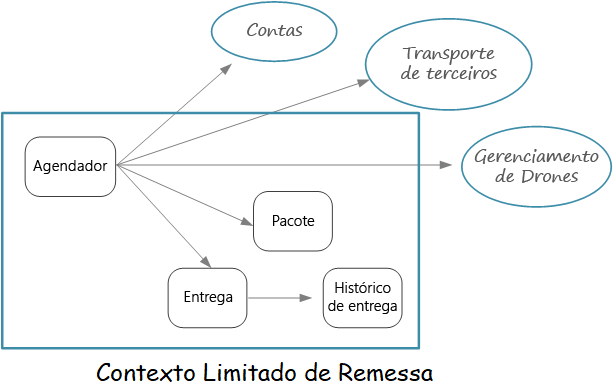
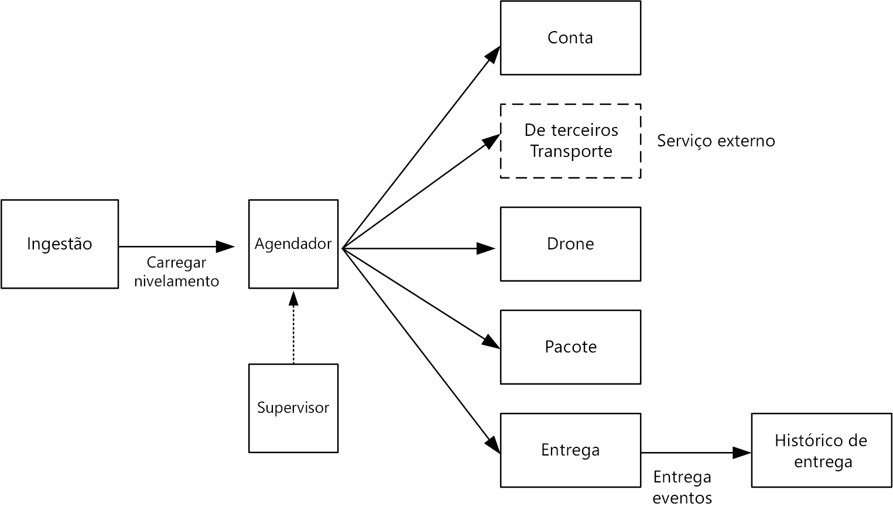

# Identificando limites de microsserviço

Qual é o tamanho correto de um microsserviço? Muitas vezes você ouve algo como, "não muito grande e não muito pequeno" — e, embora isso seja correto, não é muito útil, na prática. Mas, se você iniciar de um modelo de domínio cuidadosamente desenvolvido, será mais fácil pensar sobre microsserviços.

- Diagrama de contextos limitados

## Do modelo de domínio a microsserviços

Anteriormente, definimos um conjunto de contextos limitados para o aplicativo de entrega por drone. Então, analisamos mais de perto um desses contextos limitados, o contexto limitado de Remessa, e identificamos um conjunto de entidades, agregados e serviços de domínio para esse contexto limitado.

Agora estamos prontos para passar do modelo de domínio para o design do aplicativo. Aqui está uma abordagem que você pode usar para derivar microsserviços do modelo de domínio.

1. Comece com um contexto limitado. Em geral, a funcionalidade em um microsserviço não deve abranger mais de um contexto limitado. Por definição, um contexto limitado marca o limite de um modelo de domínio específico. Se você achar que um microsserviço combina diferentes modelos de domínio, é sinal de que precisa voltar e refinar sua análise de domínio.
1. Em seguida, examine os agregados no seu modelo de domínio. Agregados são, frequentemente, bons candidatos a microsserviços. Um agregado bem projetado exibe muitas das características de um microsserviço bem projetado, por exemplo:
- Agregados são derivados de requisitos de negócios, e não de questões técnicas, como acesso a dados ou mensagens.
- Um agregado deve ter alta coesão funcional.
- Um agregado é um limite de persistência.
- Agregados devem ser acoplados de forma flexível.
1. Serviços de domínio também são bons candidatos a microsserviços. Serviços de domínio são operações sem estado entre vários agregados. Um exemplo típico é um fluxo de trabalho que envolve vários microsserviços.
1. Finalmente, considere os requisitos não funcionais. Observe fatores como tamanho da equipe, tipos de dados, tecnologias, requisitos de escalabilidade, requisitos de disponibilidade e requisitos de segurança. Esses fatores podem levá-lo a decompor ainda mais um microsserviço em dois ou mais serviços menores, ou fazer o contrário e combinar vários microsserviços em um.

Depois de identificar os microsserviços em seu aplicativo, valide o design conforme os seguintes critérios:

- Cada serviço tem uma única responsabilidade.
- Não há nenhuma chamada de comunicação entre os serviços. Se a divisão da funcionalidade em dois serviços gerar excesso de comunicação, isso poderá ser um sintoma de que essas funções pertencem ao mesmo serviço.
- Cada serviço é pequeno o suficiente para ser criado por uma pequena equipe trabalhando de forma independente.
- Não há nenhuma interdependência que exige que dois ou mais serviços sejam implantados em sincronia. Deve ser sempre possível implantar um serviço sem redistribuir outros serviços.
- Os serviços não estão acoplados de forma firme e podem evoluir de forma independente.
- Os limites do serviço não criarão problemas de consistência ou integridade de dados. Às vezes, é importante manter a consistência dos dados colocando a funcionalidade em um único microsserviço. Dito isto, considere se você realmente precisa de consistência forte. Existem estratégias para abordar a consistência eventual em um sistema distribuído, e os benefícios dos serviços de decomposição geralmente superam os desafios de gerenciar a consistência eventual.

Acima de tudo, é importante ser pragmático e lembrar-se de que o design orientado por domínio é um processo iterativo. Em caso de dúvida, comece com microsserviços de granulação grosseira. É mais fácil dividir um microsserviço em dois serviços menores do que refatorar a funcionalidade em vários microsserviços existentes.

## Entrega por Drones: Definindo os microsserviços

Lembre-se de que a equipe de desenvolvimento identificou as quatro agregações — Entrega, Pacote, Drone e Conta — e dois serviços de domínio, Agendador e o Supervisor.

Entrega e Pacote são candidatos óbvios a microsserviços. O Agendador e o Supervisor coordenam as atividades executadas por outros microsserviços, então, faz sentido implementar esses serviços de domínio como microsserviços.

Drone e Conta são interessantes porque pertencem a outros contextos limitados. Uma opção é Agendador chamar contextos limitados de Drone e Conta diretamente. Outra opção é criar microsserviços de Drone e Conta dentro do contexto de envio limitado. Esses microsserviços fariam a mediação entre os contextos delimitados, expondo as APIs ou os esquemas de dados mais adequados ao contexto de Remessa.

Os detalhes dos contextos limitados de Drone e Conta estão além do escopo desta orientação. Mas, aqui estão alguns fatores a considerar nessa situação:

- Qual é a sobrecarga de rede ao chamar diretamente outro contexto limitado?
- O esquema de dados para o outro contexto limitado é adequado para esse contexto ou é melhor ter um esquema adaptado a esse contexto limitado?
- O outro contexto limitado é sistema legado? Em caso afirmativo, crie um serviço que atue como camada anticorrupção para converter entre o sistema legado e o aplicativo moderno.
- Como é a estrutura de equipe? É fácil se comunicar com a equipe responsável pelo outro contexto limitado? Se não for fácil, a criação de um serviço que faça a mediação entre os dois contextos pode ajudar a atenuar o custo da comunicação entre equipes.

Até agora, não consideramos nenhum requisito não funcional. Pensando nos requisitos de taxa de transferência do aplicativo, a equipe de desenvolvimento decidiu criar um microsserviço de Ingestão separado, responsável pela ingestão de solicitações do cliente. Esse microsserviço implementará o nivelamento de carga, colocando as solicitações recebidas em um buffer para processamento. O Agendador fará a leitura das solicitações do buffer e executará o fluxo de trabalho.

Requisitos não funcionais levaram a equipe a criar um serviço adicional. Todos os serviços até agora foram sobre o processo de agendamento e entrega de pacotes em tempo real. Mas o sistema também precisa armazenar o histórico de cada entrega no armazenamento de longo prazo para análise dos dados. A equipe considerou atribuir essa responsabilidade ao serviço de Entrega. No entanto, os requisitos de armazenamento de dados são muito diferentes para a análise histórica versus operações em andamento. Portanto, a equipe decidiu criar um serviço de Histórico de Entrega separado, que escutará eventos DeliveryTracking do serviço de Entrega e gravará os eventos no armazenamento de longo prazo.

O diagrama a seguir mostra o design neste ponto:

- Diagrama de design

## Escolhendo um opção de computação

O termo computação refere-se ao modelo de hospedagem para os recursos de computação em que seu aplicativo é executado. Para uma arquitetura de microsserviços, duas abordagens são especialmente populares:

- Um orquestrador de serviços que gerencia serviços em execução em nós dedicado (VMs).
- Uma arquitetura sem servidor que funciona como um serviço (FaaS).

Embora essas não sejam as únicas opções, são abordagens comprovadas para criação de microsserviços. Um aplicativo pode incluir ambas as abordagens.

### Orquestradores de serviço

Um orquestrador manipula tarefas relacionadas à implantação e ao gerenciamento de um conjunto de serviços. Essas tarefas incluem a colocação de serviços em nós, monitoramento da integridade dos serviços, reinicialização de serviços não íntegros, balanceamento de carga de tráfego de rede em instâncias de serviço, descoberta de serviço, dimensionamento do número de instâncias de um serviço e aplicação das atualizações de configuração. Entre os orquestradores populares estão Kubernetes, DC/OS, Docker Swarm e Service Fabric.

### Contêineres

Às vezes, as pessoas falam sobre contêineres e microsserviços como se fossem a mesma coisa. Embora isso não seja verdade — você não precisa de contêineres para criar microsserviços — os contêineres têm alguns benefícios particularmente relevantes para microsserviços, como:

- **Portabilidade**. Uma imagem de contêiner é um pacote autônomo, que é executado sem a necessidade de instalar bibliotecas ou outras dependências. Isso facilita a implantação. Contêineres podem ser iniciados e interrompidos rapidamente, portanto, você pode criar novas instâncias para lidar com mais carga ou para se recuperar de falhas de nó.
- **Densidade**. Contêineres são leves em comparação com a execução de uma máquina virtual, porque eles compartilham os recursos do sistema operacional. Isso possibilita empacotar vários contêineres em um único nó, o que é especialmente útil quando o aplicativo é composto por muitos pequenos serviços.
- **Isolamento de recurso**. Você pode limitar a quantidade de memória e a CPU disponível para um contêiner, o que ajuda a garantir que um processo sem controle não esgote os recursos do host.

### Server Less (Funções como um serviço)

Com uma arquitetura sem servidor, não é possível administrar VMs nem a infraestrutura de rede virtual. Em vez disso, você implanta o código, e o serviço de hospedagem coloca esse código em uma VM e o executa. Essa abordagem tende a favorecer pequenas funções granulares que sejam coordenadas usando gatilhos baseados em eventos. Por exemplo, uma mensagem colocada em uma fila pode disparar uma função que lê da fila e processa a mensagem.

### Orquestrador ou Server Less?

Aqui estão alguns fatores a considerar ao escolher entre uma abordagem de orquestrador e uma abordagem sem servidor.

**Capacidade de gerenciamento** um aplicativo sem servidor é fácil de gerenciar, porque a plataforma gerencia todos os de recursos de computação por você. Um orquestrador abstrai alguns aspectos de gerenciamento e configuração de um cluster, mas ele não oculta completamente as VMs subjacentes. Com um orquestrador, você terá de pensar sobre problemas como, balanceamento de carga, uso de CPU e de memória e rede.

**Flexibilidade e controle**. Um orquestrador fornece muito controle sobre como configurar e gerenciar seus serviços e o cluster. A desvantagem é a complexidade adicional. Com uma arquitetura sem servidor, você perde um pouco do controle porque esses detalhes são abstraídos.

**Portabilidade**. Todos os orquestradores listados aqui (Kubernetes, DC/OS, Docker Swarm e Service Fabric) podem ser executados localmente ou em várias nuvens publicas.

**Integração de aplicativos**. Pode ser um desafio criar um aplicativo complexo usando uma arquitetura sem servidor. 

**Custo**. Com um orquestrador, você paga pelas VMs em execução no cluster. Com um aplicativo sem servidor, você paga apenas pelos recursos de computação real consumidos. Em ambos os casos, você precisa considerar o custo dos serviços adicionais, como armazenamento, bancos de dados e serviços de mensagens.

**Escalabilidade**. Em geral, quando se trabalha sem servidor, há o dimensionamento automatico para atender à demanda, com base no número de eventos recebidos. Com um orquestrador, você pode expandir, aumentando o número de instâncias de serviço em execução no cluster. Você também pode dimensionar adicionando VMs ao cluster.

## Fonte

- https://docs.microsoft.com/pt-br/azure/architecture/microservices/microservice-boundaries
