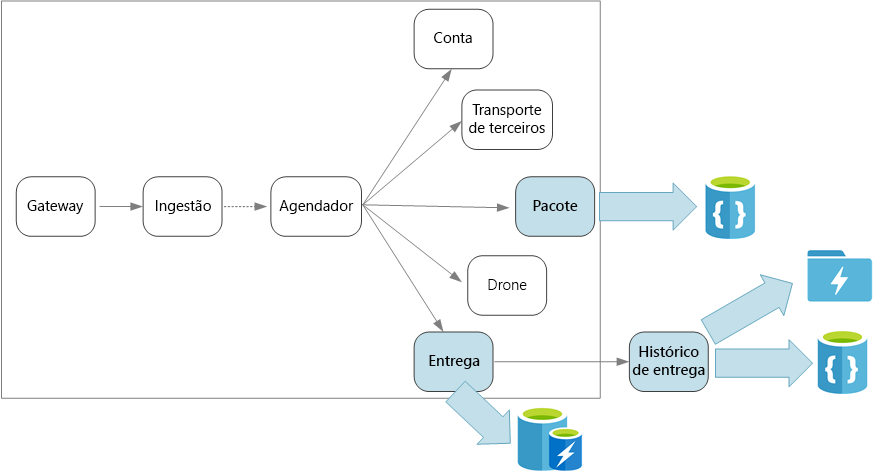
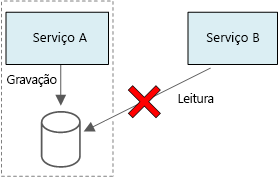

# Considerações de dados

Quais são as considerações para gerenciar dados em uma arquitetura de microsserviços? Os principais desafios são como cada microsserviço gerencia os próprios dados, a integridade e a consistência de dados.

Um princípio básico dos microsserviços é que cada serviço gerencia seus próprios dados. Dois serviços não devem compartilhar um armazenamento de dados. Em vez disso, cada serviço é responsável pelo próprio armazenamento de dados particular, que não pode ser acessado diretamente por outros serviços.

O motivo para essa regra é evitar acoplamento não intencional entre serviços, que poderá ocorrer se os serviços compartilharem os mesmos esquemas de dados subjacentes. Se houver alteração de esquema de dados, a alteração deverá ser coordenada em cada serviço que dependa desse banco de dados. Ao isolar o armazenamento de dados de cada serviço, podemos limitar o escopo da alteração e preservar a agilidade de implantações verdadeiramente independentes. Outro motivo é que cada microsserviço pode ter seus próprios modelos de dados, consultas ou padrões de leitura/gravação. O uso de um armazenamento de dados compartilhado limita a capacidade de cada equipe de otimizar o armazenamento para seu serviço específico.

Essa abordagem leva naturalmente a uma persistência poliglota — o uso de várias tecnologias de armazenamento de dados em um único aplicativo. Um serviço pode exigir os recursos de esquema na leitura de um banco de dados de documento. Outro pode precisar da integridade referencial fornecida por um RDBMS. Cada equipe pode fazer a melhor escolha para seu serviço. Para obter mais informações sobre os princípios gerais da persistência poliglota, consulte Usar o melhor armazenamento de dados para o trabalho.

> Observação: Não há problema em os serviços compartilharem o mesmo servidor de banco de dados físico. O problema ocorre quando os serviços compartilham o mesmo esquema ou a leitura e a gravação para o mesmo conjunto de tabelas de banco de dados.

## Desafios

Alguns desafios são provenientes dessa abordagem distribuída ao gerenciamento de dados. Primeiro, pode haver redundância entre os armazenamentos de dados, com o mesmo item de dados aparecendo em vários lugares. Por exemplo, dados podem ser armazenados como parte de uma transação, armazenados em outro local para análise, geração de relatórios ou arquivamento. Dados duplicados ou particionados podem levar a problemas de integridade e consistência. Quando as relações de dados abrangem vários serviços, não é possível usar técnicas de gerenciamento de dados tradicionais para impor as relações.

A modelagem de dados tradicional usa a regra "um fato em um único local". Cada entidade aparece exatamente uma vez no esquema. Outras entidades podem manter referências a ele, mas não duplicá-lo. A vantagem óbvia à abordagem tradicional é que as atualizações são feitas em um único local, o que evita problemas com consistência de dados. Em uma arquitetura de microsserviços, considere como as atualizações são propagadas entre os serviços e como gerenciar eventual consistência quando os dados aparecem em vários locais sem uma consistência forte.

## Abordagens ao gerenciamento de dados

Não há uma abordagem adequada para todos os casos, mas, a seguir, temos algumas diretrizes gerais que podem ajudá-lo no gerenciamento de dados em uma arquitetura de microsserviços.

- Adote consistência eventual quando possível. Entenda os lugares no sistema onde uma consistência forte ou as transações ACID são necessárias e os locais onde a consistência eventual é aceitável.

- Quando você precisa de garantias de consistência forte, um serviço pode representar a fonte de verdade para determinada entidade, exposta por meio de uma API. Outros serviços podem conter sua própria cópia ou um subconjunto de dados, que eventualmente são consistente com os dados mestres, mas não são considerados como fonte da verdade. Por exemplo, imagine um sistema de comércio eletrônico com um serviço de pedido de cliente e um serviço de recomendação. O serviço de recomendação pode escutar eventos do serviço de pedidos, mas se um cliente solicitar reembolso, será o serviço de pedidos, e não o serviço de recomendação, que terá todo o histórico da transação.

- Para transações, use padrões como Supervisor de Agente do Agendador (coordena um conjunto de ações distribuídas como uma única operação. Se qualquer uma das ações falhar, tenta tratar as falhas de forma transparente ou então desfaz o trabalho que foi executado para que toda a operação tenha êxito ou falhe como um todo) e transações de compensação (desfaz o trabalho executado por uma série de etapas, que juntas definem uma operação eventualmente consistente, se uma ou mais das etapas falhar) para manter os dados consistentes em vários serviços. Talvez seja necessário armazenar dados adicionais que capturem o estado de uma unidade de trabalho que abrange vários serviços, para evitar uma falha parcial entre os serviços. Por exemplo, manter um item de trabalho em uma fila durável, enquanto uma transação de várias etapas está em andamento.

- Armazene apenas os dados que um serviço precisa. Um serviço pode precisar apenas de um subconjunto de informações sobre uma entidade de domínio. Por exemplo, no contexto limitado de Remessa, precisamos saber qual cliente está associado a uma entrega específica. Mas não precisamos do endereço de cobrança do cliente — que é gerenciado pelo contexto limitado de Contas. Pensar cuidadosamente o domínio e usar uma abordagem DDD, pode ajudar.

- Considere se os serviços são coerentes e acoplados de forma flexível. Se dois serviços trocam informações continuamente entre si, resultando em APIs de conversa, será necessário redigir os limites do serviço, mesclando dois serviços ou refatorando suas funcionalidades.

- Use um estilo de arquitetura baseado em eventos. Nesse estilo de arquitetura, um serviço publica um evento quando há alterações em suas entidades ou modelos públicos. Serviços interessados podem assinar esses eventos. Por exemplo, outro serviço pode usar os eventos para construir uma visão materializada dos dados que seja mais adequada a consultas.

- Um serviço que tem eventos deve publicar um esquema que pode ser usado para automatizar a serialização e desserialização de eventos, para evitar acoplamento entre publicadores e assinantes. Considere o esquema JSON ou uma estrutura como Microsoft Bond, Protobuf ou Avro.

- Em grande escala, os eventos podem se tornar um gargalo no sistema, portanto, considere usar agregação ou processamento em lote para reduzir a carga total.

## Entrega por Drones: Escolhendo os repositórios de dados

Mesmo com apenas alguns serviços, o contexto limitado de Remessa ilustra vários dos pontos abordados nesta seção.

Quando um usuário agenda uma nova entrega, a solicitação do cliente inclui informações sobre a entrega, como locais de retirada e entrega, e sobre o pacote, como tamanho e peso. Essas informações definem uma unidade de trabalho, que o serviço de ingestão envia para os Hubs de Eventos. É importante que a unidade de trabalho permaneça no armazenamento persistente enquanto o serviço do Agendador executa o fluxo de trabalho, para que nenhuma solicitação de entrega seja perdida.

Os vários serviços de back-end cuidam de diferentes partes da informação na solicitação e também têm diferentes perfis de leitura e gravação.

## Serviço de Entrega

O serviço de Entrega armazena informações sobre cada entrega agendada no momento ou em andamento. Ele escuta eventos de drone e acompanha o status das entregas em andamento. Ele também envia eventos de domínio com atualizações de status da entrega.

Espera-se que os usuários verifiquem com frequência o status de uma entrega enquanto aguardam o pacote. Portanto, o serviço de Entrega exige um armazenamento de dados que enfatize a taxa de transferência (leitura e gravação) em um armazenamento de longo prazo. Além disso, o serviço de Entrega não realiza consultas nem análises complexas, simplesmente busca o status mais recente de determinada entrega. A equipe do serviço de Entrega escolheu o Cache Redis por seu alto desempenho de leitura e gravação. As informações armazenadas no Redis têm duração relativamente curta. Quando uma entrega é concluída, o serviço de histórico da entrega é o sistema de registro.

## Serviço de histórico da entrega

O serviço de histórico da entrega escuta os eventos de status do serviço de entrega. Ele armazena esses dados em armazenamento de longo prazo. Há dois diferentes casos de uso de dados históricos, com diferentes requisitos de armazenamento de dados.

O primeiro cenário é a agregação de dados com o objetivo de análise, a fim de otimizar os negócios ou melhorar a qualidade do serviço. Observe que o serviço de histórico de entrega não executa análise real dos dados. Só é responsável pela inclusão e pelo armazenamento. Para este cenário, o armazenamento deve ser otimizado para análise de dados em um grande conjunto de dados, usando uma abordagem de esquema na leitura para acomodar uma variedade de fontes de dados.

## Serviço de pacote

O serviço do pacote armazena informações sobre todos os pacotes. Os requisitos de armazenamento para o pacote são:

- Armazenamento de longo prazo;
- Capaz de lidar com um alto volume de pacotes, que requerem alta taxa de transferência de gravação;
- Suporte a consultas simples por ID do pacote. Nenhum requisito de integridade referencial ou junções complexas;

Como os dados do pacote não são relacionais, um banco de dados orientado a documentos é apropriado.
