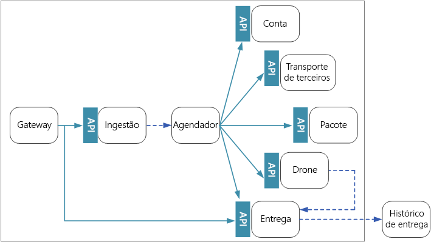
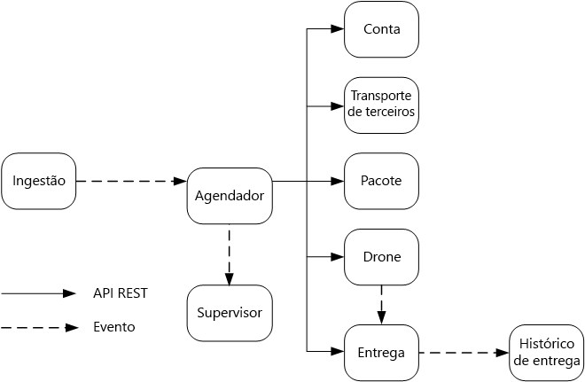

# Comunicação entre serviços

A comunicação entre os microsserviços deve ser eficiente e robusta. Com vários serviços pequenos interagindo para concluir uma única transação, isso pode ser um desafio. Vamos examinar as compensações entre o sistema de mensagens assíncrono em relação às APIs síncronas. Em seguida, vamos observar alguns dos desafios ao criar uma comunicação entre serviços resiliente e a função que uma malha de serviço pode desempenhar.

## Desafios

Aqui estão alguns dos principais desafios decorrentes da comunicação de serviço a serviço. As malhas de serviço, descritas mais adiante, são projetadas para lidar com muitos desses desafios.

**Resiliência**. Pode haver dezenas ou até mesmo centenas de instâncias de qualquer microsserviço. Uma instância pode falhar por vários motivos. Pode haver uma falha no nível de nó, como uma falha de hardware ou uma reinicialização da VM. Uma instância pode falhar ou ficar sobrecarregada com solicitações e, assim, impossibilitada de processar solicitações novas. Qualquer um desses eventos pode fazer com que uma chamada de rede falhe. Há dois padrões de design que podem ajudar a tornar as chamadas de rede de serviço a serviço mais resilientes:

- **Repetição**[^1]. Uma chamada de rede pode falhar por causa de uma falha temporária que desaparece por si só. Em vez de falhar totalmente, o autor da chamada normalmente deverá repetir a operação um determinado número de vezes ou até que um período de tempo limite configurado expire. No entanto, se uma operação não for idempotente, as repetições poderão causar efeitos colaterais não intencionais. A chamada original talvez seja bem-sucedida, mas o autor da chamada nunca receberá uma resposta. Se o autor da chamada fizer novas tentativas, a operação poderá ser invocada duas vezes. Em geral, não é seguro repetir os métodos POST ou PATCH, uma vez que não há garantias de que eles sejam idempotentes.

[^1]: Permita que um aplicativo trate falhas transitórias quando tentar se conectar a um serviço ou recurso de rede ao repetir de forma transparente uma operação com falha. Isso pode melhorar a estabilidade do aplicativo.

- **Disjuntor (circuit breaker)**[^2]. Um número excessivo de solicitações com falha pode causar um gargalo, já que as solicitações pendentes se acumulam na fila. Essas solicitações bloqueadas podem reter recursos críticos do sistema, como memória, threads, conexões de banco de dados e outros, e provocar falhas em cascata. O uso do padrão de Disjuntor pode impedir que um serviço tente repetir várias vezes uma operação que provavelmente falhará.

[^2]: Trate as falhas que possam consumir uma quantidade variável de tempo para serem recuperadas ao se conectar a um serviço ou recurso remoto. Isso pode melhorar a estabilidade e a resiliência de um aplicativo.

**Balanceamento de carga**. Quando o serviço "A" chama o serviço "B", a solicitação deve alcançar uma instância em execução do serviço "B". No Kubernetes, o tipo de recurso Service fornece um endereço IP estável para um grupo de pods. O tráfego de rede para o endereço IP do serviço é encaminhado para um pod por meio de regras de iptable. Por padrão, um pod aleatório é escolhido. Uma malha de serviço pode fornecer algoritmos de balanceamento de carga mais inteligentes com base na latência observada ou em outras métricas.

**Rastreamento distribuído**. Uma única transação pode abranger vários serviços. Isso pode dificultar o monitoramento do desempenho geral e da integridade do sistema. Mesmo que cada serviço gere logs e métricas, sem alguma forma associá-los, eles serão de utilidade limitada.

**Controle de versão do serviço**. Quando uma equipe implanta uma nova versão de um serviço, ela deve evitar a interrupção de qualquer outro serviço ou cliente externo que dependa dele. Além disso, talvez você queira executar várias versões de uma serviço lado a lado e rotear solicitações para uma versão específica.

**Criptografia de TLS e autenticação de TLS mútua**. Por motivos de segurança, convém criptografar o tráfego entre os serviços com TLS e usar a autenticação de TLS mútua para autenticar os autores de chamadas.

## Sistema de mensagens síncrono versus assíncrono

Há dois padrões básicos de mensagens que os microsserviços podem utilizar para se comunicarem com outros microsserviços:

1. Comunicação síncrona. Nesse padrão, um serviço chama uma API que outro serviço expõe usando um protocolo, como o HTTP ou o gRPC. Esta opção é um padrão de sistema de mensagens síncrono porque o autor da chamada aguarda uma resposta do receptor.
1. Transmissão de mensagens assíncronas. Nesse padrão, um serviço envia a mensagem sem aguardar uma resposta, e um ou mais serviços processam a mensagem de maneira assíncrona.

É importante distinguir entre uma E/S assíncrona e um protocolo assíncrono. Uma E/S assíncrona indica que o thread de chamada não será bloqueado enquanto a E/S não for concluída. Isso é importante para o desempenho, mas é um detalhe de implementação em termos de arquitetura. Um protocolo assíncrono indica que o remetente não aguardará uma resposta. O HTTP será um protocolo síncrono, mesmo que um cliente HTTP utilize a E/S assíncrona ao enviar uma solicitação.

Há vantagens e desvantagens para cada padrão. O paradigma de solicitação/resposta é bem compreendido, de modo que a criação de uma API pode parecer mais natural do que a criação de um sistema de mensagens. No entanto, o sistema de mensagens assíncrono apresenta algumas vantagens que podem ser muito úteis em uma arquitetura de microsserviços:

- **Acoplamento reduzido**. O remetente da mensagem não precisa saber sobre o consumidor.

- **Vários assinantes**. Ao usar um modelo pub/sub, vários consumidores podem assinar para receber eventos.

- **Isolamento de falha**. Se o consumidor falhar, o remetente ainda poderá enviar mensagens. As mensagens serão removidas quando o consumidor recuperá-las. Essa capacidade é especialmente útil em uma arquitetura de microsserviços, uma vez que cada serviço tem seu próprio ciclo de vida. Um serviço pode se tornar indisponível ou ser substituído por uma versão mais recente a qualquer momento. O sistema de mensagens assíncrono pode controlar o tempo de inatividade intermitente. Por outro lado, as APIs síncronas exigem que o serviço de downstream esteja disponível, ou a operação falhará.

- **Capacidade de resposta**. Um serviço de upstream poderá responder mais rapidamente se ele não aguardar os serviços de downstream. Isso é especialmente útil em uma arquitetura de microsserviços. Se houver uma cadeia de dependências de serviço (o serviço A chama o serviço B, que chama o C e assim por diante), a espera pelas chamadas síncronas poderá adicionar quantidades de latência inaceitáveis.

- **Nivelamento de carga**. Uma fila pode atuar como um buffer para nivelar a carga de trabalho, de modo que os destinatários possam processar as mensagens em seu próprio ritmo.

- **Fluxos de trabalho**. As filas podem ser usadas para gerenciar um fluxo de trabalho, marcando a mensagem após cada etapa no fluxo de trabalho.

No entanto, há também alguns desafios para usar o sistema de mensagens assíncrono com eficiência.

- **Acoplamento com a infraestrutura de mensagens**. O uso de uma infraestrutura de mensagens específica pode causar um acoplamento estreito com essa infraestrutura. Será difícil mudar para outra infraestrutura de mensagens posteriormente.

- **Latência**. A latência de ponta a ponta para uma operação poderá ser alta se as filas de mensagens forem preenchidas.

- **Custo**. Nas taxas de transferência altas, o custo monetário da infraestrutura de mensagens pode ser significativo.

- **Complexidade**. Controlar o sistema de mensagens assíncrono não é uma tarefa fácil. Por exemplo, você deve lidar com mensagens duplicadas, seja ao eliminar a duplicação ou ao tornar as operações idempotentes. Também é difícil implementar a semântica de solicitação-resposta usando o sistema de mensagens assíncrono. Para enviar uma resposta, você precisa de outra fila, além de uma maneira de correlacionar as mensagens de solicitação e de resposta.

- **Taxa de transferência**. Se as mensagens exigirem uma semântica de fila, a fila poderá se tornar um gargalo no sistema. Cada mensagem exige, pelo menos, uma operação de fila e uma operação de remoção da fila. Além disso, a semântica de fila geralmente exige algum tipo de bloqueio na infraestrutura de mensagens. Se a fila for um serviço gerenciado, poderá haver latência adicional, uma vez que a fila é externa à rede virtual do cluster. Você pode mitigar esses problemas por meio de mensagens de lote, mas isso complica o código. Se as mensagens não exigirem a semântica de fila, você poderá usar o fluxo de evento em vez de uma fila. Para obter mais informações, consulte Arquitetura orientada a eventos.

## Entrega por Drones: escolhendo os padrões de mensagens

Com essas considerações em mente, a equipe de desenvolvimento fez as seguintes opções de design para o aplicativo de entrega por drone:

- O serviço Ingestão expõe uma API de REST pública que os aplicativos clientes usam para agendar, atualizar ou cancelar as entregas.

- O serviço Ingestão usa os Hubs de Eventos para enviar mensagens assíncronas para o serviço Agendador. As mensagens assíncronas são necessárias para implementar o nivelamento de carregamento que é necessário para a ingestão de dados.

- Os serviços Contabilidade, Entrega, Empacotamento, Drone e Transporte de Terceiros expõem as APIs de REST internas. O serviço Agendador chama essas APIs para executar uma solicitação de usuário. Um motivo para usar as APIs síncronas é que o Agendador precisa obter uma resposta de cada um dos serviços de downstream. Uma falha em qualquer um dos serviços de downstream indica que toda a operação falhou. No entanto, um problema potencial é a quantidade de latência que é introduzida ao chamar os serviços de back-end.

- Se algum serviço de downstream tiver uma falha não transitória, toda a transação deverá ser marcada como com falha. Para lidar com este caso, o serviço Agendador envia uma mensagem assíncrona para o Supervisor, para que o Supervisor possa agendar transações de compensação.

- O serviço Entrega expõe uma API pública que os clientes podem usar para obter o status de uma entrega.

- Enquanto um drone está em trânsito, o serviço Drone envia eventos que contêm a localização e o status atual do drone. O serviço Entrega segue esses eventos para acompanhar o status de uma entrega.

- Quando o status de uma entrega é alterado, o serviço Entrega envia um evento de status de entrega, como `DeliveryCreated` ou `DeliveryCompleted`. Qualquer serviço pode assinar esses eventos. No projeto atual, o serviço Entrega é o único assinante, mas poderá haver outros assinantes posteriormente. Por exemplo, os eventos poderão ir para um serviço de análise em tempo real. E, uma vez que o Agendador não precisa aguardar uma resposta, a adição de mais assinantes não afeta o caminho principal do fluxo de trabalho.

Observe que os eventos de status de entrega são derivados de eventos de localização de drone. Por exemplo, quando um drone alcança um local de entrega e solta um pacote, o serviço Entrega converte isso em um evento DeliveryCompleted. Este é um exemplo de raciocínio em termos de modelos de domínio. Conforme descrito anteriormente, o Gerenciamento de Drone pertence a um contexto limitado separado. Os eventos de drone transmitem a localização física de um drone. Por outro lado, os eventos de entrega representam as alterações no status de uma entrega, que é uma entidade de negócios diferente.

## Usando uma malha de serviço

Uma malha do serviço é uma camada de software que gerencia a comunicação de serviço a serviço. As malhas de serviço são projetadas para abordar muitas das preocupações listadas na seção anterior e para levar a responsabilidade por essas preocupações para longe dos próprios microsserviços e para dentro de uma camada compartilhada. A malha de serviço atua como um proxy que intercepta a comunicação de rede entre os microsserviços no cluster.

> Observação: A malha de serviço é um exemplo do Padrão embaixador —, um serviço auxiliar que envia as solicitações de rede em nome do aplicativo.

No momento, as principais opções para uma malha de serviço no Kubernetes são linkerd e Istio. Ambas as tecnologias estão evoluindo rapidamente. No entanto, alguns recursos que o linkerd e o Istio têm em comum incluem:

- O balanceamento de carga no nível da sessão, com base nas latências observadas ou no número de solicitações pendentes. Isso pode melhorar o desempenho em relação ao balanceamento de carga da camada 4 fornecido pelo Kubernetes.

- Roteamento da camada 7 com base no caminho da URL, no cabeçalho de Host, na versão da API ou em outras regras no nível de aplicativo.

- Repetição de solicitações com falha. Uma malha de serviço reconhece os códigos de erro de HTTP e pode repetir automaticamente as solicitações com falha. Você pode configurar o número máximo de repetições, juntamente com um período de tempo limite para delimitar a latência máxima.

- Interrupção de circuito. Se uma instância falhar de modo consistente nas solicitações, a malha de serviço a marcará temporariamente como indisponível. Após um período de retirada, ele tentará a instância novamente. Você pode configurar o disjuntor com base em vários critérios, como o número de falhas consecutivas.

- A malha de serviço captura métricas sobre chamadas entre serviços, como o volume de solicitação, a latência, as taxas de êxito e de erro e os tamanhos das respostas. A malha de serviço também habilita o rastreamento distribuído ao adicionar informações de correlação para cada salto em uma solicitação.

- Autenticação de TLS mútua para chamadas de serviço a serviço.

Você precisa de uma malha de serviço? O valor agregado a um sistema distribuído é, de fato, interessante. Se não tiver uma malha de serviço, você precisará considerar cada um dos desafios mencionados no início deste capítulo. Você pode resolver problemas de repetição, no disjuntor e de rastreamento distribuído sem uma malha de serviço, mas uma malha do serviço transfere essas problemas dos serviços individuais para uma camada dedicada. Por outro lado, a malha de serviço é uma tecnologia relativamente nova, que ainda está em desenvolvimento. A implantação de uma malha de serviço adiciona complexidade à instalação e à configuração do cluster. Pode haver implicações de desempenho porque as solicitações agora são roteadas por meio do proxy da malha de serviço e também porque os serviços extras agora estão sendo executados em cada nó no cluster. Você deve realizar testes de carga e de desempenho minuciosos antes de implementar uma malha de serviço na produção.
