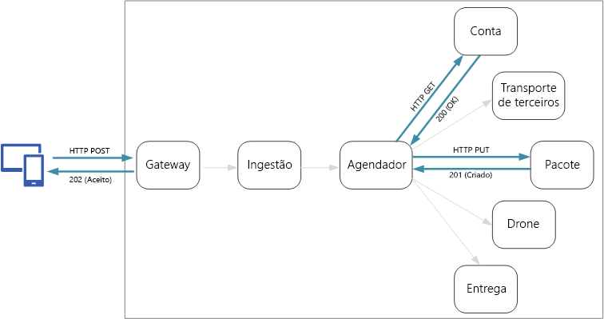
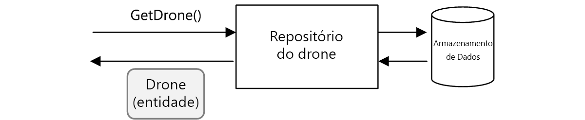
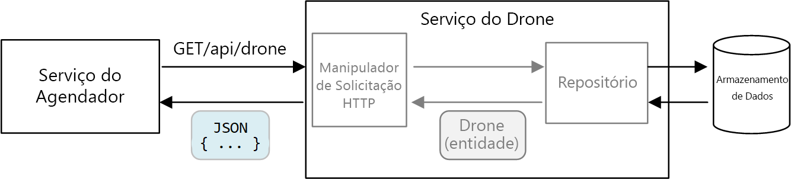

# Design de API

Um bom design de API é importante em uma arquitetura de microsserviços porque toda a troca de dados entre os serviços ocorre por meio de mensagens ou de chamadas à API. As APIs devem ser eficientes para evitar a criação de E/S com ruídos [^1]. Uma vez que os serviços são projetados por equipes que trabalham de forma independente, as APIs devem ter esquemas semânticos e de controle de versão bem definidos para que as atualizações não interrompam outros serviços.

[^1]: O efeito cumulativo de um grande número de solicitações de E/S pode ter um impacto significativo no desempenho e capacidade de resposta.



É importante distinguir entre os dois tipos de API:

- As APIs públicas que os aplicativos do cliente chamam.
- As APIs de back-end que são usadas para comunicação entre serviços.

Esses dois casos de uso têm requisitos um pouco diferentes. Uma API pública deve ser compatível com aplicativos cliente, normalmente os aplicativos de navegador ou os aplicativos móveis nativos. Na maioria das vezes, isso significa que a API pública usará o REST sobre o HTTP. No entanto, para as APIs de back-end, você precisa levar em conta o desempenho da rede. Dependendo da granularidade dos seus serviços, a comunicação entre serviços pode resultar em uma grande quantidade de tráfego de rede. Os serviços podem rapidamente se tornar um limite de E/S. Por esse motivo, considerações como a velocidade de serialização e o tamanho de payload se tornam mais importantes. Algumas alternativas populares para usar o REST sobre o HTTP incluem gRPC, Apache Avro e Apache Thrift. Esses protocolos são compatíveis com a serialização binária e geralmente são mais eficientes do que o HTTP.

## Considerações

Aqui estão algumas questões a serem consideradas ao escolher como implementar uma API.

**REST versus RPC**. Considere as compensações entre o uso de uma interface no estilo REST em vez de uma interface no estilo RPC.

- O REST modela recursos, o que pode ser uma maneira natural de expressar seu modelo de domínio. Ele define uma interface uniforme com base nos verbos HTTP, o que incentiva a evolucionabilidade. Ele tem uma semântica bem definida em termos de idempotência, efeitos colaterais e códigos de resposta. E impõe uma comunicação sem monitoração de estado, o que melhora a escalabilidade.

- O RPC está mais voltado para as operações ou para os comandos. Uma vez que as interfaces de RPC se parecem com chamadas de método locais, talvez você acabe criando APIs extremamente ruidosas. No entanto, isso não significa que o RPC deve ser ruidoso. Isso apenas indica que você precisa ter cuidado ao criar a interface.

Para obter uma interface RESTful, a opção mais comum é REST sobre HTTP usando JSON. Para obter uma interface no estilo RPC, há várias estruturas populares, incluindo gRPC, Apache Avro e Apache Thrift.

**Eficiência**. Considere a eficiência em termos de velocidade, memória e tamanho de payload. Normalmente, uma interface baseada em gRPC é mais rápida que REST sobre HTTP.

**IDL (linguagem IDL)**. Uma IDL é usada para definir os métodos, os parâmetros e os valores retornados de uma API. Um IDL pode ser usado para gerar o código do cliente, o código de serialização e a documentação da API. Os IDLs também podem ser consumidos por ferramentas de teste da API, como o Postman. Estruturas como gRPC, Avro e Thrift definem suas próprias especificações de IDL. O REST sobre HTTP não tem um formato padrão de IDL, mas uma opção comum é o OpenAPI (anteriormente conhecido como Swagger). Você também pode criar uma API de REST HTTP sem usar uma linguagem de definição formal, mas perderá os benefícios da geração de código e de teste.

**Serialização**. Como os objetos são serializados eletronicamente? As opções incluem formatos baseados em texto (principalmente JSON) e formatos binários, como um buffer de protocolo. Os formatos binários geralmente são mais rápidos do que os formatos baseados em texto. No entanto, o JSON tem vantagens em termos de interoperabilidade porque a maioria das linguagens e das estruturas são compatíveis com a serialização JSON. Alguns formatos de serialização exigem um esquema fixo e alguns exigem a compilação de um arquivo de definição de esquema. Nesse caso, você precisará incorporar essa etapa no processo de build.

**Suporte de frameworks e linguagem**. O HTTP é compatível com praticamente todas os frameworks e linguagens. gRPC, Avro e Thrift têm bibliotecas para C++, C#, Java e Python. Thrift e gRPC também são compatíveis com Go.

**Compatibilidade e interoperabilidade**. Se escolher um protocolo como gRPC, talvez você precisará de uma camada de conversão de protocolo entre a API pública e o back-end. Um gateway pode executar essa função. Se você estiver usando uma malha de serviço, considere quais protocolos são compatíveis com ela. Por exemplo, linkerd tem suporte interno para HTTP, Thrift e gRPC.

Uma recomendação de linha de base é escolher REST sobre HTTP, a menos que você precise dos benefícios de desempenho de um protocolo binário. O REST sobre HTTP não requer nenhuma biblioteca especial. Ele cria um acoplamento mínimo, uma vez que os autores da chamada não precisam de um stub de cliente para se comunicarem com o serviço. Há ecossistemas avançados de ferramentas para dar suporte às definições de esquema, teste e monitoramento de pontos de extremidade de HTTP RESTful. Por fim, o HTTP é compatível com clientes de navegador, portanto, você não precisa de uma camada de conversão de protocolo entre o cliente e o back-end.

No entanto, se escolher o REST sobre HTTP, você deverá fazer testes de carga e de desempenho no início do processo de desenvolvimento para validar se ele funciona bem o suficiente para o seu cenário.

## Projeto de API RESTful

Aqui estão algumas considerações específicas para ter em mente:

- Fique atento às APIs que vazam detalhes de implementação internos ou refletem um esquema de banco de dados interno. A API deve modelar o domínio. É um contrato entre serviços e, de modo ideal, só deve ser alterado quando novas funcionalidades forem adicionadas, não apenas porque você refatorou algum código ou normalizou uma tabela de banco de dados.

- Diferentes tipos de cliente, como o aplicativo móvel e o navegador da Web da área de trabalho, podem exigir tamanhos diferentes de payload ou padrões de interação. Considere o uso do padrão back-ends para front-ends[^2] para criar back-ends separados para cada cliente, que expõem uma interface ideal para esse cliente.

[^2]: Crie serviços de back-end separados a serem consumidos por aplicativos de front-end específico ou interfaces. Esse padrão é útil quando você deseja evitar a personalização de um único back-end para várias interfaces. Esse padrão foi descrito pela primeira vez por Sam Newman.

- Para as operações com efeitos colaterais, considere torná-los idempotentes e implementá-los como métodos PUT. Isso habilitará tentativas seguras e poderá melhorar a resiliência.

- Os métodos HTTP podem ter uma semântica assíncrona, em que o método retorna uma resposta imediatamente, mas o serviço realiza a operação assíncrona. Nesse caso, o método deve retornar um código de resposta HTTP 202, que indica que a solicitação foi aceita para processamento, mas o processamento ainda não foi concluído.

## Mapeamento de REST para padrões de DDD

Os padrões como entidade, agregação e objeto de valor são projetados para colocar determinadas restrições nos objetos em seu modelo de domínio. Em muitas discussões de DDD, os padrões são modelados usando conceitos da linguagem orientada a objeto (OO), como construtores ou getters e setters de propriedade. Por exemplo, os objetos de valor devem ser imutáveis. Em uma linguagem de programação OO, você aplicaria isso ao atribuir os valores no construtor e tornando as propriedades somente leitura:

```ts
export class Location {
    readonly latitude: number;
    readonly longitude: number;

    constructor(latitude: number, longitude: number) {
        if (latitude < -90 || latitude > 90) {
            throw new RangeError('latitude must be between -90 and 90');
        }
        if (longitude < -180 || longitude > 180) {
            throw new RangeError('longitude must be between -180 and 180');
        }
        this.latitude = latitude;
        this.longitude = longitude;
    }
}
```
Esses tipos de práticas recomendadas de codificação são particularmente importantes ao criar um aplicativo monolítico tradicional. Com uma base de código grande, muitos subsistemas podem usar o objeto Location, portanto, é importante que o objeto imponha o comportamento correto.

Outro exemplo é o padrão Repositório, que garante que outras partes do aplicativo não façam leituras ou gravações diretas no armazenamento de dados:



Em uma arquitetura de microsserviços, no entanto, os serviços não compartilham a mesma base de código, nem os repositórios de dados. Em vez disso, eles se comunicam por meio de APIs. Considere o caso em que o serviço Agendador solicita informações sobre um drone do serviço Drone. O serviço Drone tem seu modelo interno de drone expresso através de código. Mas o Agendador não o vê. Em vez disso, ele recupera uma representação da entidade — do drone, talvez um objeto JSON em uma resposta de HTTP.



O serviço Agendador não pode modificar os modelos internos de serviço do Drone ou gravar no armazenamento de dados de serviço do Drone. Isso indica que o código que implementa o serviço Drone tem uma área de superfície exposta menor em comparação com o código em um monolito tradicional.

Você pode modelar muitos dos padrões de DDD por meio das APIs REST.

Por exemplo:

- As agregações naturalmente mapeiam para os recursos em REST. Por exemplo, a agregação Entrega deve ser exposta como um recurso pela API Entrega.

- As agregações são os limites de consistência. As operações em agregações nunca devem deixar uma agregação em um estado inconsistente. Portanto, você deve evitar criar APIs que permitem que um cliente manipule o estado interno de uma agregação. Em vez disso, favoreça as APIs de alta granularidade que expõem agregações como recursos.

- As entidades têm identidades exclusivas. No REST, os recursos têm identificadores exclusivos na forma de URLs. Crie URLs de recursos que correspondam à identidade de domínio da entidade. O mapeamento da URL para a identidade de domínio pode parecer vago para o cliente.

- As entidades filho de uma agregação podem ser alcançadas por meio da navegação da entidade raiz. Se você seguir os princípios HATEOAS, as entidades filho poderão ser acessadas por meio de links na representação da entidade pai.

- Uma vez que os objetos de valor são imutáveis, as atualizações são executadas, substituindo o objeto de valor inteiro. No REST, implante as atualizações por meio das solicitações PUT ou PATCH.

- Um repositório permite aos clientes consultar, adicionar ou remover objetos em uma coleção, abstraindo os detalhes do armazenamento de dados subjacente. No REST, uma coleção pode ser um recurso distinto, com métodos para consultar a coleção ou adicionar novas entidades na coleção.

Quando você projeta suas APIs, pense em como elas expressam o modelo de domínio, não apenas nos dados dentro do modelo, mas também nas operações de negócios e nas restrições nos dados.

| Conceito de DDD | Equivalente a REST | Exemplo                                    |
|-----------------|--------------------|--------------------------------------------|
| Agregação       | Recurso            | `{ "1":1234, "status":"pending"... }`      |
| Identidade      | URL                | `https://delivery-service/deliveries/1`    |
| Entidades filho | Links              | `{ "href": "/deliveries/1/confirmation" }` |
| Atualizar objetos de valor | PUT ou PATCH | `PUT https://delivery-service/deliveries/1/dropoff` |
| Repositório     | Coleção            | `https://delivery-service/deliveries?status=pending` |

## Controle de versão de API

Uma API é um contrato entre um serviço e os clientes ou os consumidores do serviço. Se uma API for alterada, haverá o risco de interromper clientes que dependem da API, sejam eles clientes externos ou de outros microsserviços. Portanto, é uma boa ideia minimizar a quantidade de alterações de API que você faz. Geralmente, as alterações na implementação subjacente não exigem nenhum alteração na API. No entanto, de modo realista, em algum momento você desejará adicionar novos recursos ou novas capacidades que exigem a alteração de uma API existente.

Sempre que possível, torne as alterações na API compatíveis com as versões anteriores. Por exemplo, evite remover um campo de um modelo, uma vez que isso pode interromper os clientes que esperam que o campo exista. A adição de um campo não interrompe a compatibilidade, visto que os clientes devem ignorar todos os campos que não compreendem em uma resposta. No entanto, o serviço deve tratar o caso em que um cliente mais antigo omite o novo campo em uma solicitação.

Suporte para o controle de versão em seu contrato de API. Se você fizer uma alteração de API de interrupção, apresente uma nova versão de API. Continue a oferecer suporte à versão anterior e permita que os clientes selecionem qual versão será chamada. Há algumas maneiras de fazer isso. Uma delas é expor as duas versões no mesmo serviço. Outra opção é executar as duas versões do serviço lado a lado e rotear as solicitações para uma versão ou para a outra com base nas regras de roteamento de HTTP.


Há um custo para dar suporte a várias versões em termos de tempo de desenvolvedor, de teste e de sobrecarga operacional. Portanto, é conveniente substituir versões antigas o mais rápido possível. Para as APIs internas, a equipe que tem a API pode trabalhar com outras equipes para ajudá-las a migrar para a nova versão. Isso deve ser feito quando for útil ter um processo de controle de várias equipes. Para as APIs externas (públicas), poderá ser mais difícil substituir uma versão de API, especialmente se a API for consumida por terceiros ou por aplicativos cliente nativos.

Quando uma implementação de serviço for alterada, será útil marcar a alteração com uma versão. A versão fornece informações importantes ao solucionar problemas de erros. Ela pode ser muito útil para a análise da causa raiz saber exatamente qual versão do serviço foi chamada. Considere o uso do controle de versão semântico para versões de serviço. O controle de versão semântico usa um formato MAJOR.MINOR.PATCH. No entanto, os clientes deverão selecionar somente uma API com o número de versão principal ou, possivelmente, a versão secundária se houver alterações significativas (mas não interruptivas) entre as versões secundárias. Em outras palavras, é razoável para os clientes selecionar entre a versão 1 e a versão 2 de uma API, mas não é coerente selecionar a versão 2.1.3. Se permitir esse nível de granularidade, você correrá o risco de ter que dar suporte à proliferação de versões.
