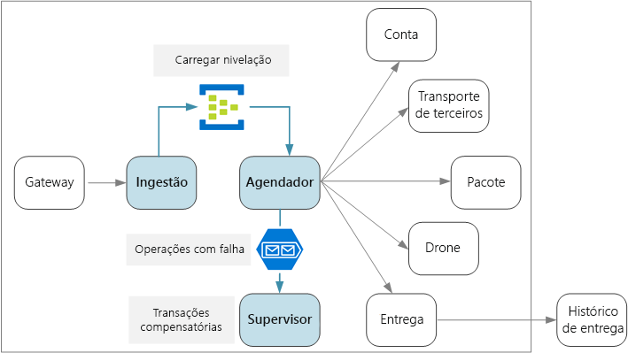
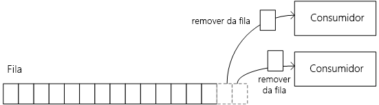
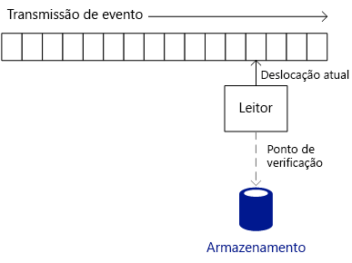
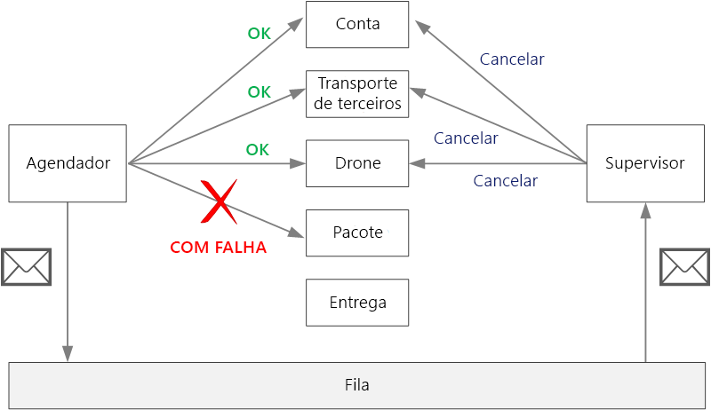

# Ingestão de dados e fluxo de trabalho

Os microsserviços normalmente têm um fluxo de trabalho que abrange vários serviços para uma única transação. O fluxo de trabalho deve ser confiável; ele não pode perder transações nem deixá-las em um estado parcialmente concluído. Além disso, o controle da taxa de ingestão de solicitações de entrada é algo crítico. Com muitos serviços pequenos comunicando-se entre si, um grande volume de solicitações de entrada pode sobrecarregar a comunicação entre os serviços.

## O fluxo de trabalho da entrega por drone

No aplicativo de entrega por drone, as seguintes operações devem ser executadas para o agendamento de uma entrega:

1. Verificar o status da conta do cliente (serviço de Conta).
1. Criar uma nova entidade de pacote (serviço de Pacote).
1. Verificar se é necessário algum serviço de transporte terceirizado para a entrega, de acordo com os locais da retirada e da entrega (serviço de Transporte terceirizado).
1. Agendar um drone para a retirada (serviço de Drone).
1. Criar uma nova entidade de entrega (serviço de Entrega).

Essa é a essência do aplicativo inteiro, portanto o processo todo deve ter alto desempenho e ser confiável. Alguns desafios específicos devem ser tratados:

- **Nivelamento de carga**. O excesso de solicitações de clientes pode sobrecarregar o sistema com o tráfego de rede entre os serviços. Isso também pode sobrecarregar as dependências de back-end, como os serviços de armazenamento ou remotos. Isso pode ocasionar a limitação dos serviços realizando as chamadas, o que cria pressão de retorno no sistema. Portanto, é importante nivelar a carga das solicitações que chegam ao sistema, armazenando-as em buffer ou colocando-as em fila para processamento.

- **Entrega garantida**. Para evitar a remoção de solicitações de clientes, o componente de ingestão deverá assegurar a entrega de mensagens pelo menos uma vez.

- **Manipulação de erros**. Se algum dos serviços retornar um código de erro ou apresentar uma falha não transitória, a entrega não poderá ser agendada. Um código de erro pode indicar uma condição de erro esperada (por exemplo, a conta do cliente está suspensa) ou um erro de servidor inesperado (HTTP 5xx). Há também a possibilidade de um serviço não estar disponível, fazendo com que a chamada de rede atinja o tempo limite.

Em primeiro lugar, examinaremos o lado da ingestão da equação: como o sistema pode ingerir solicitações de entrada do usuário com alta produtividade. Em seguida, consideraremos como o aplicativo de entrega por drone pode implementar um fluxo de trabalho confiável. Na verdade, o design do subsistema de ingestão afeta o back-end do fluxo de trabalho.

## Ingestão

Com base nos requisitos comerciais, a equipe de desenvolvimento identificou os seguintes requisitos não funcionais para a ingestão:

- Produtividade constante de 10 mil solicitações/s.
- Capacidade de lidar com picos de até 50 mil/s sem remover solicitações de cliente nem atingir o tempo limite.
- Latência inferior a 500 ms em 99% do tempo.

O requisito para lidar com picos ocasionais de tráfego apresenta um desafio de design. Em teoria, o sistema pode ser escalado horizontalmente para manipular o tráfego máximo esperado. No entanto, provisionar uma quantidade tão grande de recursos como essa seria muito ineficiente. Na maioria das vezes, o aplicativo não precisará dessa capacidade, portanto haverá núcleos ociosos custando dinheiro sem adicionar valor.

Uma abordagem melhor é colocar as solicitações de entrada em um buffer e deixá-lo atuar como um nivelador de carga. Com esse design, o serviço de Ingestão deve lidar com a taxa máxima de ingestão em curtos períodos, mas os serviços de back-end precisam apenas lidar com a carga constante máxima. Ao armazenar em buffer no front-end, os serviços de back-end não precisarão lidar com grandes picos no tráfego. Os Hubs de Eventos oferecem baixa latência e alta produtividade, além de ser uma solução econômica em altos volumes de ingestão.

É importante entender como os Hubs de Eventos podem alcançar uma produtividade tão alta, porque isso afeta como um cliente deve consumir as mensagens dos Hubs de Eventos. Os Hubs de Eventos não implementam uma fila. Em vez disso, eles implementam um fluxo de eventos.
Com uma fila, um consumidor individual poderá remover uma mensagem da fila e o próximo consumidor não verá essa mensagem. As filas, portanto, permitem que você use um Padrão de consumidores concorrentes para processar mensagens em paralelo e melhorar a escalabilidade. Para maior resiliência, o consumidor mantém um bloqueio na mensagem e libera-o quando termina de processá-la. Se o consumidor falhar, por exemplo, por causa de uma falha no nó em que ele é executado, o bloqueio atingirá o tempo limite e a mensagem voltará à fila.

Os Hubs de Eventos, por outro lado, usam a semântica de streaming. Os consumidores leem o fluxo de forma independente em seu próprio ritmo. Cada consumidor é responsável por manter o controle da sua posição atual no fluxo. Um consumidor deve gravar sua posição atual no armazenamento persistente em um intervalo predefinido. Dessa forma, se o consumidor apresentar uma falha (por exemplo, falhas do consumidor ou do host), uma nova instância poderá retomar a leitura do fluxo da última posição gravada. Esse processo é chamado *ponto de verificação*.

Por motivos de desempenho, um consumidor normalmente não realiza o ponto de verificação depois de cada mensagem. Em vez disso, realiza o ponto de verificação em um intervalo fixo, por exemplo, depois de processar n mensagens ou a cada n segundos. Como consequência, se um consumidor falhar, alguns eventos poderão ser processados duas vezes, porque uma nova instância sempre continuará do último ponto de verificação. Há dois lados da mesma moeda: os pontos de verificação frequentes podem prejudicar o desempenho, mas os pontos de verificação esparsos significam que você reproduzirá mais eventos após uma falha.

Os Hubs de Eventos não são projetados para consumidores concorrentes. Embora vários consumidores possam ler um fluxo, cada um deles percorre-o de forma independente. Em vez disso, os Hubs de Eventos usam um padrão de consumidor particionado. Um hub de eventos tem até 32 partições. A escala horizontal é obtida atribuindo um consumidor separado a cada partição.

O que isso significa para o fluxo de trabalho da entrega por drone? Para obter todos os benefícios dos Hubs de Eventos, o Agendador de Entregas não pode esperar o processamento de cada mensagem antes de passar para a próxima. Se fizer isso, passará a maior parte do tempo aguardando a conclusão das chamadas de rede. Em vez disso, ele precisa processar lotes de mensagens em paralelo, usando chamadas assíncronas aos serviços de back-end.

## Tratamento de falhas

Há três classes gerais de falha a serem consideradas:

1. Um serviço downstream pode ter uma falha não transitória, que é qualquer falha que provavelmente não desapareça por si só. As falhas não transitórias incluem condições de erro normais, como uma entrada inválida para um método. Elas também incluem exceções sem tratamento no código do aplicativo ou uma falha de processo. Se esse tipo de erro ocorrer, a transação comercial inteira deverá ser marcada como uma falha. Será necessário desfazer as outras etapas na mesma transação que já foram concluídas com êxito.
1. Um serviço de downstream pode apresentar uma falha temporária, como tempo limite de rede atingido. Esses erros normalmente podem ser resolvidos simplesmente ao tentar a chamada novamente. Se a operação ainda falhar após um determinado número de tentativas, ela será considerada uma falha não transitória.
1. O serviço de Agendador em si pode falhar (por exemplo, por causa de uma falha no nó). Nesse caso, o Kubernetes abrirá uma nova instância do serviço. No entanto, as transações ainda em andamento deverão ser retomadas.

## Transações de compensação

Se ocorrer uma falha não transitória, a transação atual poderá estar em um estado de falha parcial, em que uma ou mais etapas já foram concluídas com êxito. Por exemplo, se o serviço de drone já tiver agendado um drone, ele deverá ser cancelado. Nesse caso, o aplicativo deverá desfazer as etapas concluídas com êxito usando uma transação de compensação. Em alguns casos, isso deve ser feito por um sistema externo ou até mesmo por um processo manual.

Se a lógica das transações de compensação for complexa, considere a criação de um serviço separado responsável por esse processo. No aplicativo de entrega por drone, o serviço de Agendador coloca as operações com falha em uma fila dedicada. Um microsserviço separado, chamado Supervisor, lê dessa fila e chama uma API de cancelamento nos serviços que precisam ser compensados. Essa é uma variação do Padrão de Supervisor de Agente do Agendador. O serviço de Supervisor também pode executar outras ações, como notificar o usuário por e-mail ou por SMS ou enviar um alerta para um painel de operações.

## Operações idempotentes e não idempotentes

Para evitar a perda das solicitações, o serviço de Agendador deve assegurar que todas as mensagens sejam processadas pelo menos uma vez. Os Hubs de Eventos poderão assegurar a entrega pelo menos uma vez se o cliente realizar o ponto de verificação corretamente.

Se o serviço de Agendador falhar, poderá ser no meio do processamento de uma ou mais solicitações de cliente. Essas mensagens serão retiradas por outra instância do Agendador e reprocessadas. O que acontece se uma solicitação é processada duas vezes? É importante evitar a duplicação de qualquer trabalho. Afinal, não desejamos que o sistema envie dois drones para o mesmo pacote.

Uma abordagem é criar todas as operações para que sejam idempotentes. Uma operação será idempotente se puder ser chamada várias vezes sem produzir efeitos colaterais adicionais após a primeira chamada. Em outras palavras, um cliente poderá invocar a operação uma, duas ou muitas vezes e o resultado será o mesmo. O serviço basicamente deve ignorar chamadas duplicadas. Para um método com efeitos colaterais ser idempotentes, o serviço deverá ter a capacidade de detectar chamadas duplicadas. Por exemplo, você pode solicitar que o responsável pela chamada atribua a ID, em vez de o serviço gerar uma nova ID. Com isso, o serviço pode verificar se há IDs duplicadas.

> Observação: A especificação do HTTP declara que os métodos GET, PUT e DELETE devem ser idempotentes. Não há garantia que os métodos POST sejam idempotentes. Se um método POST criar um novo recurso, normalmente não haverá nenhuma garantia de que a operação será idempotente.

Nem sempre é simples gravar um método idempotente. Outra opção é o Agendador acompanhar o andamento de todas as transações de um repositório durável. Sempre que uma mensagem fosse processada, ele consultaria o estado no repositório durável. Depois de cada etapa, ele gravaria o resultado no repositório. Pode haver implicações de desempenho nessa abordagem.

## Exemplo: operações idempotentes

A especificação do HTTP declara que os métodos PUT devem ser idempotentes. A especificação define idempotente da seguinte forma:

> um método de solicitação será considerado "idempotente" se o efeito desejado no servidor de várias solicitações idênticas com esse método for o mesmo efeito de uma única solicitação como essa. (RFC 7231)

É importante entender a diferença entre a semântica de PUT e de POST ao criar uma nova entidade. Em ambos os casos, o cliente envia uma representação de uma entidade no corpo da solicitação. No entanto, o significado do URI é diferente.

- Para um método POST, o URI representa um recurso pai da nova entidade, como uma coleção. Por exemplo, para criar uma nova entrega, o URI pode ser `/api/deliveries`. O servidor cria a entidade e atribui a ela um novo URI, como `/api/deliveries/39660`. Esse URI é retornado no cabeçalho de Localização da resposta. Cada vez que o cliente enviar uma solicitação, o servidor criará uma nova entidade com um novo URI.

- Para um método PUT, o URI identifica a entidade. Se já existir uma entidade com esse URI, o servidor substituirá a entidade existente pela versão na solicitação. Se nenhuma entidade existir com esse URI, o servidor criará uma. Por exemplo, suponha que o cliente envie uma solicitação PUT para `api/deliveries/39660`. Pressupondo que não exista nenhuma entrega com esse URI, o servidor criará uma nova. Agora se o cliente enviar a mesma solicitação novamente, o servidor substituirá a entidade existente.
