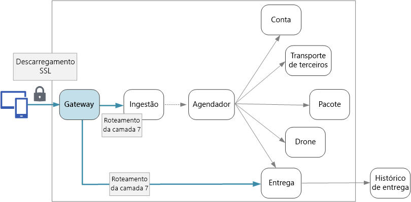

# Gateways de API

Em uma arquitetura de microsserviços, um cliente pode interagir com mais de um serviço front-end. Em razão disso, como um cliente sabe quais end-points a serem chamados? O que acontece quando são introduzidos novos serviços ou serviços existentes são refatorados? Como os serviços processam terminação SSL, autenticação e outras questões? Um gateway de API pode ajudá-lo a enfrentar esses desafios.

## O que é um gateway de API?

Um gateway de API fica entre clientes e serviços. Ele atua como um proxy reverso, encaminhando as solicitações de clientes para serviços. Ele também pode executar várias tarefas detalhadas, como autenticação, terminação de SSL e a limitação de taxa. Se você não implantar um gateway, os clientes deverão enviar solicitações diretamente aos serviços front-end. No entanto, há alguns possíveis problemas com a exposição de serviços diretamente aos clientes:

- Isso pode resultar em código de cliente complexo. O cliente deve manter o controle dos vários end-points e lidar com falhas de forma resiliente.
- Ele cria um acoplamento entre o cliente e o back-end. O cliente precisa saber como os serviços individuais são decompostos. Isso torna mais difícil manter o cliente e também mais difícil refatorar serviços.
- Uma única operação pode exigir chamadas para vários serviços. Isso pode resultar em várias viagem de ida e volta na rede entre o cliente e o servidor, adicionando latência significativa.
- Cada serviço voltado ao público deve lidar com preocupações como autenticação, SSL e limite de taxa do cliente.
- Serviços devem expor um protocolo de cliente amigável, como HTTP ou WebSocket. Isso limita a escolha de protocolos de comunicação.
- Serviços com end-points públicos são uma superfície de ataque potencial e devem ser protegidos.

Um gateway ajuda a resolver esses problemas, separando clientes de serviços. Gateways podem executar várias funções diferentes, e você pode não precisar de todas elas. As funções podem ser agrupadas nos seguintes padrões de design:

- **Roteamento de Gateway**. Use o gateway como um proxy reverso para encaminhar solicitações para um ou mais serviços de back-end, usando o roteamento de 7 camadas. O gateway fornece um end-point único para os clientes e ajuda a separar clientes de serviços.

- **Gateway de Agregação**. Use o gateway para agregar várias solicitações individuais em uma única solicitação. Esse padrão se aplica quando uma única operação exige chamadas para vários serviços de back-end. O cliente envia uma solicitação para o gateway. O gateway envia solicitações para os vários serviços de back-end, agrega os resultados e os envia de volta ao cliente. Isso ajuda a reduzir conversas entre o cliente e o back-end.

**Gateway de Descarregamento**. Use o gateway para descarregar funcionalidade de serviços individuais no gateway, particularmente questões transversais. Pode ser útil consolidar essas funções em um único local, em vez de responsabilizar cada serviço por implementá-las. Isso é especialmente verdadeiro para recursos que exigem habilidades especializadas para implementação correta, como autenticação e autorização.

Aqui estão alguns exemplos de funcionalidades que podem ser transferidas para um gateway:
- Terminação SSL
- Autenticação
- Lista de permissões de IP
- Limitação de taxa do cliente
- Log e monitoramento
- Cache de resposta
- Firewall do aplicativo Web
- Compactação GZIP
- Servir conteúdo estático

## Escolhendo uma tecnologia de gateway

Eis algumas opções para a implementação de um gateway de API em seu aplicativo.

- **Servidor proxy reverso**. Nginx e HAProxy são servidores de proxy reverso populares compatíveis com recursos como balanceamento de carga, SSL e roteamento de 7 camadas. Os dois são produtos de software livre, com edições pagas que fornecem recursos adicionais e opções de suporte. Nginx e HAProxy são ambos produtos desenvolvidos com conjuntos de recursos avançados e alto desempenho. Você pode estendê-las com módulos de terceiros ou gravar scripts personalizados em Lua. O Nginx também é compatível um módulo de script baseado em JavaScript, chamado NginScript.

- **Controlador de entrada de malha de serviços**. Se você estiver usando uma malha de serviços como linkerd ou Istio, considere os recursos fornecidos pelo controlador de entrada dessa malha de serviços. Por exemplo, o controlador de entrada Istio é compatível com roteamento de 7 camadas, redirecionamentos de HTTP, repetições e outros recursos.

Ao escolher uma tecnologia de gateway, considere o seguinte:

**Recursos**. As opções listadas acima são compatíveis com roteamento de 7 camadas, mas o suporte a outros recursos vai variar. Dependendo dos recursos que você precisa, poderá implantar mais de um gateway.

**Implantação**. Gateway de Aplicativo do Azure e Gerenciamento de API são serviços gerenciados. Nginx e HAProxy serão executado normalmente em contêineres dentro do cluster, mas também podem ser implantados em VMs dedicadas fora do cluster. Isso isola o gateway do restante da carga de trabalho, mas resulta em maior sobrecarga de gerenciamento.

**Gerenciamento**. Talvez seja necessário atualizar as regras de roteamento de gateway quando novos serviços são atualizados ou adicionados. Considere como esse processo será gerenciado. Considerações semelhantes aplicam-se ao gerenciamento de certificados SSL, listas de permissões IP e outros aspectos da configuração.
