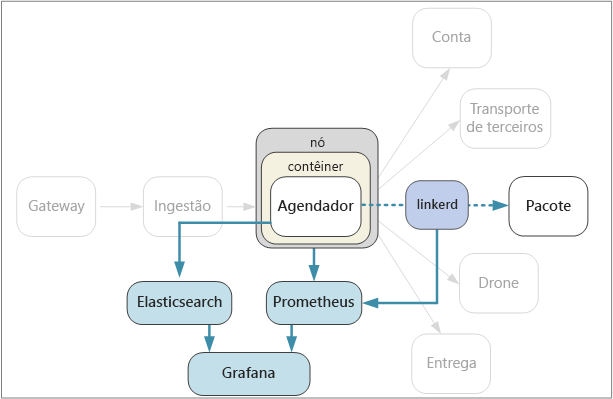

# Log e monitoramento

Em qualquer aplicativo complexo, em algum momento, algo dará errado. Em um aplicativo de microsserviço, você precisa controlar o que está acontecendo em dúzias ou até mesmo centenas de serviços. O monitoramento e o registro em log são extremamente importantes para fornecer uma visão holística do sistema.

Em uma arquitetura de microsserviços, descobrir a causa exata de erros ou gargalos de desempenho pode ser algo especialmente desafiador. Uma única operação de usuário pode abranger vários serviços. Serviços podem atingir os limites de E/S de rede dentro do cluster. Uma cadeia de chamadas entre serviços pode causar pressão de retorno no sistema, resultando em latência alta ou em falhas em cascata. Além disso, geralmente você não sabe em qual nó um contêiner específico será executado. Contêineres colocados no mesmo nó podem estar competindo por CPU ou memória limitada.

Para entender o que está acontecendo, colete a telemetria do aplicativo. A telemetria pode ser dividida em logs e métricas.

Os **Logs** são registros de eventos baseados em texto que ocorrem durante a execução do aplicativo. Eles incluem itens como logs de aplicativos (instruções de rastreamento) ou logs do servidor Web. Os logs são úteis principalmente para análise da causa raiz e análise forense.

**Métricas** são valores numéricos que podem ser analisados. Você pode usá-los para observar o sistema em tempo real (ou quase em tempo real) ou então para analisar as tendências de desempenho ao longo do tempo. As métricas podem ser subcategorizadas ainda mais da seguinte maneira:

- Métricas **no nível do nó**, incluindo CPU, memória, rede, disco e uso do sistema de arquivos. As métricas do sistema ajudam a compreender a alocação de recurso para cada nó no cluster e exceções de solução de problemas.

- Métricas do **contêiner**. Se os serviços forem executados em contêineres, você precisará coletar métricas no nível do contêiner, não apenas no nível da VM.

- Métricas de **aplicativo**. Isso inclui as métricas que são relevantes para entender o comportamento de um serviço. Exemplos incluem o número de solicitações HTTP de entrada na fila, latência de solicitação, comprimento da fila de mensagens. Os aplicativos também podem criar métricas personalizadas específicas ao domínio, como o número de transações de negócios processadas por minuto.

- Métricas de **serviço dependentes**. Os serviços podem chamar serviços externos ou pontos de extremidade, como serviços de PaaS gerenciados ou serviços SaaS. Os serviços de terceiros podem ou não fornecer alguma métrica. Se não fornecerem, você dependerá de suas próprias métricas de aplicativo para acompanhar as estatísticas de latência e taxa de erros.

## Considerações

Aqui estão algumas coisas específicas para se pensar no contexto de uma arquitetura de microsserviços:

**Configuração e gerenciamento**. Você usará um serviço gerenciado para monitoramento e registro em log ou implantará os componentes de registro em log e monitoramento como contêineres dentro do cluster?

**Taxa de ingestão**. Qual é a taxa de transferência na qual o sistema pode incluir eventos de telemetria? O que acontece se essa taxa é excedida? Por exemplo, o sistema pode limitar os clientes, caso em que os dados de telemetria são perdidos, ou pode reduzir a amostra de dados. Às vezes, você pode atenuar esse problema reduzindo a quantidade de dados coletados:

- Agregue métricas calculando estatísticas como média e desvio padrão e envie esses dados estatísticos para o sistema de monitoramento.

- Reduza a amostra de dados — ou seja, processe apenas um percentual dos eventos.

- Envie os dados em lotes para reduzir o número de chamadas de rede para o serviço de monitoramento.

**Custo**. O custo de ingerir e armazenar dados de telemetria pode ser alto, especialmente em grandes volumes. Em alguns casos, ele pode até mesmo exceder o custo de executar o aplicativo. Nesse caso, convém reduzir o volume de telemetria agregando os dados, reduzindo sua resolução ou enviando-os em lotes, conforme descrito acima.

**Fidelidade de dados**. Qual o nível de precisão das métricas? Médias podem ocultar exceções, especialmente em escala. Além disso, se a taxa de amostragem é muito baixa, ela pode suavizar flutuações nos dados. Pode parecer que tem todas as solicitações têm aproximadamente a mesma latência de ponta a ponta, quando na verdade uma parte significativa das solicitações estão demorando muito mais.

**Latência**. Para habilitar alertas e monitoramento em tempo real, os dados de telemetria devem estar disponíveis rapidamente. Quanto a disponibilização dos dados que aparecem no painel de monitoramento realmente se aproxima de "tempo real"? Com alguns segundos de atraso? Mais de um minuto?

**Armazenamento**. Para logs, pode ser mais eficiente para gravar os eventos de log em armazenamento efêmero no cluster e configurar um agente para enviar os arquivos de log para armazenamento mais persistente. Dados devem ser movidos eventualmente para o armazenamento de longo prazo para que ele esteja disponível para análise retrospectiva. Uma arquitetura de microsserviços pode gerar um grande volume de dados de telemetria, portanto, o custo de armazenar esses dados é uma consideração importante. Além disso, considere como você consultará os dados.

**Painel e visualização**. Você tem uma visão holística do sistema, em todos os serviços, tanto de dentro do cluster quanto dos serviços externos? Se você estiver gravando dados de telemetria e logs em mais de um local, o painel poderá mostrar todos eles e correlacioná-los? O painel de monitoramento deve mostrar pelo menos as seguintes informações:

- Alocação de recurso geral para crescimento e capacidade. Isso inclui o número de contêineres, as métricas do sistema de arquivos, rede e alocação de núcleos.

- Métricas de contêiner correlacionadas no nível de serviço.

- As métricas do sistema correlacionadas a contêineres.

- Erros de serviço e exceções.

## Rastreamento distribuído

Conforme mencionado, um desafio em microsserviços é entender o fluxo de eventos entre os serviços. Uma única operação ou transação pode envolver a chamadas para vários serviços. Para reconstruir a toda sequência de etapas, cada serviço deve propagar uma ID de correlação que atua como um identificador exclusivo para essa operação. A ID de correlação habilita o rastreamento distribuído entre serviços.

O primeiro serviço que recebe uma solicitação de cliente deve gerar a ID de correlação. Se o serviço faz uma chamada HTTP para outro serviço, ele coloca a ID de correlação em um cabeçalho de solicitação. Da mesma forma, se o serviço envia uma mensagem assíncrona, ele coloca a ID de correlação nessa mensagem. Serviços de downstream continuam a propagar a ID de correlação, de modo que ela flui através de todo o sistema. Além disso, todo o código que grava eventos de log ou métricas do aplicativo deve incluir a ID de correlação.

Quando as chamadas de serviço são correlacionadas, você pode calcular métricas operacionais, como a latência de ponta a ponta para uma transação completa, o número de transações bem-sucedidas por segundo e o percentual de transações com falha. Incluir IDs de correlação nos logs de aplicativo possibilita realizar a análise da causa raiz. Se uma operação falhar, você poderá encontrar as instruções de log para todas as chamadas de serviço que fizerem parte da mesma operação.

Aqui estão algumas considerações ao implementar o rastreamento distribuído:

- Atualmente, não há nenhum cabeçalho HTTP padrão para IDs de correlação. Sua equipe deve padronizar em um valor de cabeçalho personalizado. Essa escolha pode ser decidida por sua estrutura de monitoramento/registro em log ou sua escolha de malha de serviço.

- Para mensagens assíncronas, se sua infraestrutura de mensagens é compatível com a adição de metadados a mensagens, você deve incluir a ID de correlação como metadados. Caso contrário, inclua-a como parte do esquema de mensagem.

- Em vez de um único identificador opaco, você pode enviar um contexto de correlação que inclui informações mais avançadas, tais como relações chamador/receptor.

- Considere o modo como você agregará os logs. Você talvez queira que o modo como as IDs de correlação são incluídas nos logs seja padronizado entre as equipes. Use um formato estruturado ou semiestruturado, tal como JSON, e defina um campo comum para conter a ID de correlação.

## Opções de tecnologia

Para métricas de sistema e de contêiner, considere exportar métricas para um banco de dados de série temporal como Prometheus ou InfluxDB em execução no cluster.

- InfluxDB é um sistema baseado em push. É necessário que um agente envie as métricas por push. Você pode usar o Heapster, que é um serviço que coleta métricas de todo o cluster do kubelet, agrega os dados e envia-os por push para InfluxDB ou outra solução de armazenamento de série temporal.

- O Prometheus é um sistema baseado em pull. Ele extrai periodicamente as métricas de locais configurados. O Prometheus pode extrair métricas geradas por cAdvisor ou métricas de estado kube. Métricas de estado kube é um serviço que coleta métricas do servidor de API do Kubernetes e as disponibiliza para o Prometheus (ou um extrator que seja compatível com um ponto de extremidade de cliente do Prometheus). Embora o Heapster agregue as métricas geradas pelo Kubernetes e encaminhe-as para um coletor, o serviço métricas de estado kube gera suas próprias métricas e disponibiliza-as por meio de um ponto de extremidade para extração. Para métricas do sistema, use o Exportador de nó, que é um exportador Prometheus para métricas do sistema. O Prometheus é compatível com os dados de ponto flutuante, mas não com os dados de cadeia de caracteres, portanto, ele é apropriado para as métricas do sistema, mas não para logs.

- Usar uma ferramenta de painel, tal como Kibana ou Grafana, para visualizar e monitorar os dados. O serviço de painel também pode ser executado dentro de um contêiner no cluster.

Para logs de aplicativo, considere o uso de Fluentd e Elasticsearch. Fluentd é um coletor de dados de software livre e Elasticsearch é um banco de dados de documento que é otimizado para atuar como um mecanismo de pesquisa. Usando essa abordagem, cada serviço envia logs para stdout e stderr e o Kubernetes grava esses fluxos para o sistema de arquivos local. O Fluentd coleta os logs, opcionalmente enriquece-os com metadados adicionais do Kubernetes e envia os logs para o Elasticsearch. Use o Kibana, o Grafana ou uma ferramenta semelhante para criar um painel para o Elasticsearch. O Fluentd é executado como um conjunto de daemons no cluster, o que garante que um pod do Fluentd é atribuído a cada nó. Você pode configurar o Fluentd para coletar logs do kubelet, bem como os logs de contêiner. Em grandes volumes, gravar logs no sistema de arquivos local pode se tornar um gargalo de desempenho, especialmente quando vários serviços estão em execução no mesmo nó. Monitore a latência do disco e a utilização do sistema de arquivos na produção.

Uma vantagem de usar Fluentd com Elasticsearch para logs é que os serviços não exigem nenhuma dependência de biblioteca adicional. Cada serviço grava apenas para stdout e stderr e o Fluentd fica responsável pela exportação dos logs para o Elasticsearch. Além disso, as equipes que escrevem código de serviços não precisam entender como configurar a infraestrutura de log. Um desafio é configurar o cluster Elasticsearch para uma implantação de produção de modo que ele seja dimensionado para lidar com o tráfego.
