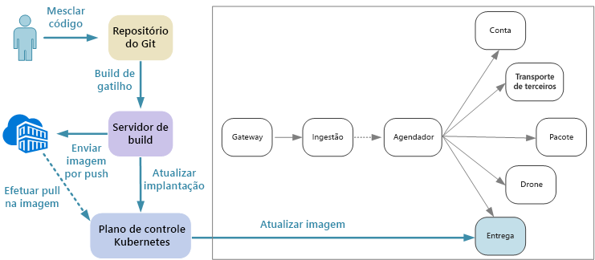
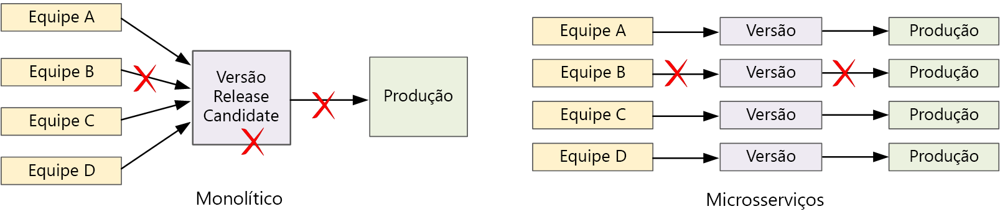

# Integração contínua

CI/CD (integração contínua e entrega contínua) são um requisito fundamental para alcançar êxito com microsserviços. Sem um bom processo de CI/CD, você não obterá a agilidade que os microsserviços prometem. Alguns dos desafios de CI/CD para microsserviços são oriundos de se ter várias bases de código e ambientes de build heterogêneos para os diversos serviços. 

Ciclos de lançamento mais rápidos são um dos maiores motivos para se adotar uma arquitetura de microsserviços.

Em um aplicativo totalmente monolítico, há um único pipeline de build cuja saída é o executável do aplicativo. Todo o trabalho de desenvolvimento alimenta este pipeline. Se for encontrado um bug de alta prioridade, uma correção deverá ser integrada, testada e publicada, o que poderá atrasar o lançamento dos novos recursos. É verdade que você pode atenuar esses problemas com módulos bem fatorados e usando ramificações de recursos para minimizar o impacto de alterações de código. Mas conforme o aplicativo se torna mais complexo e mais recursos são adicionados, o processo de liberação para um monolito tende a se tornar mais frágil e suscetível a interrupção.

Seguindo a filosofia de microsserviços, nunca deverá haver uma *release train* longa em que todas as equipes precisam se mobilizar. A equipe que cria o serviço "A" pode lançar uma atualização a qualquer momento, sem esperar que as alterações no serviço "B" sejam mescladas, testadas e implantadas. O processo de CI/CD é essencial para tornar isso possível. O pipeline de lançamento deve ser automatizado e altamente confiável, para que os riscos de implantação de atualizações sejam minimizados. Se você estiver liberando para produção diariamente ou várias vezes ao dia, as regressões ou as interrupções de serviço deverão ser muito raras. Ao mesmo tempo, se uma atualização inválida é implantada, você deve ter uma maneira confiável de reverter ou efetuar roll forward rapidamente para uma versão anterior de um serviço.

Quando falamos de CI/CD, na verdade estamos falando de processos relacionados: Integração contínua, entrega contínua e implantação contínua.

- **Integração contínua** significa que as alterações de código são frequentemente mescladas à ramificação principal, usando processos de build e de teste automatizados para garantir que o código na ramificação principal tenha sempre qualidade em nível de produção.

- **Entrega contínua** significa que as alterações de código que passam pelo processo de CI são publicadas automaticamente em um ambiente similar ao de produção. A implantação no ambiente de produção dinâmico pode exigir aprovação manual, mas caso contrário, é automatizada. A meta é que o seu código esteja sempre pronto para implantação na produção.

- **Implantação contínua** significa que as alterações de código que passam pelo processo de CI/CD são automaticamente implantadas em produção.

No contexto de Kubernetes e microsserviços, o estágio de CI trata de compilar e testar as imagens de contêiner e enviá-las por push para um registro de contêiner. No estágio de implantação, especificações de pod são atualizadas para que a imagem de produção mais recente seja escolhida.

## Desafios

- **Várias bases de código pequenas independentes**. Cada equipe é responsável por criar seu próprio serviço, com seu próprio pipeline de build. Em algumas organizações, as equipes podem usar repositórios de código separados. Isso pode levar a uma situação em que o conhecimento de como compilar o sistema é disseminado entre as equipes e ninguém na organização sabe como implantar o aplicativo inteiro. Por exemplo, o que acontecerá em um cenário de recuperação de desastre, se você precisar implantar rapidamente para um novo cluster?

- **Múltiplas linguagens de programação e frameworks**. Com cada equipe usando seu próprio conjunto de tecnologias, pode ser difícil criar um processo de build único que funcione em toda a organização. O processo de build deve ser flexível o suficiente para que cada equipe possa adaptá-lo para sua linguagem de programação ou estrutura de preferência.

- **Integração e teste de carga**. Com as equipes de liberação de atualizações em seu próprio ritmo, pode ser difícil projetar testes de ponta a ponta robustos, especialmente quando os serviços têm dependências em outros serviços. Além disso, o processo de execução de um cluster de produção completo pode ser cara, portanto, é improvável que cada equipe possa executar seu próprio cluster completo em escalas de produção, apenas para teste.

- **Gerenciamento de versão**. Cada equipe deve ter a capacidade de implantar uma atualização em produção. Isso não significa que cada membro da equipe tem permissões para fazer isso. Mas ter uma função de Gerenciador de Versão centralizada pode reduzir a velocidade das implantações. Quanto mais o processo de CI/CD for automatizado e confiável, menos deverá haver necessidade de uma autoridade central. Dito isso, você pode ter diferentes políticas para liberar atualizações dos principais recursos e correções de bugs secundários. Ser descentralizado não significa que não deve haver governança.

- **Controle de versão de imagem de contêiner**. Durante o ciclo de desenvolvimento e teste, o processo de CI/CD cria muitas imagens de contêiner. Somente alguns deles são candidatos a lançamento, e apenas alguns desses serão enviados por push para produção. É preciso ter uma estratégia de controle de versão clara para que você saiba quais imagens estão implantadas atualmente para produção e possa reverter para uma versão anterior, se necessário.

- **Atualizações de serviço**. Quando você atualizar um serviço para uma nova versão, ele não deverá interromper outros serviços que dependem dele. Se você fizer uma atualização sem interrupção, haverá um período de tempo quando uma mistura de versões estará em execução.

Esses desafios refletem uma tensão fundamental. Por outro lado, as equipes precisam trabalhar de modo tão independente quanto possível. Por outro lado, algumas coordenação é necessária para que uma única pessoa possa realizar tarefas como executar um teste de integração, reimplantar a solução inteira para um novo cluster ou reverter uma atualização inválida.

## Abordagens de CI/CD para microsserviços

É uma prática recomendada que cada equipe de serviço coloque o respectivo ambiente de build em um contêiner. Esse contêiner deverá ter todas as ferramentas de build necessárias para compilar os artefatos de código para o serviço dessa equipe. Geralmente, você pode encontrar uma imagem do Docker oficial para sua linguagem de programação e framework. Em seguida, você pode usar `docker run` ou o Docker Compose para executar o build.

Com essa abordagem, é simples configurar um novo ambiente de build. Um desenvolvedor que deseja compilar seu código não precisa instalar um conjunto de ferramentas de build, apenas executar a imagem de contêiner. E o que é talvez ainda mais importante, o servidor de build pode ser configurado para fazer a mesma coisa. Dessa forma, você não precisa instalar essas ferramentas no servidor de build nem gerenciar versões conflitantes de ferramentas.

Para desenvolvimento e teste locais, use o Docker para executar o serviço dentro de um contêiner. Como parte desse processo, talvez seja necessário executar outros contêineres com serviços simulados ou bancos de dados de teste necessários para teste local. Você pode usar o Docker Compose para coordenar esses contêineres ou usar o Minikube para executar o Kubernetes localmente.

Quando o código estiver pronto, abra uma solicitação pull e realize a merge no master. Isso iniciará um trabalho no servidor de build:

1. Compile os ativos de código.
1. Execute testes de unidade no código.
1. Compile a imagem de contêiner.
1. Teste a imagem de contêiner executando testes funcionais em um contêiner em execução. Essa etapa pode detectar erros no arquivo de Docker como um ponto de entrada inválido.
1. Envie a imagem por push para um registro de contêiner.
1. Atualize o cluster de teste com a nova imagem para executar testes de integração.

Quando a imagem estiver pronta para entrar em produção, atualize os arquivos de implantação necessários para especificar a imagem mais recente, inclusive eventuais arquivos de configuração do Kubernetes. Em seguida, aplique a atualização ao cluster de produção.

Aqui estão algumas recomendações para tornar as implantações mais confiáveis:

- Defina as convenções de toda a organização para marcações de contêiner, controle de versão e convenções de nomenclatura de recursos implantados para o cluster (pods, serviços e assim por diante). Isso pode facilitar o diagnóstico de problemas de implantação.

- Crie dois registros de contêiner separados, um para desenvolvimento/teste e outro para produção. Não envie uma imagem por push para o registro de produção até que você esteja pronto para implantá-lo em produção. Se você combinar essa prática com controle de versão semântico de imagens de contêiner, isso poderá reduzir a chance de acidentalmente implantar uma versão não aprovada para lançamento.

## Atualizando serviços

Há várias estratégias para atualizar um serviço que já está em produção. Aqui, abordamos três opções comuns: Atualização sem interrupção, implantação "blue-green" e versão canário.

### Atualização sem interrupção (Rolling update)

Em uma atualização sem interrupção, você implanta novas instâncias de um serviço e as novas instâncias começam a receber solicitações imediatamente. À medida que as novas instâncias chegam, as anteriores são removidas.

Atualizações sem interrupção são o comportamento padrão no Kubernetes quando você atualiza a especificação de pod para uma implantação. O controlador de implantação cria um novo ReplicaSet para os pods atualizados. Em seguida, ele expande o novo ReplicaSet e reduz simultaneamente o antigo, para manter a contagem de réplicas desejada. Ela não exclui os pods antigos até que os novos estejam prontos. O Kubernetes mantém um histórico da atualização, de modo que você pode usar kubectl para reverter uma atualização se necessário.

Se o seu serviço executa uma tarefa de inicialização longa, você pode definir um teste de preparação. A investigação de preparação relata quando o contêiner está pronto para começar a receber tráfego. O Kubernetes não enviará tráfego para o pod até que a investigação relate êxito.

Um desafio de reverter atualizações é que durante o processo de atualização uma mistura das versões antiga e nova estão em execução e recebendo tráfego. Durante esse período, qualquer solicitação poderia ser roteada para qualquer uma das duas versões. Isso pode causar ou não problemas, dependendo do escopo das alterações entre as duas versões.

### Implantação "blue-green"

Em uma implantação "blue-green", você deve implantar a nova versão juntamente com a versão anterior. Depois de validar a nova versão, você pode mudar todo o tráfego da versão anterior para a nova versão, de uma só vez. Após a troca, você deve monitorar o aplicativo para quaisquer problemas. Se algo der errado, você poderá retornar à versão antiga. Se nenhum problema ocorrer, você poderá excluir a versão antiga.

Com um aplicativo monolítico ou de N camadas mais tradicional, a implantação "blue-green" geralmente significa provisionar dois ambientes idênticos. Você implantaria a nova versão em um ambiente de preparo e então redirecionaria o tráfego de cliente para o ambiente de preparo — por exemplo, alternando VIPs.

No Kubernetes, você não precisa provisionar um cluster separado para fazer implantações "blue-green". Em vez disso, você pode tirar proveito de seletores. Crie um novo recurso de implantação com uma nova especificação de pod e um conjunto diferente de rótulos. Crie essa implantação sem excluir a implantação anterior nem modificar o serviço que aponta para ela. Quando os novo pods estiverem em execução, você poderá atualizar o seletor do serviço para corresponder à nova implantação.

Uma vantagem de implantações "blue-green" é que o serviço muda todos os pods simultaneamente. Depois que o serviço for atualizado, todas as novas solicitações serão roteadas para a nova versão. Uma desvantagem é que durante a atualização você executa o dobro de pods para o serviço (os atuais e os próximos). Se os pods exigirem muitos recursos de CPU ou de memória, talvez você precisará expandir o cluster temporariamente para dar conta do consumo de recursos.

## Versão canário

Em uma versão canário, você distribui uma versão atualizada para um número pequeno de clientes. Em seguida, você monitora o comportamento do novo serviço antes de implantá-lo em todos os clientes. Isso lhe permite fazer uma distribuição lenta de forma controlada, observar dados reais e identificar problemas antes que todos os clientes sejam afetados.

Uma versão canário é mais complexa de gerenciar do que a atualização sem interrupção ou "blue-green", porque você deve rotear solicitações dinamicamente para diferentes versões do serviço. No Kubernetes, você pode configurar um serviço para abranger dois conjuntos de réplicas (um para cada versão) e ajustar as contagens de réplicas manualmente. No entanto, essa abordagem tem uma granularidade bastante alta devido ao modo como o Kubernetes balanceia a carga entre os pods. Por exemplo, se você tiver um total de dez réplicas, só poderá realizar deslocamentos de tráfego em incrementos de 10%. Se você estiver usando uma malha de serviço, poderá usar as regras de roteamento de malha do serviço para implementar uma estratégia de versão canário mais sofisticada.

## Conclusão

Nos últimos anos, houve uma mudança radical na indústria, um movimento saindo da criação de *sistemas de registro* em direção à criação de *sistemas de engajamento*.

**Sistemas de registro** são aplicativos de gerenciamento de dados de back office tradicionais. No núcleo desses sistemas geralmente há um RDBMS, que é a única fonte de verdade. O termo "sistema de engajamento" é creditado a Geoffrey Moore em seu artigo de 2011, Systems of Engagement and the Future of Enterprise IT (sistemas de engajamento e o futuro do TI empresarial). **Sistemas de engajamento** são aplicativos voltados à comunicação e colaboração. Eles conectam pessoas em tempo real. Eles devem estar disponíveis 24 horas por dia, 7 dias por semana. Novos recursos são introduzidos regularmente sem que o aplicativo fique offline. Os usuários esperam mais e são menos pacientes com relação a tempo de inatividade ou atrasos inesperados.

No espaço do consumidor, uma melhor experiência de usuário pode ter valor comercial mensurável. A quantidade de tempo durante o qual um usuário se envolve com um aplicativo pode ser convertida diretamente em receita. E no universo dos sistemas comerciais, as expectativas dos usuários mudaram. Se esses sistemas visam promover comunicação e colaboração, eles devem usar como referência os aplicativos voltados para o consumidor.

Microsserviços são uma resposta a essa paisagem em mudança. Ao decompor um aplicativo monolítico em um grupo de serviços acoplados de forma flexível, podemos controlar o ciclo de versão de cada serviço e habilitar atualizações frequentes, sem tempo de inatividade nem alterações significativas. Os microsserviços também ajudam com a escalabilidade, o isolamento de falhas e a resiliência. Enquanto isso, plataformas de nuvem estão facilitando o build e a execução de microsserviços, com o provisionamento automatizado de recursos de computação, orquestradores de contêiner como um serviço e ambientes sem servidor controlados por eventos.

Mas, como vimos, arquiteturas de microsserviços também enfrentam muitos desafios. Para ter êxito, você deve iniciar de um design sólido. Você deve pensar cuidadosamente ao analisar o domínio, escolher as tecnologias, modelar dados, projetar APIs e criar uma cultura de DevOps madura. Esperamos que este guia e que a implementação de referência que o acompanha tenham ajudado a iluminar a jornada.
