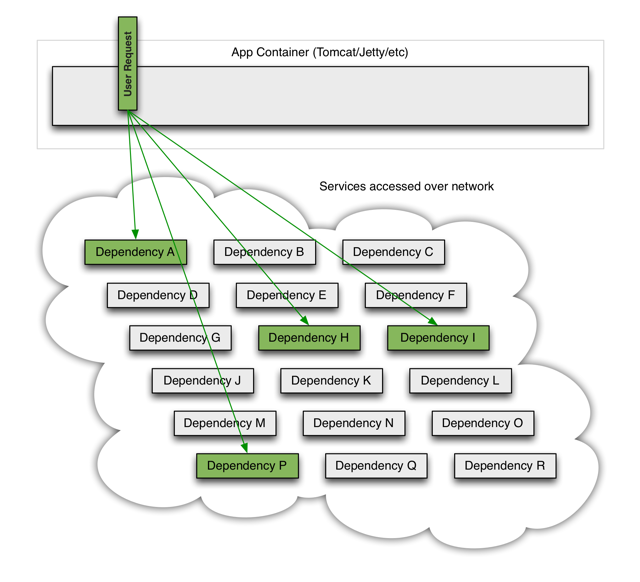
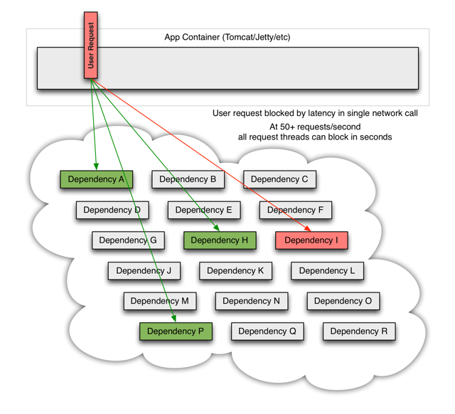
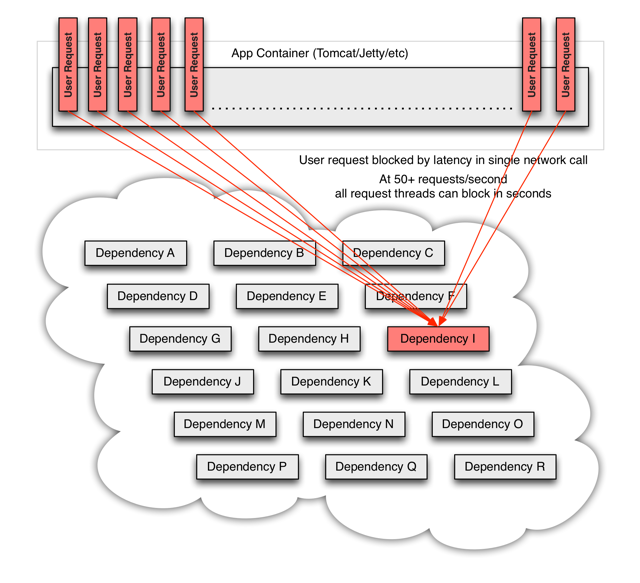
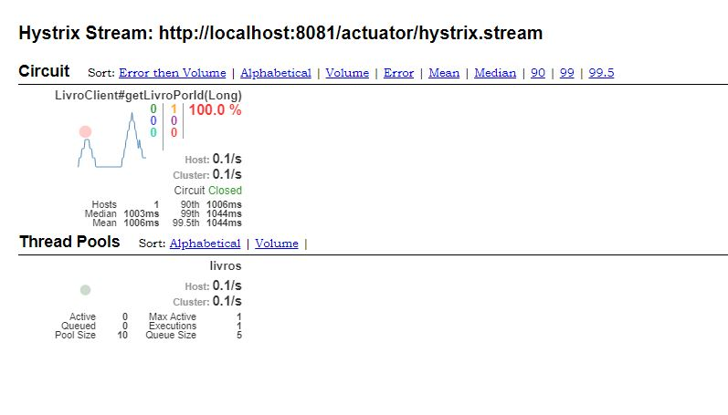

# Tolerância a Falhas

Um sistema distribuído típico consiste em vários serviços que colaboram juntos.

Esses serviços são propensos a falhas ou respostas atrasadas. Se um serviço falhar, isso pode afetar outros serviços que afetam o desempenho e possivelmente tornar outras partes do aplicativo inacessíveis ou, no pior dos casos, derrubar todo o aplicativo.

Naturalmente, existem soluções disponíveis que ajudam a tornar os aplicativos resilientes e tolerantes a falhas - uma dessas estruturas é a Hystrix.

A biblioteca de framework Hystrix ajuda a controlar a interação entre os serviços, fornecendo tolerância a falhas e tolerância a latência. Ele melhora a resiliência geral do sistema, isolando os serviços com falha e interrompendo o efeito de falhas em cascata.

Analisaremos como a Hystrix auxilia quando um serviço ou sistema falha e o que a Hystrix pode realizar nessas circunstâncias.

Usaremos a biblioteca e implementaremos o padrão corporativo "Circuit Breaker", que descreve uma estratégia contra a falha em cascata em diferentes níveis em um aplicativo.

O princípio é análogo à eletrônica: a Hystrix observa métodos para falhas nas chamadas de serviços relacionados. Se houver essa falha, ele abrirá o circuito e encaminhará a chamada para um método de fallback.

A biblioteca tolerará falhas até um limite. Além disso, deixa o circuito aberto. O que significa que ele encaminhará todas as chamadas subsequentes para o método de fallback, para evitar futuras falhas. Isso cria um buffer de tempo para o serviço relacionado recuperar de seu estado com falha.

## Hystrix

O Hystrix é uma biblioteca de tolerância a falhas e latência projetada para isolar pontos de acesso em sistemas remotos, serviços e bibliotecas de terceiros, parar falhas em cascata e habilitar a resiliência em sistemas distribuídos complexos onde a falha é inevitável.

### Quais tipos de problemas o Hystrix resolve?

Aplicações em arquiteturas complexas contém muitas dependências, algumas inevitavelmente podem falhar em algum ponto.

Imagine o cenário onde você tem 30 serviços e cada um tem 99.99% de uptime, portanto você pode esperar que:

> 99.99³⁰ = 99.7% uptime
> 0.3% de 1 bilhão de requests = 3.000.000 falhas
> 2+ horas de downtime por mês, mesmo que todas as dependências possuam um excelente uptime.

Em um cenário ideal o sistema funciona da seguinte forma:



Portanto algum serviço pode começar a falhar:



Isso significa que o UserRequest fica bloqueado porque a dependência I ilustrada em vermelho está em falha, seja um timeout, um problema de infra, base de dados etc.. resultando para o usuário um possível **Server Error 500** e todos os futuros requests irão travar devido à esse serviço que não está saudável.



Hystrix foi projetado para fazer o seguinte:

- Dar proteção e controle sobre a latência e a falha nas dependências acessadas (normalmente através da rede) através de bibliotecas de clientes de terceiros.
- Parar falhas em cascata em um sistema distribuído complexo.
- Falhar rapidamente e permitir rápida recuperação.
- Fallback e interromper processos quando possível.
- Permite monitoramento, alerta e controle operacional quase em tempo real.

## Tornando a inclusão de Avaliações tolerante a falhas

O serviço de inclusão de avaliações realiza uma requisição para o serviço de consulta de livros antes de efetuar a inclusão da avaliação, porém, um novo requisito que temos é tornar esta operação tolerante a falhas no serviço de consulta de livros, ou seja, mesmo que o serviço de consulta de livros falhe a inclusão da avaliação deverá proceder com um valor default para o nome do livro.

Inicialmente, iremos incluir a dependência do Hystrix no projeto avaliacao-service:

**pom.xml**

```xml
<dependency>
    <groupId>org.springframework.cloud</groupId>
    <artifactId>spring-cloud-starter-netflix-hystrix</artifactId>
</dependency>	
```

A anotação ```@EnableCircuitBreaker``` examinará o caminho de classe para qualquer implementação de circuit-breaker compatível.

Para usar o Hystrix explicitamente, você deve anotar ```AvaliacaoServiceApplication``` com ```@EnableHystrix```:

**AvaliacaoServiceApplication**

```java
package com.acme.avaliacaoservice;

import org.springframework.boot.SpringApplication;
import org.springframework.boot.autoconfigure.SpringBootApplication;
import org.springframework.cloud.client.circuitbreaker.EnableCircuitBreaker;
import org.springframework.cloud.client.discovery.EnableDiscoveryClient;

@SpringBootApplication
@EnableDiscoveryClient
// Novidade aqui
@EnableCircuitBreaker
public class AvaliacaoServiceApplication {
	public static void main(String[] args) {
		SpringApplication.run(AvaliacaoServiceApplication.class, args);
	}
}
```

Agora, criaremos um serviço para retornar o título do livro, isolando esta funcionalidade:

**TituloLivroService**

```java
@Service
public class TituloLivroService {

	@HystrixCommand(fallbackMethod = "getTituloDefault")
	public String getTitulo(Long livroId) {

		RestTemplate restTemplate = new RestTemplate();
		String livroResourceUrl = "http://localhost:8080/livros/";

		ResponseEntity<Livro> responseLivro = restTemplate.getForEntity(livroResourceUrl + livroId, Livro.class);
		
		return responseLivro.getBody().getTitulo();
	}

	@SuppressWarnings("unused")
	private String getTituloDefault(Long livroId) {
		return "Erro ao consultar o título: " + livroId;
	}
}
```

O último passo é alterar `AvalicacoesController` para que utilize o serviço de consulta do nome do livro:

**AvalicacoesController**

```java
// Código atual omitido
private final AvaliacaoRepository repository;

// Novidades aqui
private final TituloLivroService tituloLivroService;

AvalicacoesController(AvaliacaoRepository repository, TituloLivroService tituloLivroService) {
    this.repository = repository;
    this.tituloLivroService = tituloLivroService;
}

// Código atual omitido

// Novidades aqui
@PostMapping
@ResponseStatus(HttpStatus.CREATED)
public Avaliacao adicionarAvaliacao(@RequestBody Avaliacao avaliacao) throws IOException {
    logger.info("adicionarAvaliacao: " + avaliacao);
    
    String tituloLivro = tituloLivroService.getTitulo(avaliacao.getLivroId());
    logger.info("Título do livro avaliado: " + tituloLivro);

    return repository.save(avaliacao);
}
```

Para testar, tente incluir uma avaliação com o serviço de livros ativo e em seguida desligue o servidor de livros-service.

Mas agora, se o serviço de consulta de livros estiver ativo e você tentar incluir uma avaliação para um livro inexistente, vai ter um resultado indesejado, a função de fallback será acionada.

Para evitar isso, temos que ajustar o serviço de consulta de nomes de livros para não emitir exceção somente no caso do serviço estar ativo e retornar 404 para o determinado livro.

```java
package com.acme.avaliacaoservice;

import org.slf4j.Logger;
import org.slf4j.LoggerFactory;
import org.springframework.http.HttpStatus;
import org.springframework.http.ResponseEntity;
import org.springframework.stereotype.Service;
import org.springframework.web.client.HttpClientErrorException;
import org.springframework.web.client.RestTemplate;

import com.netflix.hystrix.contrib.javanica.annotation.HystrixCommand;

@Service
public class TituloLivroService {

	Logger logger = LoggerFactory.getLogger(TituloLivroService.class);

	@HystrixCommand(fallbackMethod = "getTituloDefault")
	public String getTitulo(Long livroId) {
		RestTemplate restTemplate = new RestTemplate();
		String livroResourceUrl = "http://localhost:8080/livros/";
		try {
			ResponseEntity<Livro> responseLivro = restTemplate.getForEntity(livroResourceUrl + livroId, Livro.class);
			return responseLivro.getBody().getTitulo();
		} catch (HttpClientErrorException ex) {
			if (ex.getRawStatusCode() == HttpStatus.NOT_FOUND.value()) {
				return null;
			} else {
				logger.error("Ocorreu um erro na comunicação com o serviço de livros", ex);
				throw ex;
			}
		}
	}

	@SuppressWarnings("unused")
	private String getTituloDefault(Long livroId) {
		return "Erro ao consultar o título: " + livroId;
	}
}
```

A versão final em AvaliacaoController fica assim:

```java
@PostMapping
@ResponseStatus(HttpStatus.CREATED)
public Avaliacao adicionarAvaliacao(@RequestBody Avaliacao avaliacao) throws IOException {
    logger.info("adicionarAvaliacao: " + avaliacao);

    String tituloLivro = tituloLivroService.getTitulo(avaliacao.getLivroId());
    if (tituloLivro != null) {
        logger.info("Título do livro avaliado: " + tituloLivro);
    } else {
        throw new ResponseStatusException(HttpStatus.BAD_REQUEST, "Livro não existe: " + avaliacao.getLivroId());
    }

    return repository.save(avaliacao);
}
```

## Feign

Feign é um cliente de serviço da web declarativo. Facilita a criação de clientes de serviços da Web. Para usar Feign, crie uma interface e anote-a. Ele possui suporte a anotações plugáveis, incluindo anotações Feign e anotações JAX-RS. O Feign também suporta codificadores e decodificadores plugáveis. O Spring Cloud adiciona suporte para anotações do Spring MVC e para usar os mesmos HttpMessageConverters usados por padrão no Spring Web. O Spring Cloud integra o Ribbon e o Eureka para fornecer um cliente http de carga balanceada ao usar o Feign.

### Utilizando o Feign para as chamadas entre serviços

Para utilizar o Feign devemos incluir sua dependência:

**pom.xml**

```xml
<dependency>
    <groupId>org.springframework.cloud</groupId>
    <artifactId>spring-cloud-starter-openfeign</artifactId>
</dependency>
```

Devemos também anotar ```AvaliacaoServiceApplication``` com ```@EnableFeignClients```:

**AvaliacaoServiceApplication**

```java
package com.acme.avaliacaoservice;

import org.springframework.boot.SpringApplication;
import org.springframework.boot.autoconfigure.SpringBootApplication;
import org.springframework.cloud.client.circuitbreaker.EnableCircuitBreaker;
import org.springframework.cloud.client.discovery.EnableDiscoveryClient;
import org.springframework.cloud.openfeign.EnableFeignClients;

@SpringBootApplication
@EnableDiscoveryClient
@EnableCircuitBreaker
// Novidade aqui
@EnableFeignClients
public class AvaliacaoServiceApplication {
	public static void main(String[] args) {
		SpringApplication.run(AvaliacaoServiceApplication.class, args);
	}
}
```

Vamos criar uma classe cliente para realizar as requisições REST, é algo parecido com o conceito do repository:

**LivroClient**

```java
package com.acme.avaliacaoservice;

import java.util.List;

import org.springframework.cloud.openfeign.FeignClient;
import org.springframework.web.bind.annotation.PathVariable;
import org.springframework.web.bind.annotation.RequestMapping;
import org.springframework.web.bind.annotation.RequestMethod;

@FeignClient(name = "livros", url = "http://localhost:8080")
public interface LivroClient {
	@RequestMapping(method = RequestMethod.GET, value = "/livros")
	List<Livro> getLivros();

	@RequestMapping(method = RequestMethod.GET, value = "/livros/{livroId}")
	Livro getLivroPorId(@PathVariable("livroId") Long livroId);
}
```

O último passo é ajustar nosso controller para utilize o novo método para recuperar o título do livro:

```java
// Código atual omitido

@RestController
@RequestMapping("/avaliacoes")
public class AvalicacoesController {

	Logger logger = LoggerFactory.getLogger(AvalicacoesController.class);

	private final AvaliacaoRepository repository;

    // Novidades aqui
	private final LivroClient livroClient;

	AvalicacoesController(AvaliacaoRepository repository, LivroClient livroClient) {
		this.repository = repository;
		this.livroClient = livroClient;
	}

    // Código atual omitido

    // Novidades aqui
	@PostMapping
	@ResponseStatus(HttpStatus.CREATED)
	public Avaliacao adicionarAvaliacao(@RequestBody Avaliacao avaliacao) throws IOException {
		logger.info("adicionarAvaliacao: " + avaliacao);

		try {
			String tituloLivro = livroClient.getLivroPorId(avaliacao.getLivroId()).getTitulo();
			logger.info("Título do livro avaliado: " + tituloLivro);
		} catch (FeignException ex) {
			if (ex.status() == HttpStatus.NOT_FOUND.value()) {
				throw new ResponseStatusException(HttpStatus.BAD_REQUEST,
						"Livro não existe: " + avaliacao.getLivroId());
			} else {
				throw new ResponseStatusException(HttpStatus.SERVICE_UNAVAILABLE,
						"Ocorreu um erro ao consultar o título do livro: " + ex.getMessage());
			}
		}
		return repository.save(avaliacao);
	}
}
```

Compile e teste a aplicação, tudo deve estar funcionando normalmente, mas perceba que perdemos a funcionalidade do circuit-breaker neste ajuste, vamos recuperá-la.

## Hystrix e Feign

Agora, vamos combinar a utilização do Hystrix e do Feign, para isso, primeiro temos que ativar uma propriedade de integração das duas bibliotecas no arquivo de propriedades da aplicação:

**bootstrap.properties**

```
...
feign.hystrix.enabled=true
```

Ajustamos agora nossa classe cliente para que tenha uma classe de fallback configurada:

**LivroClient**

```java
package com.acme.avaliacaoservice;

import java.util.ArrayList;
import java.util.List;

import org.springframework.cloud.openfeign.FeignClient;
import org.springframework.stereotype.Component;
import org.springframework.web.bind.annotation.PathVariable;
import org.springframework.web.bind.annotation.RequestMapping;
import org.springframework.web.bind.annotation.RequestMethod;

@FeignClient(name = "livros", url = "http://localhost:8080", decode404 = true, fallback = LivroClient.LivroClientFallback.class)
public interface LivroClient {
	@RequestMapping(method = RequestMethod.GET, value = "/livros")
	List<Livro> getLivros();

	@RequestMapping(method = RequestMethod.GET, value = "/livros/{livroId}")
	Livro getLivroPorId(@PathVariable("livroId") Long livroId);

	@Component
	public static class LivroClientFallback implements LivroClient {

		@Override
		public List<Livro> getLivros() {
			return new ArrayList<Livro>();
		}

		@Override
		public Livro getLivroPorId(Long livroId) {
			return new Livro("Desconhecido", "Desconhecido", 0d);
		}
	}
}
```

O último passo é ajustar nosso controller para que identifique quando um livro não foi encontrado.

```java
// Código atual omitido

@RestController
@RequestMapping("/avaliacoes")
public class AvalicacoesController {

    // Código atual omitido

    // Novidades aqui
	@PostMapping
	@ResponseStatus(HttpStatus.CREATED)
	public Avaliacao adicionarAvaliacao(@RequestBody Avaliacao avaliacao) throws IOException {
		logger.info("adicionarAvaliacao: " + avaliacao);
		String tituloLivro = livroClient.getLivroPorId(avaliacao.getLivroId()).getTitulo();
		if (tituloLivro == null) {
			throw new ResponseStatusException(HttpStatus.BAD_REQUEST, "Livro não existe: " + avaliacao.getLivroId());
		}
		logger.info("Título do livro avaliado: " + tituloLivro);
		return repository.save(avaliacao);
	}
}
```

## Exercício opcional

Utilizar o Feign e o Hystrix nas chamadas do lado do livro-service

## Hystrix Dashboard

Um bom recurso do Hystrix é a capacidade de monitorar seu status em um painel.

Para ativá-lo, colocaremos uma nova dependência em nosso projeto:

**pom.xml**

```xml
<dependency>
    <groupId>org.springframework.cloud</groupId>
    <artifactId>spring-cloud-starter-netflix-hystrix-dashboard</artifactId>
</dependency>
```

Em seguida, o ativamos via anotação `@EnableHystrixDashboard`:

**AvaliacaoServiceApplication**

```java
package com.acme.avaliacaoservice;

import org.springframework.boot.SpringApplication;
import org.springframework.boot.autoconfigure.SpringBootApplication;
import org.springframework.cloud.client.circuitbreaker.EnableCircuitBreaker;
import org.springframework.cloud.client.discovery.EnableDiscoveryClient;
import org.springframework.cloud.netflix.hystrix.dashboard.EnableHystrixDashboard;
import org.springframework.cloud.openfeign.EnableFeignClients;

@SpringBootApplication
@EnableDiscoveryClient
@EnableCircuitBreaker
@EnableFeignClients
// Novidade aqui
@EnableHystrixDashboard
public class AvaliacaoServiceApplication {
	public static void main(String[] args) {
		SpringApplication.run(AvaliacaoServiceApplication.class, args);
	}
}
```

Depois que reiniciarmos o aplicativo, direcionaremos um navegador para http://localhost:8081/hystrix, inseriremos o URL de métricas de um "hystrix.stream" (http://localhost:8081/actuator/hystrix.stream) e começaremos o monitoramento.

Finalmente, devemos ver algo assim:



Monitorar um "hystrix.stream" é algo bom, mas se você tiver que assistir a vários aplicativos habilitados para o Hystrix, ele se tornará inconveniente. Para essa finalidade, o Spring Cloud fornece uma ferramenta chamada Turbine, que pode agregar fluxos para apresentar em um painel Hystrix.

## Consul e Feign

Uma das vantagens de se utilizar o Feign é sua fácil integração com serviços de discovery como o Consul e Eureka.

Vamos retirar as URLs fixas em nosso código e utilizar o serviço de discovery para identificar os hosts a serem acionados pelos clientes Feign, para isso, basta um pequeno ajuste:

**LivroClient**

```java
// Novidade aqui
@FeignClient(name = "livro-service", decode404 = true, fallback = LivroClient.LivroClientFallback.class)
public interface LivroClient {
	@RequestMapping(method = RequestMethod.GET, value = "/livros")
	List<Livro> getLivros();

	@RequestMapping(method = RequestMethod.GET, value = "/livros/{livroId}")
	Livro getLivroPorId(@PathVariable("livroId") Long livroId);

	@Component
	public static class LivroClientFallback implements LivroClient {

		@Override
		public List<Livro> getLivros() {
			return new ArrayList<Livro>();
		}

		@Override
		public Livro getLivroPorId(Long livroId) {
			return new Livro("Desconhecido", "Desconhecido", 0d);
		}
	}
}
```

## Fontes
- https://www.baeldung.com/spring-cloud-netflix-hystrix
- https://medium.com/@thiagoloureiro/conhecendo-o-hystrix-2c72e2cbe5ef
